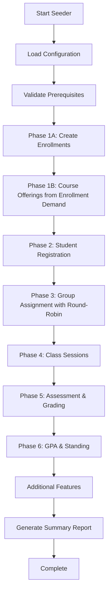

# Design Document

## Overview

The Academic Lifecycle Seeder is a sophisticated data generation system that creates realistic academic data to simulate the complete student journey from enrollment through graduation. The system operates in sequential phases, building upon existing student and curriculum data to generate comprehensive academic records including course offerings, registrations, sessions, assessments, and academic standings.

## Architecture

### Core Components

1. **Seeder Orchestrator**: Main controller that coordinates the execution of all seeder phases
2. **Phase Processors**: Individual processors for each phase of the academic lifecycle
3. **Data Generators**: Specialized generators for different types of academic data
4. **Configuration Manager**: Handles seeder parameters and settings
5. **Progress Tracker**: Monitors and reports seeder execution progress

### System Flow



## Components and Interfaces

### 1. Seeder Orchestrator

**Class**: `AcademicLifecycleSeeder`

**Responsibilities**:
- Coordinate execution of all seeder phases in correct order (Enrollments → Course Offerings → Registration → etc.)
- Manage configuration and parameters
- Handle error recovery and rollback
- Generate progress reports

**Key Methods**:
```php
public function execute(array $config = []): SeederResult
public function executePhase(string $phase): PhaseResult
public function rollback(): void
public function getProgress(): ProgressReport
```

### 2. Phase Processors

#### EnrollmentProcessor (NEW - CRITICAL)
**Responsibilities**:
- Create semester enrollments for all active students BEFORE any course offerings
- Calculate correct semester_number based on admission_date vs semester dates
- Establish enrollment demand foundation for course offering creation

**Key Methods**:
```php
public function createSemesterEnrollments(Semester $semester): Collection
public function calculateStudentSemesterNumber(Student $student, Semester $semester): int
public function determineEligibleStudents(Semester $semester): Collection
public function createEnrollment(Student $student, Semester $semester, int $semesterNumber): Enrollment
```

#### CourseOfferingProcessor (UPDATED)
**Responsibilities**:
- Calculate student's current semester number based on admission date
- **CRITICAL CHANGE**: Generate course offerings ONLY for curriculum units with enrolled students
- Query enrollments table to determine demand before creating offerings
- Assign lecturers and schedules
- Create syllabus and assessment components

**Key Methods**:
```php
public function calculateStudentSemesterNumber(Student $student): int
public function getEnrollmentDemand(Semester $semester): Collection
public function fetchCurriculumUnitsWithDemand(Semester $semester): Collection
public function generateCourseOfferingsFromDemand(Semester $semester): Collection
public function createCourseOfferingIfDemandExists(CurriculumUnit $unit, Semester $semester, int $demandCount): CourseOffering
public function assignLecturers(Collection $offerings): void
public function createSyllabusData(CourseOffering $offering): Syllabus
```

#### StudentRegistrationProcessor (UPDATED)
**Responsibilities**:
- Register students for appropriate courses BASED ON THEIR ENROLLMENTS
- Create academic records
- Handle prerequisite validation

**Key Methods**:
```php
public function registerStudentsForCourses(Collection $offerings): void
public function createAcademicRecords(Collection $registrations): void
public function validatePrerequisites(Student $student, CourseOffering $offering): bool
public function getEligibleStudentsFromEnrollments(CourseOffering $offering): Collection
```

#### GroupAssignmentProcessor (CRITICAL UPDATE)
**Responsibilities**:
- Split large courses into manageable sections
- **CRITICAL CHANGE**: Use round-robin distribution for even student assignment
- Reassign students to appropriate sections with maximum 1 student difference between sections
- Maintain enrollment balance

**Key Methods**:
```php
public function splitLargeCourses(Collection $offerings): Collection
public function distributeStudentsRoundRobin(Collection $students, Collection $sections): void
public function validateEvenDistribution(Collection $sections): bool
public function balanceEnrollment(Collection $sections): void
```

#### ClassSessionProcessor
**Responsibilities**:
- Generate class sessions based on syllabus
- Assign rooms and time slots
- Create attendance records

**Key Methods**:
```php
public function generateClassSessions(CourseOffering $offering): Collection
public function assignRoomsAndTimes(Collection $sessions): void
public function createAttendanceRecords(ClassSession $session): Collection
```

#### AssessmentProcessor
**Responsibilities**:
- Create assessment component details
- Generate student scores
- Calculate final grades

**Key Methods**:
```php
public function createAssessmentDetails(AssessmentComponent $component): Collection
public function generateStudentScores(Collection $details, Collection $students): void
public function calculateFinalGrades(Collection $registrations): void
```

#### GpaStandingProcessor
**Responsibilities**:
- Calculate semester and cumulative GPAs
- Determine academic standings
- Create intervention records

**Key Methods**:
```php
public function calculateGpas(Student $student, Semester $semester): GpaCalculation
public function determineAcademicStanding(GpaCalculation $gpa): AcademicStanding
public function createInterventionRecords(Collection $standings): void
```

### 3. Data Generators

#### RealisticDataGenerator
**Responsibilities**:
- Generate realistic academic performance data
- Apply statistical distributions for grades
- Create varied attendance patterns

**Key Methods**:
```php
public function generateGradeDistribution(int $studentCount): array
public function generateAttendancePattern(Student $student): array
public function generatePerformanceVariation(): float
```

#### ScheduleGenerator
**Responsibilities**:
- Create realistic class schedules
- Avoid time conflicts
- Optimize room utilization

**Key Methods**:
```php
public function generateWeeklySchedule(CourseOffering $offering): array
public function checkTimeConflicts(array $schedule): bool
public function assignOptimalRooms(Collection $sessions): void
```

#### StudentDistributionGenerator (NEW)
**Responsibilities**:
- Implement round-robin student distribution algorithm
- Ensure even section assignment
- Validate distribution balance

**Key Methods**:
```php
public function distributeStudentsRoundRobin(Collection $students, int $sectionCount): array
public function validateDistributionBalance(array $sectionAssignments): bool
public function getMaxStudentDifference(array $sectionAssignments): int
```

## Data Models

### Configuration Schema

```php
class SeederConfiguration
{
    public array $targetSemesters;
    public int $maxStudentsPerSection = 55;
    public array $gradeDistribution;
    public array $attendancePatterns;
    public bool $includeRetakes = true;
    public bool $includeProgramChanges = true;
    public bool $includeAcademicHolds = true;
    public int $batchSize = 100;
    public bool $enableProgressReporting = true;
    public bool $enforceEnrollmentValidation = true; // NEW - Ensure offerings only created for enrolled students
    public bool $enforceEvenDistribution = true; // NEW - Ensure even section distribution
}
```

### Progress Tracking

```php
class ProgressReport
{
    public string $currentPhase;
    public int $totalPhases;
    public int $completedPhases;
    public int $totalRecords;
    public int $processedRecords;
    public array $phaseDetails;
    public ?string $errorMessage;
    public DateTime $startTime;
    public ?DateTime $endTime;
    public array $enrollmentToOfferingRatio; // NEW - Track logical consistency
    public array $sectionDistributionBalance; // NEW - Track section balance
}
```

## Error Handling

### Error Recovery Strategy

1. **Phase-level Rollback**: Each phase can be rolled back independently
2. **Checkpoint System**: Save progress at key milestones
3. **Validation Gates**: Validate data integrity between phases
4. **Error Logging**: Comprehensive logging of all errors and warnings
5. **NEW**: **Enrollment Validation**: Ensure course offerings have corresponding enrollments
6. **NEW**: **Distribution Validation**: Ensure students are evenly distributed across sections

### Exception Hierarchy

```php
abstract class SeederException extends Exception {}
class ConfigurationException extends SeederException {}
class DataValidationException extends SeederException {}
class PhaseExecutionException extends SeederException {}
class DatabaseConstraintException extends SeederException {}
class EnrollmentValidationException extends SeederException {} // NEW
class DistributionValidationException extends SeederException {} // NEW
```

## Algorithm Details

### Round-Robin Student Distribution Algorithm

```php
/**
 * Distribute students evenly across sections using round-robin assignment
 * Ensures maximum difference of 1 student between any two sections
 */
public function distributeStudentsRoundRobin(Collection $students, int $sectionCount): array
{
    $sections = array_fill(0, $sectionCount, []);
    $currentSection = 0;
    
    foreach ($students as $student) {
        $sections[$currentSection][] = $student;
        $currentSection = ($currentSection + 1) % $sectionCount;
    }
    
    // Validate even distribution
    $counts = array_map('count', $sections);
    $maxDifference = max($counts) - min($counts);
    
    if ($maxDifference > 1) {
        throw new DistributionValidationException(
            "Uneven distribution detected: max difference is {$maxDifference}"
        );
    }
    
    return $sections;
}
```

### Enrollment-Driven Course Offering Creation

```php
/**
 * Create course offerings only for curriculum units with enrolled students
 */
public function generateCourseOfferingsFromDemand(Semester $semester): Collection
{
    // Step 1: Get enrollment demand
    $enrollmentDemand = Enrollment::where('semester_id', $semester->id)
        ->where('status', 'in_progress')
        ->join('curriculum_units', 'enrollments.curriculum_version_id', '=', 'curriculum_units.curriculum_version_id')
        ->where('curriculum_units.semester_number', DB::raw('enrollments.semester_number'))
        ->groupBy('curriculum_units.id')
        ->selectRaw('curriculum_units.id, COUNT(*) as student_count')
        ->get();
    
    // Step 2: Create offerings only for units with demand
    $createdOfferings = collect();
    
    foreach ($enrollmentDemand as $demand) {
        $curriculumUnit = CurriculumUnit::find($demand->id);
        $offering = $this->createCourseOfferingIfNotExists(
            $curriculumUnit, 
            $semester, 
            $demand->student_count
        );
        
        if ($offering) {
            $createdOfferings->push($offering);
        }
    }
    
    return $createdOfferings;
}
```

## Performance Considerations

### Optimization Strategies

1. **Batch Processing**: Process records in configurable batches
2. **Database Transactions**: Use transactions for data consistency
3. **Memory Management**: Clear collections after processing
4. **Parallel Processing**: Process independent phases concurrently
5. **NEW**: **Enrollment Indexing**: Index enrollment queries for performance
6. **NEW**: **Distribution Caching**: Cache section assignments during distribution

### Scalability Metrics

- **Target Performance**: 1000 students per minute
- **Memory Usage**: Maximum 512MB for large datasets
- **Database Connections**: Efficient connection pooling
- **Progress Reporting**: Real-time progress updates
- **NEW**: **Enrollment Validation Time**: <5% of total execution time
- **NEW**: **Distribution Processing**: O(n) complexity for round-robin assignment

## Validation Framework

### Data Integrity Checks

1. **Enrollment Consistency**: Verify all course offerings have corresponding enrollments
2. **Distribution Balance**: Verify students are evenly distributed across sections (max difference ≤ 1)
3. **Referential Integrity**: Ensure all foreign keys are valid
4. **Business Logic**: Validate academic rules and constraints

### Quality Metrics

```php
class DataQualityReport
{
    public float $enrollmentToOfferingRatio; // Should be 1.0 (perfect match)
    public int $maxSectionSizeDifference; // Should be ≤ 1
    public array $orphanedOfferings; // Course offerings without enrollments
    public array $unevenSections; // Sections with uneven distribution
    public float $overallDataQualityScore; // 0-100% quality score
}
```
