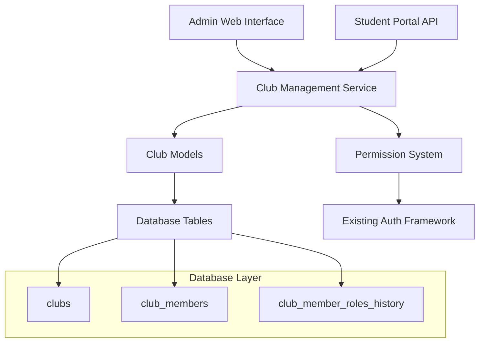
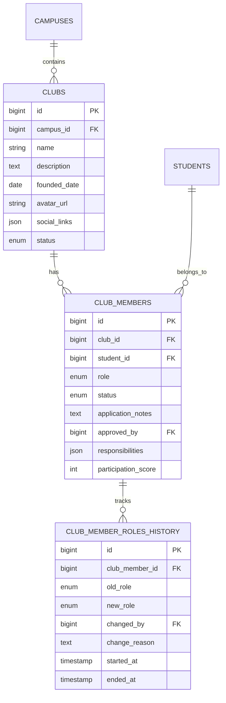

# Design Document

## Overview

The Club Management System is designed as a two-tier system where administrators manage club creation and initial setup through the web interface, while club presidents manage day-to-day operations through the student portal API. The system leverages the existing Laravel + Vue.js architecture, authentication framework, and permission system to provide seamless integration with the current academic platform.

## Architecture

### System Components



### Integration Points

1. **Authentication**: Uses existing Laravel Sanctum for API authentication
2. **Permissions**: Integrates with current permission framework and policies
3. **Student Portal**: Extends existing V1 API structure
4. **Admin Interface**: Follows established web route patterns
5. **Database**: Uses existing auditable model patterns and migration structure

## Components and Interfaces

### Database Models

#### Club Model
```php
class Club extends AuditableModel
{
    protected $fillable = [
        'campus_id', 'name', 'description', 'founded_date',
        'avatar_url', 'thumbnail_url', 'cover_url', 'social_links',
        'contact_email', 'contact_phone', 'status', 'achievements'
    ];
    
    protected $casts = [
        'social_links' => 'array',
        'achievements' => 'array',
        'founded_date' => 'date'
    ];
    
    // Relationships
    public function campus(): BelongsTo;
    public function members(): HasMany;
    public function president(): HasOne;
}
```

#### ClubMember Model
```php
class ClubMember extends AuditableModel
{
    protected $fillable = [
        'club_id', 'student_id', 'role', 'status',
        'application_notes', 'approved_by', 'responsibilities',
        'participation_score', 'last_active_at', 'joined_at', 'left_at'
    ];
    
    protected $casts = [
        'responsibilities' => 'array',
        'last_active_at' => 'datetime',
        'joined_at' => 'datetime',
        'left_at' => 'datetime'
    ];
    
    // Relationships
    public function club(): BelongsTo;
    public function student(): BelongsTo;
    public function approver(): BelongsTo;
    public function roleHistory(): HasMany;
}
```

#### ClubMemberRoleHistory Model
```php
class ClubMemberRoleHistory extends Model
{
    protected $fillable = [
        'club_member_id', 'old_role', 'new_role',
        'changed_by', 'change_reason', 'started_at', 'ended_at'
    ];
    
    protected $casts = [
        'started_at' => 'datetime',
        'ended_at' => 'datetime'
    ];
    
    // Relationships
    public function clubMember(): BelongsTo;
    public function changedBy(): BelongsTo;
}
```

### API Controllers

#### Student Portal API Controller
```php
class ClubController extends Controller
{
    public function __construct(private ClubService $clubService) {}
    
    // GET /api/v1/student/clubs
    public function index(Request $request): JsonResponse;
    
    // GET /api/v1/student/clubs/{club}
    public function show(Club $club): JsonResponse;
    
    // POST /api/v1/student/clubs/{club}/apply
    public function apply(Club $club, ClubApplicationRequest $request): JsonResponse;
    
    // GET /api/v1/student/clubs/my-memberships
    public function myMemberships(): JsonResponse;
}

class ClubManagementController extends Controller
{
    // GET /api/v1/student/clubs/{club}/manage (president only)
    public function managementDashboard(Club $club): JsonResponse;
    
    // PUT /api/v1/student/clubs/{club} (president only)
    public function update(Club $club, UpdateClubRequest $request): JsonResponse;
    
    // GET /api/v1/student/clubs/{club}/members (president only)
    public function members(Club $club): JsonResponse;
    
    // PUT /api/v1/student/clubs/{club}/members/{member}/approve (president only)
    public function approveMember(Club $club, ClubMember $member): JsonResponse;
    
    // PUT /api/v1/student/clubs/{club}/members/{member}/reject (president only)
    public function rejectMember(Club $club, ClubMember $member, RejectMemberRequest $request): JsonResponse;
    
    // PUT /api/v1/student/clubs/{club}/members/{member}/role (president only)
    public function updateMemberRole(Club $club, ClubMember $member, UpdateRoleRequest $request): JsonResponse;
}
```

#### Admin Web Controller
```php
class AdminClubController extends Controller
{
    // GET /clubs
    public function index(): Response;
    
    // GET /clubs/create
    public function create(): Response;
    
    // POST /clubs
    public function store(CreateClubRequest $request): RedirectResponse;
    
    // GET /clubs/{club}
    public function show(Club $club): Response;
    
    // GET /clubs/{club}/edit
    public function edit(Club $club): Response;
    
    // PUT /clubs/{club}
    public function update(Club $club, UpdateClubRequest $request): RedirectResponse;
    
    // POST /clubs/{club}/assign-president
    public function assignPresident(Club $club, AssignPresidentRequest $request): RedirectResponse;
}
```

### Service Layer

#### ClubService
```php
class ClubService
{
    public function createClub(array $data, int $presidentStudentId): Club;
    public function updateClub(Club $club, array $data): Club;
    public function assignPresident(Club $club, int $studentId, ?string $reason = null): ClubMember;
    public function getClubsForStudent(int $studentId): Collection;
    public function getClubManagementData(Club $club, int $studentId): array;
}

class ClubMembershipService
{
    public function applyForMembership(Club $club, int $studentId, ?string $notes = null): ClubMember;
    public function approveMembership(ClubMember $member, int $approvedBy): ClubMember;
    public function rejectMembership(ClubMember $member, int $rejectedBy, ?string $reason = null): ClubMember;
    public function updateMemberRole(ClubMember $member, string $newRole, int $changedBy, ?string $reason = null): ClubMember;
    public function removeMember(ClubMember $member, int $removedBy, ?string $reason = null): ClubMember;
}
```

### Permission Integration

#### Policies
```php
class ClubPolicy
{
    public function view(User $user, Club $club): bool;
    public function update(User $user, Club $club): bool;
    public function manageMembers(User $user, Club $club): bool;
    public function assignRoles(User $user, Club $club): bool;
}

class ClubMemberPolicy
{
    public function approve(User $user, ClubMember $member): bool;
    public function reject(User $user, ClubMember $member): bool;
    public function updateRole(User $user, ClubMember $member): bool;
    public function remove(User $user, ClubMember $member): bool;
}
```

#### Middleware
- Existing `auth:sanctum` for API authentication
- Custom `club.president` middleware for president-only endpoints
- Integration with existing permission middleware

## Data Models

### Database Schema

#### clubs table
```sql
CREATE TABLE clubs (
    id BIGINT UNSIGNED AUTO_INCREMENT PRIMARY KEY,
    campus_id BIGINT UNSIGNED NOT NULL,
    name VARCHAR(255) NOT NULL,
    description TEXT,
    founded_date DATE,
    avatar_url VARCHAR(500),
    thumbnail_url VARCHAR(500),
    cover_url VARCHAR(500),
    social_links JSON,
    contact_email VARCHAR(255),
    contact_phone VARCHAR(20),
    status ENUM('active', 'inactive') DEFAULT 'active',
    achievements JSON,
    created_at TIMESTAMP NULL,
    updated_at TIMESTAMP NULL,
    
    FOREIGN KEY (campus_id) REFERENCES campuses(id) ON DELETE CASCADE,
    UNIQUE KEY unique_club_name_per_campus (campus_id, name)
);
```

#### club_members table
```sql
CREATE TABLE club_members (
    id BIGINT UNSIGNED AUTO_INCREMENT PRIMARY KEY,
    club_id BIGINT UNSIGNED NOT NULL,
    student_id BIGINT UNSIGNED NOT NULL,
    role ENUM('president', 'vice_president', 'secretary', 'treasurer', 'member') NOT NULL,
    status ENUM('active', 'pending', 'rejected', 'left', 'banned') DEFAULT 'pending',
    application_notes TEXT,
    approved_by BIGINT UNSIGNED NULL,
    responsibilities JSON,
    participation_score INT DEFAULT 0,
    last_active_at TIMESTAMP NULL,
    joined_at TIMESTAMP NULL,
    left_at TIMESTAMP NULL,
    created_at TIMESTAMP NULL,
    updated_at TIMESTAMP NULL,
    
    FOREIGN KEY (club_id) REFERENCES clubs(id) ON DELETE CASCADE,
    FOREIGN KEY (student_id) REFERENCES students(id) ON DELETE CASCADE,
    FOREIGN KEY (approved_by) REFERENCES students(id) ON DELETE SET NULL,
    UNIQUE KEY unique_active_membership (club_id, student_id, status)
);
```

#### club_member_roles_history table
```sql
CREATE TABLE club_member_roles_history (
    id BIGINT UNSIGNED AUTO_INCREMENT PRIMARY KEY,
    club_member_id BIGINT UNSIGNED NOT NULL,
    old_role ENUM('president', 'vice_president', 'secretary', 'treasurer', 'member') NULL,
    new_role ENUM('president', 'vice_president', 'secretary', 'treasurer', 'member') NOT NULL,
    changed_by BIGINT UNSIGNED NULL,
    change_reason TEXT,
    started_at TIMESTAMP NOT NULL,
    ended_at TIMESTAMP NULL,
    created_at TIMESTAMP NULL,
    updated_at TIMESTAMP NULL,
    
    FOREIGN KEY (club_member_id) REFERENCES club_members(id) ON DELETE CASCADE
);
```

### Data Relationships



## Error Handling

### API Error Responses
- Follow existing V1 API error response format
- Use appropriate HTTP status codes (400, 401, 403, 404, 422)
- Provide clear error messages for validation failures
- Handle permission denied scenarios gracefully

### Business Logic Validation
- Prevent duplicate club names per campus
- Enforce single president per club rule
- Validate role transitions and permissions
- Check membership status before operations

### Exception Handling
```php
class ClubManagementException extends BusinessLogicException
{
    public static function duplicateClubName(string $name, string $campus): self;
    public static function multiplePresidents(): self;
    public static function invalidRoleTransition(string $from, string $to): self;
    public static function membershipNotFound(): self;
}
```

## Testing Strategy

### Unit Tests
- Model relationships and business logic
- Service layer methods and validation
- Policy authorization rules
- Exception handling scenarios

### Feature Tests
- API endpoint functionality
- Authentication and authorization
- Database transactions and rollbacks
- Integration with existing systems

### Test Coverage Areas
1. **Club Creation**: Admin creates club with president assignment
2. **Membership Application**: Student applies for club membership
3. **Membership Management**: President approves/rejects applications
4. **Role Management**: President assigns and changes member roles
5. **Club Information**: President updates club details
6. **Permission Enforcement**: Unauthorized access prevention
7. **Data Integrity**: Constraint validation and error handling

### Test Data Factories
```php
// ClubFactory
Club::factory()->create([
    'campus_id' => Campus::factory(),
    'name' => 'Test Club',
    'status' => 'active'
]);

// ClubMemberFactory
ClubMember::factory()->create([
    'club_id' => Club::factory(),
    'student_id' => Student::factory(),
    'role' => 'president',
    'status' => 'active'
]);
```

### API Testing Examples
```php
test('president can approve membership applications', function () {
    $club = Club::factory()->create();
    $president = Student::factory()->create();
    $applicant = Student::factory()->create();
    
    ClubMember::factory()->create([
        'club_id' => $club->id,
        'student_id' => $president->id,
        'role' => 'president',
        'status' => 'active'
    ]);
    
    $application = ClubMember::factory()->create([
        'club_id' => $club->id,
        'student_id' => $applicant->id,
        'status' => 'pending'
    ]);
    
    $this->actingAs($president->user)
         ->putJson("/api/v1/student/clubs/{$club->id}/members/{$application->id}/approve")
         ->assertOk()
         ->assertJson(['data' => ['status' => 'active']]);
});
```
