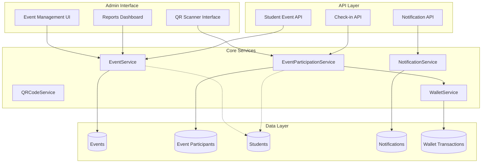

# Design Document

## Overview

The Event Management System provides a comprehensive platform for campus-wide event creation, management, and student participation. The system integrates with existing infrastructure including the club management system, student wallet system, and notification system to deliver a seamless event experience.

**Architecture Pattern**: Service-oriented architecture with clear separation between admin interface (Laravel + Vue 3 + InertiaJS) and student API endpoints.

**Key Integrations**: 
- Existing wallet system for gold rewards
- Existing notification system for event communications
- Existing club system for organizational context
- QR code generation and scanning for attendance verification

## Architecture

### System Components



### Data Flow

1. **Event Creation**: Admin creates event → EventService validates and stores → QR code generated → Notifications sent
2. **Student Registration**: Student API call → EventParticipationService validates → Registration recorded → Confirmation sent
3. **Check-in Process**: QR scan → Student verification → Attendance recorded → Status updated
4. **Reward Distribution**: Event completion → WalletService awards gold → Transaction recorded → Notification sent

## Components and Interfaces

### Database Schema

#### Events Table
```sql
CREATE TABLE events (
    id BIGINT UNSIGNED PRIMARY KEY AUTO_INCREMENT,
    campus_id BIGINT UNSIGNED NOT NULL,
    title VARCHAR(255) NOT NULL,
    description TEXT,
    start_time DATETIME NOT NULL,
    end_time DATETIME NOT NULL,
    location VARCHAR(255) NOT NULL,
    gold_reward_amount DECIMAL(10,2) NOT NULL DEFAULT 0,
    max_participants INT UNSIGNED NULL,
    qr_code VARCHAR(255) UNIQUE NOT NULL,
    organizer_type ENUM('school') NOT NULL DEFAULT 'school',
    organizer_id BIGINT UNSIGNED NOT NULL, -- campus_id for school events
    status ENUM('draft', 'published', 'cancelled', 'completed') NOT NULL DEFAULT 'draft',
    published_at TIMESTAMP NULL,
    cancelled_at TIMESTAMP NULL,
    completed_at TIMESTAMP NULL,
    created_by_user_id BIGINT UNSIGNED NOT NULL,
    created_at TIMESTAMP DEFAULT CURRENT_TIMESTAMP,
    updated_at TIMESTAMP DEFAULT CURRENT_TIMESTAMP ON UPDATE CURRENT_TIMESTAMP,
    
    FOREIGN KEY (campus_id) REFERENCES campuses(id),
    FOREIGN KEY (created_by_user_id) REFERENCES users(id),
    INDEX idx_campus_status (campus_id, status),
    INDEX idx_start_time (start_time),
    INDEX idx_qr_code (qr_code)
);
```

#### Event Participants Table
```sql
CREATE TABLE event_participants (
    id BIGINT UNSIGNED PRIMARY KEY AUTO_INCREMENT,
    event_id BIGINT UNSIGNED NOT NULL,
    student_id BIGINT UNSIGNED NOT NULL,
    status ENUM('registered', 'checked_in', 'completed', 'cancelled') NOT NULL DEFAULT 'registered',
    registered_at TIMESTAMP DEFAULT CURRENT_TIMESTAMP,
    checkin_time TIMESTAMP NULL,
    checkin_device_info JSON NULL,
    checkin_staff_id BIGINT UNSIGNED NULL,
    gold_awarded BOOLEAN NOT NULL DEFAULT FALSE,
    awarded_at TIMESTAMP NULL,
    created_at TIMESTAMP DEFAULT CURRENT_TIMESTAMP,
    updated_at TIMESTAMP DEFAULT CURRENT_TIMESTAMP ON UPDATE CURRENT_TIMESTAMP,
    
    FOREIGN KEY (event_id) REFERENCES events(id) ON DELETE CASCADE,
    FOREIGN KEY (student_id) REFERENCES students(id) ON DELETE CASCADE,
    FOREIGN KEY (checkin_staff_id) REFERENCES users(id),
    UNIQUE KEY unique_event_student (event_id, student_id),
    INDEX idx_student_status (student_id, status),
    INDEX idx_event_status (event_id, status)
);
```

### Service Layer Architecture

#### EventService
```php
class EventService
{
    public function createEvent(array $data, User $creator): Event
    public function updateEvent(Event $event, array $data): Event
    public function publishEvent(Event $event): Event
    public function cancelEvent(Event $event, string $reason = null): Event
    public function completeEvent(Event $event): Event
    public function generateQRCode(Event $event): string
    public function getEventsForCampus(int $campusId, array $filters = []): Collection
    public function getEventStatistics(Event $event): array
}
```

#### EventParticipationService
```php
class EventParticipationService
{
    public function registerStudent(Event $event, Student $student): EventParticipant
    public function unregisterStudent(Event $event, Student $student): bool
    public function checkInStudent(Event $event, Student $student, User $staff, array $deviceInfo = []): EventParticipant
    public function completeParticipation(EventParticipant $participant): EventParticipant
    public function awardGoldReward(EventParticipant $participant): bool
    public function getStudentParticipations(Student $student, array $filters = []): Collection
    public function getEventParticipants(Event $event, array $filters = []): Collection
}
```

#### QRCodeService
```php
class QRCodeService
{
    public function generateEventQRCode(Event $event): string
    public function validateQRCode(string $qrCode): ?Event
    public function generateQRCodeImage(string $qrCode): string
}
```

### API Endpoints

#### Student Portal API
```php
// Event Discovery
GET /api/v1/events
GET /api/v1/events/{id}

// Event Registration
POST /api/v1/events/{id}/register
DELETE /api/v1/events/{id}/register

// Student Participations
GET /api/v1/my-events
GET /api/v1/my-events/{id}
```

#### Admin Check-in API
```php
// QR Code Scanning
POST /api/v1/events/{id}/checkin
GET /api/v1/events/{id}/participants
```

### Frontend Components

#### Admin Interface (Vue 3 + InertiaJS)
```
EventManagement/
├── EventList.vue          # Event listing with filters
├── EventForm.vue          # Create/edit event form
├── EventDetails.vue       # Event details and statistics
├── QRScanner.vue          # QR code scanning interface
├── ParticipantList.vue    # Event participants management
└── EventReports.vue       # Analytics and reporting
```

#### Composables
```typescript
// useEvents.ts - Event management logic
// useQRScanner.ts - QR code scanning functionality
// useEventParticipants.ts - Participant management
// useEventReports.ts - Analytics and reporting
```

## Data Models

### Event Model
```php
class Event extends Model
{
    protected $fillable = [
        'campus_id', 'title', 'description', 'start_time', 'end_time',
        'location', 'gold_reward_amount', 'max_participants', 'qr_code',
        'organizer_type', 'organizer_id', 'status', 'created_by_user_id'
    ];

    protected $casts = [
        'start_time' => 'datetime',
        'end_time' => 'datetime',
        'published_at' => 'datetime',
        'cancelled_at' => 'datetime',
        'completed_at' => 'datetime',
        'gold_reward_amount' => 'decimal:2'
    ];

    // Relationships
    public function campus(): BelongsTo
    public function creator(): BelongsTo
    public function participants(): HasMany
    public function activeParticipants(): HasMany
    
    // Status Methods
    public function isPublished(): bool
    public function isCancelled(): bool
    public function isCompleted(): bool
    public function canRegister(): bool
    
    // Participant Methods
    public function getRegisteredCount(): int
    public function getCheckedInCount(): int
    public function getCompletedCount(): int
    public function hasReachedCapacity(): bool
}
```

### EventParticipant Model
```php
class EventParticipant extends Model
{
    protected $fillable = [
        'event_id', 'student_id', 'status', 'checkin_time',
        'checkin_device_info', 'checkin_staff_id', 'gold_awarded', 'awarded_at'
    ];

    protected $casts = [
        'registered_at' => 'datetime',
        'checkin_time' => 'datetime',
        'awarded_at' => 'datetime',
        'checkin_device_info' => 'array',
        'gold_awarded' => 'boolean'
    ];

    // Relationships
    public function event(): BelongsTo
    public function student(): BelongsTo
    public function checkinStaff(): BelongsTo
    
    // Status Methods
    public function isRegistered(): bool
    public function isCheckedIn(): bool
    public function isCompleted(): bool
    public function isCancelled(): bool
}
```

## Error Handling

### Validation Rules
- Event times must be in the future and start_time < end_time
- QR codes must be unique across all events
- Students cannot register for events at capacity
- Students cannot register for the same event multiple times
- Check-in requires valid event and student registration

### Exception Handling
```php
class EventException extends Exception {}
class EventCapacityException extends EventException {}
class EventRegistrationException extends EventException {}
class QRCodeException extends Exception {}
```

### API Error Responses
```json
{
    "success": false,
    "message": "Error description",
    "errors": {
        "field": ["Validation error message"]
    },
    "code": "ERROR_CODE"
}
```

## Testing Strategy

### Unit Tests
- EventService methods for CRUD operations
- EventParticipationService for registration and check-in logic
- QRCodeService for code generation and validation
- Model methods and relationships
- Validation rules and business logic

### Feature Tests
- Event creation and management workflows
- Student registration and participation flows
- QR code scanning and check-in processes
- Gold reward distribution
- Notification sending
- API endpoint functionality

### Integration Tests
- Wallet service integration for gold rewards
- Notification service integration
- Database transaction integrity
- QR code generation and scanning end-to-end

### Browser Tests
- Admin event management interface
- QR scanner functionality
- Event listing and filtering
- Participant management workflows

## Security Considerations

### Authentication & Authorization
- Admin interface requires proper user authentication
- API endpoints require valid student tokens
- QR scanning requires staff-level permissions
- Event management requires campus-specific permissions

### Data Protection
- Input validation and sanitization
- SQL injection prevention through Eloquent ORM
- XSS protection in frontend components
- Rate limiting on API endpoints

### QR Code Security
- Unique, non-guessable QR codes
- Time-based validation for check-ins
- Device fingerprinting for audit trails
- Prevention of replay attacks

## Performance Considerations

### Database Optimization
- Proper indexing on frequently queried fields
- Efficient queries with eager loading
- Pagination for large datasets
- Database connection pooling

### Caching Strategy
- Event data caching for public API
- Participant count caching
- QR code validation caching
- Cache invalidation on updates

### API Performance
- Response pagination and filtering
- Efficient JSON serialization
- Database query optimization
- Rate limiting and throttling

## Monitoring and Logging

### Event Logging
- Event creation, updates, and status changes
- Student registration and check-in activities
- Gold reward distributions
- Failed operations and errors

### Metrics Tracking
- Event participation rates
- Check-in success rates
- Gold reward distribution amounts
- API response times and error rates

### Audit Trail
- All administrative actions
- Student participation history
- Gold reward transactions
- System access and authentication events
