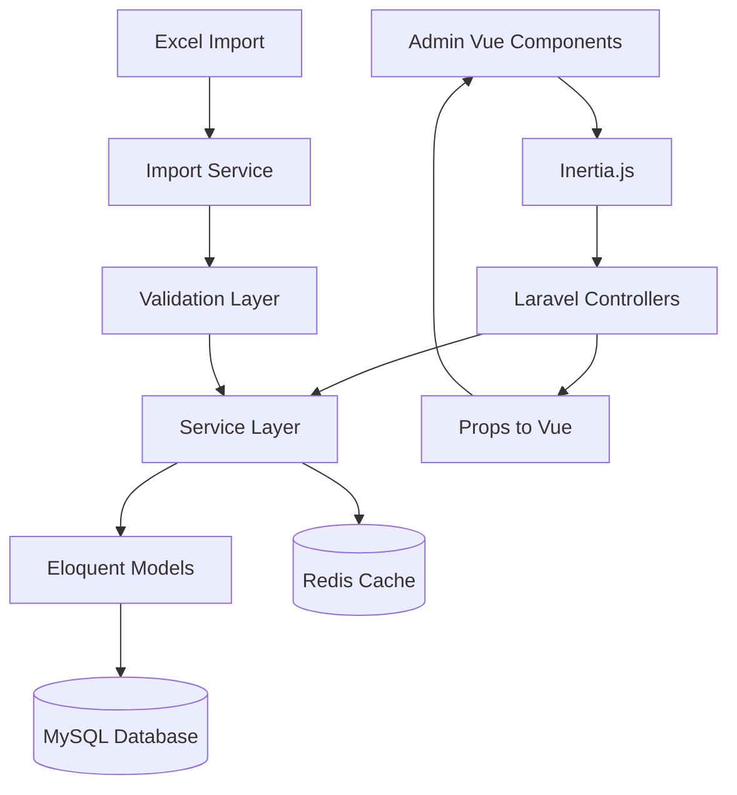
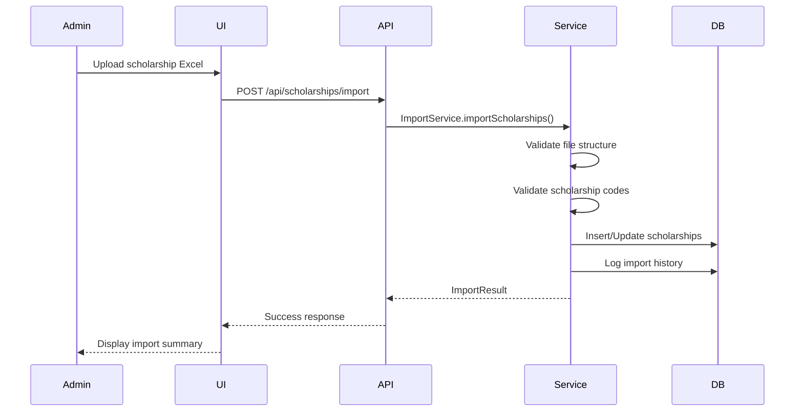
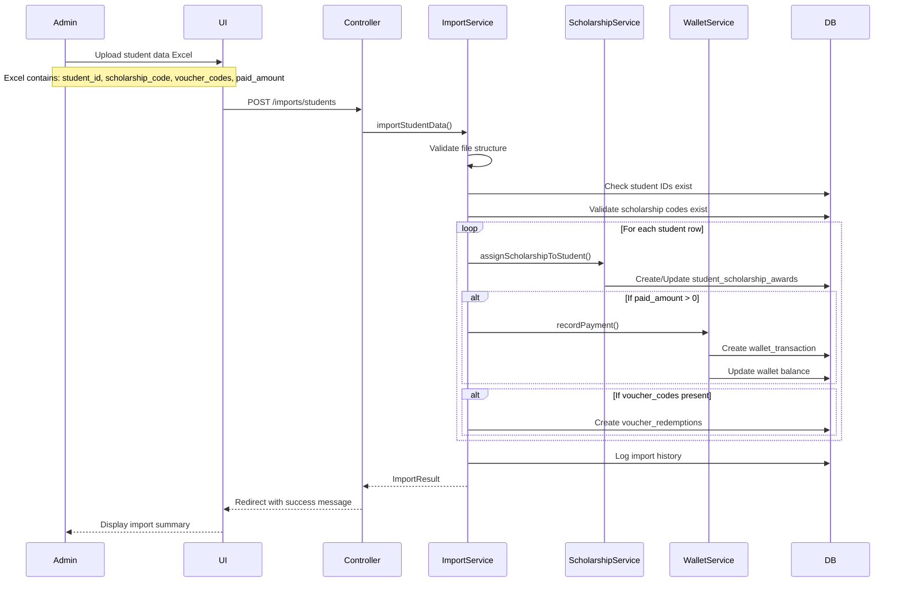
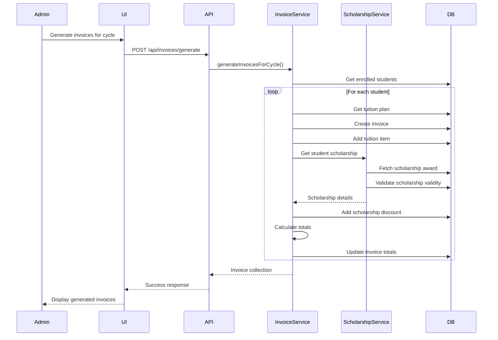
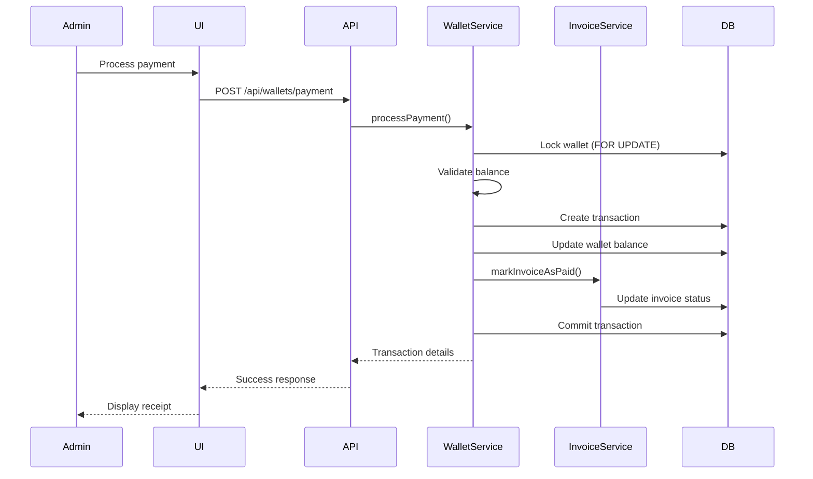

# Design Document

## Overview

The Fee Management System is a comprehensive billing and payment solution for managing student tuition, scholarships, invoices, and payments. The system is built on Laravel 12 with a Vue.js 3 frontend, following a modular architecture that separates concerns between scholarship management, billing cycles, invoice generation, and payment processing.

### Key Design Principles

1. **Data Integrity**: All financial transactions are atomic and maintain referential integrity
2. **Audit Trail**: Complete logging of all financial operations for compliance
3. **Flexibility**: Support for multiple fee types, discount mechanisms, and payment terms
4. **Scalability**: Efficient handling of bulk operations through Excel imports
5. **Admin-First**: Initial phase focuses on administrative interface only

## Architecture

### System Architecture



### Technology Stack

- **Backend**: Laravel 12, PHP 8.4+
- **Frontend**: Vue.js 3 with TypeScript, Reka-UI, TailwindCSS
- **Bridge**: Inertia.js (server-side rendering with client-side navigation)
- **Database**: MySQL 8.0
- **Cache**: Redis
- **Build**: Vite with HMR


## Database Schema

### Core Tables

#### 1. Scholarship Definitions (`scholarship_definitions`)

Stores master scholarship information with codes, amounts, and validity periods.

```sql
CREATE TABLE scholarship_definitions (
    id BIGINT UNSIGNED PRIMARY KEY AUTO_INCREMENT,
    code VARCHAR(50) UNIQUE NOT NULL,
    name VARCHAR(255) NOT NULL,
    description TEXT,
    type ENUM('percentage', 'fixed_amount') NOT NULL,
    amount DECIMAL(15, 2) NOT NULL,
    valid_from DATE NOT NULL,
    valid_until DATE NOT NULL,
    is_active BOOLEAN DEFAULT TRUE,
    created_at TIMESTAMP,
    updated_at TIMESTAMP,
    INDEX idx_code (code),
    INDEX idx_validity (valid_from, valid_until),
    INDEX idx_active (is_active)
);
```

#### 2. Student Scholarship Awards (`student_scholarship_awards`)

Links students to scholarship codes for discount application.

```sql
CREATE TABLE student_scholarship_awards (
    id BIGINT UNSIGNED PRIMARY KEY AUTO_INCREMENT,
    student_id BIGINT UNSIGNED NOT NULL,
    scholarship_code VARCHAR(50) NOT NULL,
    awarded_at DATE NOT NULL,
    notes TEXT,
    created_at TIMESTAMP,
    updated_at TIMESTAMP,
    FOREIGN KEY (student_id) REFERENCES students(id) ON DELETE CASCADE,
    FOREIGN KEY (scholarship_code) REFERENCES scholarship_definitions(code) ON UPDATE CASCADE,
    UNIQUE KEY unique_student_scholarship (student_id),
    INDEX idx_student (student_id),
    INDEX idx_scholarship_code (scholarship_code)
);
```


#### 3. Tuition Plans (`tuition_plans`)

Defines tuition fees for curriculum versions and intake periods.

```sql
CREATE TABLE tuition_plans (
    id BIGINT UNSIGNED PRIMARY KEY AUTO_INCREMENT,
    curriculum_version_id BIGINT UNSIGNED NOT NULL,
    intake_semester_id BIGINT UNSIGNED NOT NULL,
    total_amount DECIMAL(15, 2) NOT NULL,
    currency VARCHAR(3) DEFAULT 'VND',
    is_active BOOLEAN DEFAULT TRUE,
    created_at TIMESTAMP,
    updated_at TIMESTAMP,
    FOREIGN KEY (curriculum_version_id) REFERENCES curriculum_versions(id) ON DELETE CASCADE,
    FOREIGN KEY (intake_semester_id) REFERENCES semesters(id) ON DELETE CASCADE,
    UNIQUE KEY unique_curriculum_intake (curriculum_version_id, intake_semester_id),
    INDEX idx_curriculum (curriculum_version_id),
    INDEX idx_intake (intake_semester_id)
);
```

#### 4. Tuition Plan Terms (`tuition_plan_terms`)

Breaks down tuition into semester-based payment terms.

```sql
CREATE TABLE tuition_plan_terms (
    id BIGINT UNSIGNED PRIMARY KEY AUTO_INCREMENT,
    tuition_plan_id BIGINT UNSIGNED NOT NULL,
    semester_id BIGINT UNSIGNED NOT NULL,
    term_number INT NOT NULL,
    amount DECIMAL(15, 2) NOT NULL DEFAULT 0,
    due_date DATE,
    created_at TIMESTAMP,
    updated_at TIMESTAMP,
    FOREIGN KEY (tuition_plan_id) REFERENCES tuition_plans(id) ON DELETE CASCADE,
    FOREIGN KEY (semester_id) REFERENCES semesters(id) ON DELETE CASCADE,
    UNIQUE KEY unique_plan_term (tuition_plan_id, term_number),
    INDEX idx_tuition_plan (tuition_plan_id),
    INDEX idx_semester (semester_id)
);
```


#### 5. Billing Cycles (`billing_cycles`)

Manages billing periods aligned with academic semesters.

```sql
CREATE TABLE billing_cycles (
    id BIGINT UNSIGNED PRIMARY KEY AUTO_INCREMENT,
    semester_id BIGINT UNSIGNED NOT NULL,
    name VARCHAR(255) NOT NULL,
    start_date DATE NOT NULL,
    end_date DATE NOT NULL,
    due_date DATE NOT NULL,
    status ENUM('draft', 'active', 'closed') DEFAULT 'draft',
    created_at TIMESTAMP,
    updated_at TIMESTAMP,
    FOREIGN KEY (semester_id) REFERENCES semesters(id) ON DELETE CASCADE,
    INDEX idx_semester (semester_id),
    INDEX idx_status (status),
    INDEX idx_dates (start_date, end_date)
);
```

#### 6. Student Invoices (`student_invoices`)

Individual invoices for students per billing cycle.

```sql
CREATE TABLE student_invoices (
    id BIGINT UNSIGNED PRIMARY KEY AUTO_INCREMENT,
    invoice_number VARCHAR(50) UNIQUE NOT NULL,
    student_id BIGINT UNSIGNED NOT NULL,
    billing_cycle_id BIGINT UNSIGNED NOT NULL,
    semester_id BIGINT UNSIGNED NOT NULL,
    subtotal DECIMAL(15, 2) NOT NULL DEFAULT 0,
    discount_total DECIMAL(15, 2) NOT NULL DEFAULT 0,
    total_amount DECIMAL(15, 2) NOT NULL DEFAULT 0,
    paid_amount DECIMAL(15, 2) NOT NULL DEFAULT 0,
    status ENUM('draft', 'pending', 'paid', 'overdue', 'cancelled') DEFAULT 'draft',
    due_date DATE NOT NULL,
    paid_at TIMESTAMP NULL,
    created_at TIMESTAMP,
    updated_at TIMESTAMP,
    FOREIGN KEY (student_id) REFERENCES students(id) ON DELETE CASCADE,
    FOREIGN KEY (billing_cycle_id) REFERENCES billing_cycles(id) ON DELETE CASCADE,
    FOREIGN KEY (semester_id) REFERENCES semesters(id) ON DELETE CASCADE,
    INDEX idx_student (student_id),
    INDEX idx_billing_cycle (billing_cycle_id),
    INDEX idx_status (status),
    INDEX idx_invoice_number (invoice_number)
);
```


#### 7. Invoice Items (`invoice_items`)

Line items for each invoice (tuition, fees, etc.).

```sql
CREATE TABLE invoice_items (
    id BIGINT UNSIGNED PRIMARY KEY AUTO_INCREMENT,
    invoice_id BIGINT UNSIGNED NOT NULL,
    item_type ENUM('tuition', 'egc', 'retake', 'miscellaneous') NOT NULL,
    description VARCHAR(255) NOT NULL,
    quantity INT NOT NULL DEFAULT 1,
    unit_price DECIMAL(15, 2) NOT NULL,
    total_price DECIMAL(15, 2) NOT NULL,
    reference_id BIGINT UNSIGNED NULL,
    reference_type VARCHAR(100) NULL,
    created_at TIMESTAMP,
    updated_at TIMESTAMP,
    FOREIGN KEY (invoice_id) REFERENCES student_invoices(id) ON DELETE CASCADE,
    INDEX idx_invoice (invoice_id),
    INDEX idx_type (item_type)
);
```

#### 8. Invoice Discounts (`invoice_discounts`)

Tracks all discounts applied to invoices.

```sql
CREATE TABLE invoice_discounts (
    id BIGINT UNSIGNED PRIMARY KEY AUTO_INCREMENT,
    invoice_id BIGINT UNSIGNED NOT NULL,
    discount_type ENUM('scholarship', 'voucher') NOT NULL,
    discount_source VARCHAR(100) NOT NULL,
    description VARCHAR(255) NOT NULL,
    amount DECIMAL(15, 2) NOT NULL,
    reference_id BIGINT UNSIGNED NULL,
    created_at TIMESTAMP,
    updated_at TIMESTAMP,
    FOREIGN KEY (invoice_id) REFERENCES student_invoices(id) ON DELETE CASCADE,
    INDEX idx_invoice (invoice_id),
    INDEX idx_type (discount_type)
);
```


#### 9. Student Cash Wallets (`student_cash_wallets`)

VND wallet for each student.

```sql
CREATE TABLE student_cash_wallets (
    id BIGINT UNSIGNED PRIMARY KEY AUTO_INCREMENT,
    student_id BIGINT UNSIGNED NOT NULL,
    balance DECIMAL(15, 2) NOT NULL DEFAULT 0,
    currency VARCHAR(3) DEFAULT 'VND',
    created_at TIMESTAMP,
    updated_at TIMESTAMP,
    FOREIGN KEY (student_id) REFERENCES students(id) ON DELETE CASCADE,
    UNIQUE KEY unique_student_wallet (student_id),
    INDEX idx_student (student_id)
);
```

#### 10. Wallet Transactions (`wallet_transactions`)

All wallet activity with audit trail.

```sql
CREATE TABLE wallet_transactions (
    id BIGINT UNSIGNED PRIMARY KEY AUTO_INCREMENT,
    wallet_id BIGINT UNSIGNED NOT NULL,
    transaction_type ENUM('deposit', 'payment', 'refund', 'adjustment') NOT NULL,
    amount DECIMAL(15, 2) NOT NULL,
    balance_before DECIMAL(15, 2) NOT NULL,
    balance_after DECIMAL(15, 2) NOT NULL,
    description TEXT,
    reference_type VARCHAR(100) NULL,
    reference_id BIGINT UNSIGNED NULL,
    created_by BIGINT UNSIGNED NULL,
    created_at TIMESTAMP,
    updated_at TIMESTAMP,
    FOREIGN KEY (wallet_id) REFERENCES student_cash_wallets(id) ON DELETE CASCADE,
    INDEX idx_wallet (wallet_id),
    INDEX idx_type (transaction_type),
    INDEX idx_reference (reference_type, reference_id),
    INDEX idx_created_at (created_at)
);
```


#### 11. Voucher Definitions (`voucher_definitions`)

Master voucher configurations.

```sql
CREATE TABLE voucher_definitions (
    id BIGINT UNSIGNED PRIMARY KEY AUTO_INCREMENT,
    code VARCHAR(50) UNIQUE NOT NULL,
    name VARCHAR(255) NOT NULL,
    description TEXT,
    voucher_type ENUM('informational', 'discount') NOT NULL,
    discount_type ENUM('percentage', 'fixed_amount') NULL,
    discount_value DECIMAL(15, 2) NULL,
    valid_from DATE NOT NULL,
    valid_until DATE NOT NULL,
    is_active BOOLEAN DEFAULT TRUE,
    created_at TIMESTAMP,
    updated_at TIMESTAMP,
    INDEX idx_code (code),
    INDEX idx_type (voucher_type),
    INDEX idx_validity (valid_from, valid_until)
);
```

#### 12. Voucher Redemptions (`voucher_redemptions`)

Tracks student voucher usage.

```sql
CREATE TABLE voucher_redemptions (
    id BIGINT UNSIGNED PRIMARY KEY AUTO_INCREMENT,
    voucher_id BIGINT UNSIGNED NOT NULL,
    student_id BIGINT UNSIGNED NOT NULL,
    invoice_id BIGINT UNSIGNED NULL,
    redeemed_at TIMESTAMP NOT NULL,
    created_at TIMESTAMP,
    updated_at TIMESTAMP,
    FOREIGN KEY (voucher_id) REFERENCES voucher_definitions(id) ON DELETE CASCADE,
    FOREIGN KEY (student_id) REFERENCES students(id) ON DELETE CASCADE,
    FOREIGN KEY (invoice_id) REFERENCES student_invoices(id) ON DELETE SET NULL,
    INDEX idx_voucher (voucher_id),
    INDEX idx_student (student_id),
    INDEX idx_invoice (invoice_id)
);
```

## Components and Interfaces

### Backend Components

#### 1. Models

**ScholarshipDefinition Model**
- Manages scholarship master data
- Validates code uniqueness
- Checks validity periods
- Relationships: `hasMany(StudentScholarshipAward)`

**StudentScholarshipAward Model**
- Links students to scholarships
- Validates scholarship code exists
- Relationships: `belongsTo(Student)`, `belongsTo(ScholarshipDefinition, 'scholarship_code', 'code')`

**TuitionPlan Model**
- Manages tuition configurations
- Validates curriculum/intake uniqueness
- Relationships: `belongsTo(CurriculumVersion)`, `belongsTo(Semester, 'intake_semester_id')`, `hasMany(TuitionPlanTerm)`

**TuitionPlanTerm Model**
- Individual payment terms
- Supports zero amounts
- Relationships: `belongsTo(TuitionPlan)`, `belongsTo(Semester)`


**BillingCycle Model**
- Manages billing periods
- Status transitions (draft → active → closed)
- Relationships: `belongsTo(Semester)`, `hasMany(StudentInvoice)`

**StudentInvoice Model**
- Core invoice entity
- Auto-generates invoice numbers
- Calculates totals from items and discounts
- Relationships: `belongsTo(Student)`, `belongsTo(BillingCycle)`, `hasMany(InvoiceItem)`, `hasMany(InvoiceDiscount)`

**InvoiceItem Model**
- Line items for charges
- Polymorphic references for source tracking
- Relationships: `belongsTo(StudentInvoice)`

**InvoiceDiscount Model**
- Discount tracking
- Links to scholarship or voucher sources
- Relationships: `belongsTo(StudentInvoice)`

**StudentCashWallet Model**
- Student payment wallet
- Balance management with locking
- Relationships: `belongsTo(Student)`, `hasMany(WalletTransaction)`

**WalletTransaction Model**
- Immutable transaction log
- Records balance snapshots
- Relationships: `belongsTo(StudentCashWallet)`

**VoucherDefinition Model**
- Voucher master data
- Supports informational and discount types
- Relationships: `hasMany(VoucherRedemption)`

**VoucherRedemption Model**
- Tracks voucher usage
- Relationships: `belongsTo(VoucherDefinition)`, `belongsTo(Student)`, `belongsTo(StudentInvoice)`


#### 2. Services

**ScholarshipService**
- `createScholarship(array $data): ScholarshipDefinition`
- `updateScholarship(int $id, array $data): ScholarshipDefinition`
- `deleteScholarship(int $id): bool`
- `assignScholarshipToStudent(int $studentId, string $code): StudentScholarshipAward`
- `removeScholarshipFromStudent(int $studentId): bool`
- `getActiveScholarships(): Collection`
- `validateScholarshipCode(string $code): bool`
- `isScholarshipValid(string $code, Carbon $date): bool`

**ImportService**
- `importScholarships(UploadedFile $file, int $userId): ImportResult`
- `importStudentData(UploadedFile $file, int $userId): ImportResult`
- `validateScholarshipFile(array $data): ValidationResult`
- `validateStudentFile(array $data): ValidationResult`
- `processScholarshipImport(array $rows): ImportResult`
- `processStudentImport(array $rows): ImportResult`
- `logImport(string $type, ImportResult $result): ImportHistory`

**Excel File Structures**

*Scholarship Import File (scholarships.xlsx)*
| Column | Type | Required | Description |
|--------|------|----------|-------------|
| code | string | Yes | Unique scholarship code (e.g., "MERIT2024") |
| name | string | Yes | Scholarship name |
| type | enum | Yes | "percentage" or "fixed_amount" |
| amount | decimal | Yes | Discount amount or percentage value |
| valid_from | date | Yes | Start date (YYYY-MM-DD) |
| valid_until | date | Yes | End date (YYYY-MM-DD) |

*Student Import File (students.xlsx)*
| Column | Type | Required | Description |
|--------|------|----------|-------------|
| student_id | integer | Yes | Existing student ID in system |
| scholarship_code | string | No | Code from scholarship definitions |
| voucher_codes | string | No | Comma-separated voucher codes |
| paid_amount | decimal | No | Amount already paid (for wallet) |
| payment_date | date | No | Date of payment (YYYY-MM-DD) |
| notes | text | No | Additional notes |

**TuitionPlanService**
- `createTuitionPlan(array $data): TuitionPlan`
- `updateTuitionPlan(int $id, array $data): TuitionPlan`
- `deleteTuitionPlan(int $id): bool`
- `addTerm(int $planId, array $termData): TuitionPlanTerm`
- `updateTerm(int $termId, array $data): TuitionPlanTerm`
- `getTuitionForStudent(int $studentId, int $semesterId): ?TuitionPlan`

**BillingCycleService**
- `createBillingCycle(array $data): BillingCycle`
- `activateBillingCycle(int $id): BillingCycle`
- `closeBillingCycle(int $id): BillingCycle`
- `validateCycleDates(Carbon $start, Carbon $end): bool`


**InvoiceService**
- `generateInvoicesForCycle(int $cycleId): Collection`
- `generateInvoiceForStudent(int $studentId, int $cycleId): StudentInvoice`
- `addInvoiceItem(int $invoiceId, array $itemData): InvoiceItem`
- `applyScholarshipDiscount(StudentInvoice $invoice): void`
- `applyVoucherDiscount(int $invoiceId, int $voucherId): InvoiceDiscount`
- `calculateInvoiceTotal(StudentInvoice $invoice): void`
- `markInvoiceAsPaid(int $invoiceId): StudentInvoice`
- `generateInvoiceNumber(): string`

**WalletService**
- `createWallet(int $studentId): StudentCashWallet`
- `getBalance(int $studentId): float`
- `deposit(int $walletId, float $amount, string $description): WalletTransaction`
- `withdraw(int $walletId, float $amount, string $description): WalletTransaction`
- `processPayment(int $invoiceId, int $walletId): WalletTransaction`
- `validateSufficientBalance(int $walletId, float $amount): bool`
- `getTransactionHistory(int $walletId): Collection`

**VoucherService**
- `createVoucher(array $data): VoucherDefinition`
- `redeemVoucher(int $studentId, string $code, int $invoiceId): VoucherRedemption`
- `validateVoucher(string $code, int $studentId): bool`
- `getStudentVouchers(int $studentId): Collection`

**ReportService**
- `getFinancialSummary(array $filters): array`
- `getOutstandingInvoices(array $filters): Collection`
- `getScholarshipReport(array $filters): array`
- `getVoucherUsageReport(array $filters): array`
- `exportToExcel(string $reportType, array $filters): string`


#### 3. Controllers (Inertia-based)

**ScholarshipController**
- `index()` - Render 'Scholarships/Index' with scholarships data as props
- `create()` - Render 'Scholarships/Create' form
- `store(ScholarshipRequest $request)` - Create scholarship, redirect back
- `show($id)` - Render 'Scholarships/Show' with scholarship details as props
- `edit($id)` - Render 'Scholarships/Edit' with scholarship data as props
- `update(ScholarshipRequest $request, $id)` - Update scholarship, redirect back
- `destroy($id)` - Delete scholarship, redirect back
- `assignToStudent(AssignScholarshipRequest $request)` - Assign to student, redirect back
- `removeFromStudent($studentId)` - Remove assignment, redirect back

**ImportController**
- `scholarships()` - Render 'Imports/Scholarships' with import history as props
- `importScholarships(ImportRequest $request)` - Process import, redirect with results
- `students()` - Render 'Imports/Students' with import history as props
- `importStudents(ImportRequest $request)` - Process import, redirect with results
- `downloadTemplate($type)` - Download Excel template file

**TuitionPlanController**
- `index()` - Render 'TuitionPlans/Index' with plans as props
- `create()` - Render 'TuitionPlans/Create' with curriculum versions and semesters as props
- `store(TuitionPlanRequest $request)` - Create plan, redirect back
- `show($id)` - Render 'TuitionPlans/Show' with plan and terms as props
- `edit($id)` - Render 'TuitionPlans/Edit' with plan data as props
- `update(TuitionPlanRequest $request, $id)` - Update plan, redirect back
- `destroy($id)` - Delete plan, redirect back

**BillingCycleController**
- `index()` - Render 'BillingCycles/Index' with cycles as props
- `create()` - Render 'BillingCycles/Create' with semesters as props
- `store(BillingCycleRequest $request)` - Create cycle, redirect back
- `show($id)` - Render 'BillingCycles/Show' with cycle and invoices as props
- `activate($id)` - Activate cycle, redirect back
- `close($id)` - Close cycle, redirect back

**InvoiceController**
- `index()` - Render 'Invoices/Index' with filtered invoices as props
- `show($id)` - Render 'Invoices/Show' with invoice, items, and discounts as props
- `generate(GenerateInvoiceRequest $request)` - Generate invoices, redirect back
- `addItem(InvoiceItemRequest $request, $invoiceId)` - Add item, redirect back
- `applyDiscount(DiscountRequest $request, $invoiceId)` - Apply discount, redirect back


**WalletController**
- `show($studentId)` - Render 'Wallets/Show' with wallet and transactions as props
- `deposit(DepositRequest $request, $walletId)` - Add funds, redirect back
- `processPayment(PaymentRequest $request)` - Process invoice payment, redirect back

**VoucherController**
- `index()` - Render 'Vouchers/Index' with vouchers as props
- `create()` - Render 'Vouchers/Create' form
- `store(VoucherRequest $request)` - Create voucher, redirect back
- `show($id)` - Render 'Vouchers/Show' with voucher details as props
- `edit($id)` - Render 'Vouchers/Edit' with voucher data as props
- `update(VoucherRequest $request, $id)` - Update voucher, redirect back
- `destroy($id)` - Delete voucher, redirect back
- `redeem(RedeemVoucherRequest $request)` - Redeem voucher, redirect back

**ReportController**
- `dashboard()` - Render 'Reports/Dashboard' with metrics as props
- `financialSummary(Request $request)` - Render 'Reports/FinancialSummary' with data as props
- `outstandingInvoices(Request $request)` - Render 'Reports/OutstandingInvoices' with data as props
- `scholarshipReport(Request $request)` - Render 'Reports/Scholarships' with analytics as props
- `export(ExportRequest $request)` - Generate and download Excel/PDF file

#### 4. Form Requests

**ScholarshipRequest**
- Validates: code (unique), name, type, amount, valid_from, valid_until
- Rules: code format, amount > 0, valid date range

**ImportRequest**
- Validates: file (xlsx, max 10MB), import_type
- Custom validation for file structure

**TuitionPlanRequest**
- Validates: curriculum_version_id, intake_semester_id, total_amount
- Rules: unique combination, amount > 0

**BillingCycleRequest**
- Validates: semester_id, start_date, end_date, due_date
- Rules: no overlapping cycles, valid date sequence

**InvoiceItemRequest**
- Validates: item_type, description, quantity, unit_price
- Rules: quantity > 0, unit_price >= 0


### Frontend Components

#### 1. Pages (Inertia Components)

**Scholarship Management**
- `Scholarships/Index.vue` - Receives `scholarships` (paginated) as props
- `Scholarships/Create.vue` - Form for creating scholarship
- `Scholarships/Edit.vue` - Receives `scholarship` as props, form for editing
- `Scholarships/Show.vue` - Receives `scholarship` and `students` as props
- `Imports/Scholarships.vue` - Receives `importHistory` as props, Excel import interface

**Student Scholarship Assignment**
- `StudentScholarships/Index.vue` - Receives `assignments` as props
- `StudentScholarships/Assign.vue` - Receives `students` and `scholarships` as props

**Tuition Plans**
- `TuitionPlans/Index.vue` - Receives `plans` (paginated) as props
- `TuitionPlans/Create.vue` - Receives `curriculumVersions` and `semesters` as props
- `TuitionPlans/Edit.vue` - Receives `plan`, `curriculumVersions`, `semesters` as props
- `TuitionPlans/Show.vue` - Receives `plan` with `terms` as props

**Billing Cycles**
- `BillingCycles/Index.vue` - Receives `cycles` as props
- `BillingCycles/Create.vue` - Receives `semesters` as props
- `BillingCycles/Show.vue` - Receives `cycle` and `invoices` as props

**Invoices**
- `Invoices/Index.vue` - Receives `invoices` (paginated with filters) as props
- `Invoices/Show.vue` - Receives `invoice` with `items` and `discounts` as props
- `Invoices/Generate.vue` - Receives `billingCycles` as props

**Wallets**
- `Wallets/Show.vue` - Receives `wallet` and `transactions` as props

**Vouchers**
- `Vouchers/Index.vue` - Receives `vouchers` as props
- `Vouchers/Create.vue` - Form for creating voucher
- `Vouchers/Edit.vue` - Receives `voucher` as props
- `Vouchers/Show.vue` - Receives `voucher` and `redemptions` as props

**Reports**
- `Reports/Dashboard.vue` - Receives `metrics` as props
- `Reports/FinancialSummary.vue` - Receives `summary` data as props
- `Reports/OutstandingInvoices.vue` - Receives `invoices` as props
- `Reports/Scholarships.vue` - Receives `analytics` as props


#### 2. Reusable Components

**DataTable.vue**
- Standard table component with pagination, sorting, filtering
- Used across all list views

**ImportUploader.vue**
- File upload with validation
- Progress tracking
- Error display

**InvoiceItemsTable.vue**
- Display invoice line items
- Calculate subtotals

**DiscountsTable.vue**
- Display applied discounts
- Show discount sources

**TransactionHistory.vue**
- Display wallet transactions
- Running balance calculation

**DateRangePicker.vue**
- Select date ranges for reports

**ExportButton.vue**
- Export data to Excel/PDF

#### 3. Composables

**Note**: With Inertia.js, most data fetching is handled server-side and passed as props. Composables are primarily used for form submissions and client-side state management.

**useForm.ts** (from Inertia)
```typescript
import { useForm } from '@inertiajs/vue3'

// Example usage in a component
const form = useForm({
  code: '',
  name: '',
  type: 'fixed_amount',
  amount: 0,
  valid_from: '',
  valid_until: ''
})

const submit = () => {
  form.post('/scholarships', {
    onSuccess: () => form.reset(),
  })
}
```


**usePermissions.ts**
```typescript
import { computed } from 'vue'
import { usePage } from '@inertiajs/vue3'

export function usePermissions() {
  const page = usePage()
  const can = computed(() => page.props.auth?.permissions || {})
  
  const hasPermission = (permission: string) => {
    return can.value[permission] === true
  }
  
  return { can, hasPermission }
}
```

**Example Controller Passing Permissions**
```php
class ScholarshipController extends Controller
{
    public function index()
    {
        return Inertia::render('Scholarships/Index', [
            'scholarships' => ScholarshipDefinition::paginate(20),
            'can' => [
                'create_scholarship' => Auth::user()->can('scholarships.create'),
                'import_scholarship' => Auth::user()->can('scholarships.import'),
            ]
        ]);
    }
}
```

#### 4. TypeScript Interfaces

```typescript
interface ScholarshipDefinition {
  id: number
  code: string
  name: string
  description?: string
  type: 'percentage' | 'fixed_amount'
  amount: number
  valid_from: string
  valid_until: string
  is_active: boolean
  student_count?: number
}
```


```typescript
interface StudentScholarshipAward {
  id: number
  student_id: number
  scholarship_code: string
  awarded_at: string
  scholarship?: ScholarshipDefinition
  student?: Student
}

interface TuitionPlan {
  id: number
  curriculum_version_id: number
  intake_semester_id: number
  total_amount: number
  currency: string
  is_active: boolean
  terms?: TuitionPlanTerm[]
}

interface TuitionPlanTerm {
  id: number
  tuition_plan_id: number
  semester_id: number
  term_number: number
  amount: number
  due_date?: string
}

interface BillingCycle {
  id: number
  semester_id: number
  name: string
  start_date: string
  end_date: string
  due_date: string
  status: 'draft' | 'active' | 'closed'
  invoice_count?: number
}

interface StudentInvoice {
  id: number
  invoice_number: string
  student_id: number
  billing_cycle_id: number
  semester_id: number
  subtotal: number
  discount_total: number
  total_amount: number
  paid_amount: number
  status: 'draft' | 'pending' | 'paid' | 'overdue' | 'cancelled'
  due_date: string
  paid_at?: string
  items?: InvoiceItem[]
  discounts?: InvoiceDiscount[]
}
```


```typescript
interface InvoiceItem {
  id: number
  invoice_id: number
  item_type: 'tuition' | 'egc' | 'retake' | 'miscellaneous'
  description: string
  quantity: number
  unit_price: number
  total_price: number
}

interface InvoiceDiscount {
  id: number
  invoice_id: number
  discount_type: 'scholarship' | 'voucher'
  discount_source: string
  description: string
  amount: number
}

interface StudentCashWallet {
  id: number
  student_id: number
  balance: number
  currency: string
}

interface WalletTransaction {
  id: number
  wallet_id: number
  transaction_type: 'deposit' | 'payment' | 'refund' | 'adjustment'
  amount: number
  balance_before: number
  balance_after: number
  description?: string
  created_at: string
}

interface VoucherDefinition {
  id: number
  code: string
  name: string
  description?: string
  voucher_type: 'informational' | 'discount'
  discount_type?: 'percentage' | 'fixed_amount'
  discount_value?: number
  valid_from: string
  valid_until: string
  is_active: boolean
}
```


## Controller Examples with Inertia Props

### ScholarshipController Example

```php
class ScholarshipController extends Controller
{
    public function index()
    {
        return Inertia::render('Scholarships/Index', [
            'scholarships' => ScholarshipDefinition::query()
                ->with('studentCount')
                ->paginate(20),
            'filters' => request()->only(['search', 'status']),
            'can' => [
                'create' => Auth::user()->can('scholarships.create'),
                'import' => Auth::user()->can('scholarships.import'),
            ]
        ]);
    }

    public function create()
    {
        return Inertia::render('Scholarships/Create');
    }

    public function store(ScholarshipRequest $request)
    {
        $this->scholarshipService->createScholarship($request->validated());
        
        return redirect()->route('scholarships.index')
            ->with('success', 'Scholarship created successfully');
    }

    public function show(ScholarshipDefinition $scholarship)
    {
        return Inertia::render('Scholarships/Show', [
            'scholarship' => $scholarship->load('students'),
            'can' => [
                'edit' => Auth::user()->can('scholarships.update'),
                'delete' => Auth::user()->can('scholarships.delete'),
            ]
        ]);
    }

    public function edit(ScholarshipDefinition $scholarship)
    {
        return Inertia::render('Scholarships/Edit', [
            'scholarship' => $scholarship
        ]);
    }

    public function update(ScholarshipRequest $request, ScholarshipDefinition $scholarship)
    {
        $this->scholarshipService->updateScholarship($scholarship->id, $request->validated());
        
        return redirect()->route('scholarships.show', $scholarship)
            ->with('success', 'Scholarship updated successfully');
    }
}
```

### InvoiceController Example

```php
class InvoiceController extends Controller
{
    public function index(Request $request)
    {
        $invoices = StudentInvoice::query()
            ->with(['student', 'billingCycle'])
            ->when($request->status, fn($q, $status) => $q->where('status', $status))
            ->when($request->search, fn($q, $search) => 
                $q->whereHas('student', fn($q) => 
                    $q->where('name', 'like', "%{$search}%")
                )
            )
            ->paginate(20);

        return Inertia::render('Invoices/Index', [
            'invoices' => $invoices,
            'filters' => $request->only(['status', 'search']),
            'statuses' => ['draft', 'pending', 'paid', 'overdue', 'cancelled'],
        ]);
    }

    public function show(StudentInvoice $invoice)
    {
        return Inertia::render('Invoices/Show', [
            'invoice' => $invoice->load(['items', 'discounts', 'student']),
            'can' => [
                'add_item' => Auth::user()->can('invoices.update'),
                'apply_discount' => Auth::user()->can('invoices.update'),
            ]
        ]);
    }
}
```

### Vue Component Example

```vue
<script setup lang="ts">
import { Head, Link, useForm } from '@inertiajs/vue3'
import { ScholarshipDefinition, PaginatedResponse } from '@/types'

interface Props {
  scholarships: PaginatedResponse<ScholarshipDefinition>
  filters: { search?: string; status?: string }
  can: { create: boolean; import: boolean }
}

const props = defineProps<Props>()

const deleteScholarship = (id: number) => {
  if (confirm('Are you sure?')) {
    useForm({}).delete(`/scholarships/${id}`)
  }
}
</script>

<template>
  <Head title="Scholarships" />
  
  <div>
    <div class="flex justify-between mb-4">
      <h1>Scholarships</h1>
      <div class="flex gap-2">
        <Link v-if="can.import" href="/scholarships/import" class="btn">
          Import
        </Link>
        <Link v-if="can.create" href="/scholarships/create" class="btn-primary">
          Create Scholarship
        </Link>
      </div>
    </div>

    <DataTable :data="scholarships.data" :columns="columns" />
    
    <Pagination :links="scholarships.links" />
  </div>
</template>
```

## Data Flow

### Scholarship Management Flow



### Student Data Import Flow




### Invoice Generation Flow



### Payment Processing Flow




## Error Handling

### Validation Errors

**Scholarship Import Errors**
- Invalid file format → Return 422 with error details
- Duplicate scholarship codes → Skip or update based on user preference
- Invalid date formats → Log row error, continue processing
- Missing required fields → Log row error, skip row

**Student Import Errors**
- Student ID not found → Log error, skip row
- Scholarship code not found → Log warning, skip assignment
- Invalid data format → Log error, skip row

**Invoice Generation Errors**
- No tuition plan found → Log error, skip student
- Expired scholarship → Log warning, charge full amount
- Invalid billing cycle → Return 400 error

### Business Logic Errors

**Insufficient Balance**
- Check before payment processing
- Return clear error message
- Suggest deposit amount needed

**Duplicate Tuition Plan**
- Validate curriculum + intake uniqueness
- Return 409 Conflict with existing plan details

**Overlapping Billing Cycles**
- Validate date ranges before creation
- Return 409 Conflict with overlapping cycle

### System Errors

**Database Errors**
- Wrap in try-catch blocks
- Log full error details
- Return generic 500 error to user
- Rollback transactions

**File Processing Errors**
- Validate file size and type
- Handle corrupted files gracefully
- Clean up temporary files


## Testing Strategy

### Unit Tests

**Model Tests**
- Test relationships and scopes
- Test calculated attributes
- Test validation rules
- Coverage: 80%+

**Service Tests**
- Test business logic in isolation
- Mock external dependencies
- Test error conditions
- Coverage: 90%+

**Example Test Cases**
```php
// ScholarshipServiceTest.php
test('creates scholarship with valid data')
test('validates scholarship code uniqueness')
test('checks scholarship validity period')
test('assigns scholarship to student')
test('prevents assigning expired scholarship')

// InvoiceServiceTest.php
test('generates invoice with tuition items')
test('applies valid scholarship discount')
test('skips expired scholarship')
test('calculates invoice totals correctly')
test('generates unique invoice numbers')

// WalletServiceTest.php
test('processes payment with sufficient balance')
test('rejects payment with insufficient balance')
test('maintains transaction atomicity')
test('records balance snapshots correctly')
```

### Integration Tests

**API Tests**
- Test complete request/response cycles
- Test authentication and authorization
- Test validation errors
- Coverage: 70%+

**Example Test Cases**
```php
// ScholarshipControllerTest.php
test('admin can create scholarship')
test('admin can import scholarships from excel')
test('validates required fields')
test('returns paginated scholarship list')

// InvoiceControllerTest.php
test('generates invoices for billing cycle')
test('applies scholarships automatically')
test('returns invoice with items and discounts')
```


### Feature Tests

**End-to-End Workflows**
- Test complete business processes
- Use database transactions
- Test with realistic data

**Example Test Cases**
```php
// ScholarshipWorkflowTest.php
test('complete scholarship management workflow', function() {
    // 1. Import scholarships from Excel
    // 2. Verify scholarships created
    // 3. Import student data with scholarship codes
    // 4. Verify assignments created
    // 5. Generate invoices
    // 6. Verify scholarships applied to invoices
});

// BillingWorkflowTest.php
test('complete billing cycle workflow', function() {
    // 1. Create tuition plans
    // 2. Create billing cycle
    // 3. Generate invoices
    // 4. Verify invoice totals
    // 5. Process payments
    // 6. Verify invoice status updates
});
```

### Frontend Tests

**Component Tests**
- Test component rendering
- Test user interactions
- Test form validation
- Use Vitest + Vue Test Utils

**Example Test Cases**
```typescript
// ScholarshipForm.spec.ts
test('renders form fields correctly')
test('validates required fields')
test('submits form with valid data')
test('displays error messages')

// InvoiceDetail.spec.ts
test('displays invoice items')
test('displays discounts')
test('calculates totals correctly')
```


## Security Considerations

### Authentication & Authorization

**Permission System**
- Use existing Laravel permission system
- Define permissions in `config/permission.php`

**Required Permissions**
```php
'fee_management' => [
    'scholarships.view',
    'scholarships.create',
    'scholarships.update',
    'scholarships.delete',
    'scholarships.import',
    'scholarships.assign',
    
    'tuition_plans.view',
    'tuition_plans.create',
    'tuition_plans.update',
    'tuition_plans.delete',
    
    'billing_cycles.view',
    'billing_cycles.create',
    'billing_cycles.activate',
    'billing_cycles.close',
    
    'invoices.view',
    'invoices.generate',
    'invoices.update',
    
    'wallets.view',
    'wallets.deposit',
    'wallets.process_payment',
    
    'reports.view',
    'reports.export',
]
```

### Data Validation

**Input Sanitization**
- Sanitize all user inputs
- Use Laravel Form Requests
- Validate file uploads strictly

**SQL Injection Prevention**
- Use Eloquent ORM exclusively
- Use parameter binding for raw queries
- Never concatenate user input in queries

### File Upload Security

**Excel Import Security**
- Validate file extensions (xlsx only)
- Limit file size (10MB max)
- Scan for malicious content
- Store in secure temporary location
- Delete after processing


### Financial Data Protection

**Transaction Integrity**
- Use database transactions for all financial operations
- Implement row-level locking for wallet operations
- Maintain immutable transaction logs
- Never delete financial records (soft delete only)

**Audit Logging**
- Log all financial operations
- Record user, timestamp, and action
- Store before/after values for updates
- Retain logs indefinitely

### API Security

**Rate Limiting**
- Apply rate limits to import endpoints
- Limit bulk operations
- Prevent abuse

**CSRF Protection**
- Enable CSRF tokens for all state-changing operations
- Validate tokens on backend

## Performance Optimization

### Database Optimization

**Indexing Strategy**
- Index foreign keys
- Index frequently queried columns (status, dates, codes)
- Composite indexes for common query patterns
- Monitor slow queries

**Query Optimization**
- Use eager loading for relationships
- Implement pagination for large datasets
- Cache frequently accessed data (scholarship definitions)
- Use database transactions efficiently

### Caching Strategy

**Redis Caching**
```php
// Cache scholarship definitions (1 hour)
Cache::remember('scholarships.active', 3600, function() {
    return ScholarshipDefinition::where('is_active', true)->get();
});

// Cache tuition plans by curriculum (1 day)
Cache::remember("tuition_plan.{$curriculumId}.{$intakeId}", 86400, function() {
    return TuitionPlan::with('terms')->find($id);
});
```


### Bulk Operations

**Invoice Generation**
- Process in batches (100 students per batch)
- Use queue jobs for large cycles
- Provide progress feedback
- Handle failures gracefully

**Excel Import**
- Process in chunks (500 rows per chunk)
- Use queue jobs for large files
- Provide progress updates
- Collect and report errors

### Frontend Optimization

**Code Splitting**
- Lazy load routes
- Split vendor bundles
- Optimize component imports

**Data Loading**
- Implement virtual scrolling for large tables
- Use pagination effectively
- Debounce search inputs
- Cache API responses

## Deployment Considerations

### Database Migrations

**Migration Order**
1. Create scholarship_definitions table
2. Create student_scholarship_awards table
3. Create tuition_plans and tuition_plan_terms tables
4. Create billing_cycles table
5. Create student_invoices table
6. Create invoice_items and invoice_discounts tables
7. Create student_cash_wallets table
8. Create wallet_transactions table
9. Create voucher_definitions and voucher_redemptions tables

### Seeding

**Development Seeds**
- Sample scholarship definitions
- Sample tuition plans
- Test student assignments
- Sample invoices with various statuses

### Environment Configuration

**Required Environment Variables**
```env
# File Upload
MAX_UPLOAD_SIZE=10240  # 10MB in KB
ALLOWED_IMPORT_EXTENSIONS=xlsx

# Financial
DEFAULT_CURRENCY=VND
INVOICE_NUMBER_PREFIX=INV

# Cache
CACHE_DRIVER=redis
CACHE_TTL_SCHOLARSHIPS=3600
CACHE_TTL_TUITION_PLANS=86400
```


## Routes (Inertia-based)

### Scholarship Management

```
GET    /scholarships                        - List scholarships (renders Scholarships/Index)
GET    /scholarships/create                 - Create form (renders Scholarships/Create)
POST   /scholarships                        - Store scholarship (redirects back)
GET    /scholarships/{id}                   - View scholarship (renders Scholarships/Show)
GET    /scholarships/{id}/edit              - Edit form (renders Scholarships/Edit)
PUT    /scholarships/{id}                   - Update scholarship (redirects back)
DELETE /scholarships/{id}                   - Delete scholarship (redirects back)
GET    /scholarships/import                 - Import page (renders Imports/Scholarships)
POST   /scholarships/import                 - Process import (redirects back)
GET    /scholarships/template               - Download template (file download)
POST   /scholarships/assign                 - Assign to student (redirects back)
DELETE /scholarships/assign/{studentId}     - Remove assignment (redirects back)
```

### Student Scholarship Assignments

```
GET    /student-scholarships                - List assignments (renders StudentScholarships/Index)
GET    /student-scholarships/assign         - Assign form (renders StudentScholarships/Assign)
```

### Tuition Plans

```
GET    /tuition-plans                       - List plans (renders TuitionPlans/Index)
GET    /tuition-plans/create                - Create form (renders TuitionPlans/Create)
POST   /tuition-plans                       - Store plan (redirects back)
GET    /tuition-plans/{id}                  - View plan (renders TuitionPlans/Show)
GET    /tuition-plans/{id}/edit             - Edit form (renders TuitionPlans/Edit)
PUT    /tuition-plans/{id}                  - Update plan (redirects back)
DELETE /tuition-plans/{id}                  - Delete plan (redirects back)
POST   /tuition-plans/{id}/terms            - Add term (redirects back)
PUT    /tuition-plan-terms/{id}             - Update term (redirects back)
DELETE /tuition-plan-terms/{id}             - Delete term (redirects back)
```

### Billing Cycles

```
GET    /billing-cycles                      - List cycles (renders BillingCycles/Index)
GET    /billing-cycles/create               - Create form (renders BillingCycles/Create)
POST   /billing-cycles                      - Store cycle (redirects back)
GET    /billing-cycles/{id}                 - View cycle (renders BillingCycles/Show)
PUT    /billing-cycles/{id}/activate        - Activate cycle (redirects back)
PUT    /billing-cycles/{id}/close           - Close cycle (redirects back)
```

### Invoices

```
GET    /invoices                            - List invoices (renders Invoices/Index)
GET    /invoices/generate                   - Generate form (renders Invoices/Generate)
POST   /invoices/generate                   - Generate invoices (redirects back)
GET    /invoices/{id}                       - View invoice (renders Invoices/Show)
POST   /invoices/{id}/items                 - Add item (redirects back)
DELETE /invoice-items/{id}                  - Delete item (redirects back)
POST   /invoices/{id}/discounts             - Apply discount (redirects back)
```


### Wallets

```
GET    /wallets/student/{studentId}         - View wallet (renders Wallets/Show)
POST   /wallets/{id}/deposit                - Deposit funds (redirects back)
POST   /wallets/payment                     - Process payment (redirects back)
```

### Vouchers

```
GET    /vouchers                            - List vouchers (renders Vouchers/Index)
GET    /vouchers/create                     - Create form (renders Vouchers/Create)
POST   /vouchers                            - Store voucher (redirects back)
GET    /vouchers/{id}                       - View voucher (renders Vouchers/Show)
GET    /vouchers/{id}/edit                  - Edit form (renders Vouchers/Edit)
PUT    /vouchers/{id}                       - Update voucher (redirects back)
DELETE /vouchers/{id}                       - Delete voucher (redirects back)
POST   /vouchers/redeem                     - Redeem voucher (redirects back)
```

### Reports

```
GET    /reports/dashboard                   - Dashboard (renders Reports/Dashboard)
GET    /reports/financial-summary           - Summary (renders Reports/FinancialSummary)
GET    /reports/outstanding-invoices        - Outstanding (renders Reports/OutstandingInvoices)
GET    /reports/scholarships                - Scholarships (renders Reports/Scholarships)
GET    /reports/vouchers                    - Vouchers (renders Reports/Vouchers)
POST   /reports/export                      - Export file (file download)
```

### Import History

```
GET    /imports/students                    - Student import page (renders Imports/Students)
POST   /imports/students                    - Process student import (redirects back)
```

## Student Import Implementation Details

### ImportService::importStudentData() Logic

```php
public function importStudentData(UploadedFile $file, int $userId): ImportResult
{
    $rows = Excel::toArray(new StudentImport, $file)[0];
    $result = new ImportResult();
    
    DB::beginTransaction();
    try {
        foreach ($rows as $index => $row) {
            // Skip header row
            if ($index === 0) continue;
            
            // Validate student exists
            $student = Student::find($row['student_id']);
            if (!$student) {
                $result->addError($index, "Student ID {$row['student_id']} not found");
                continue;
            }
            
            // Process scholarship assignment
            if (!empty($row['scholarship_code'])) {
                $scholarship = ScholarshipDefinition::where('code', $row['scholarship_code'])->first();
                if (!$scholarship) {
                    $result->addWarning($index, "Scholarship code {$row['scholarship_code']} not found");
                } else {
                    StudentScholarshipAward::updateOrCreate(
                        ['student_id' => $student->id],
                        [
                            'scholarship_code' => $row['scholarship_code'],
                            'awarded_at' => now(),
                            'notes' => $row['notes'] ?? null
                        ]
                    );
                }
            }
            
            // Process payment if amount provided
            if (!empty($row['paid_amount']) && $row['paid_amount'] > 0) {
                $wallet = StudentCashWallet::firstOrCreate(
                    ['student_id' => $student->id],
                    ['balance' => 0, 'currency' => 'VND']
                );
                
                $this->walletService->deposit(
                    $wallet->id,
                    $row['paid_amount'],
                    "Imported payment from Excel - " . ($row['payment_date'] ?? now()->toDateString())
                );
            }
            
            // Process vouchers if provided
            if (!empty($row['voucher_codes'])) {
                $voucherCodes = explode(',', $row['voucher_codes']);
                foreach ($voucherCodes as $code) {
                    $voucher = VoucherDefinition::where('code', trim($code))->first();
                    if ($voucher) {
                        VoucherRedemption::create([
                            'voucher_id' => $voucher->id,
                            'student_id' => $student->id,
                            'redeemed_at' => now()
                        ]);
                    } else {
                        $result->addWarning($index, "Voucher code " . trim($code) . " not found");
                    }
                }
            }
            
            $result->incrementSuccess();
        }
        
        // Log import
        $this->logImport('students', $result, $userId, $file->getClientOriginalName());
        
        DB::commit();
        return $result;
        
    } catch (\Exception $e) {
        DB::rollBack();
        throw $e;
    }
}
```

### Shared Data (via HandleInertiaRequests Middleware)

```php
class HandleInertiaRequests extends Middleware
{
    public function share(Request $request)
    {
        return array_merge(parent::share($request), [
            'auth' => [
                'user' => $request->user() ? $request->user()->only('id', 'name', 'email') : null,
                'permissions' => $request->user() ? $this->getUserPermissions($request->user()) : [],
            ],
            'flash' => [
                'success' => $request->session()->get('success'),
                'error' => $request->session()->get('error'),
            ],
        ]);
    }
}
```

## Future Enhancements

### Phase 2: Student Portal
- Student view of invoices
- Self-service payment processing
- Payment history viewing
- Receipt downloads

### Phase 3: Advanced Features
- Automated payment reminders
- Installment payment plans
- Multiple payment methods (bank transfer, credit card)
- Late payment penalties
- Payment plan negotiations

### Phase 4: Analytics
- Predictive analytics for collections
- Student financial risk scoring
- Revenue forecasting
- Scholarship impact analysis
