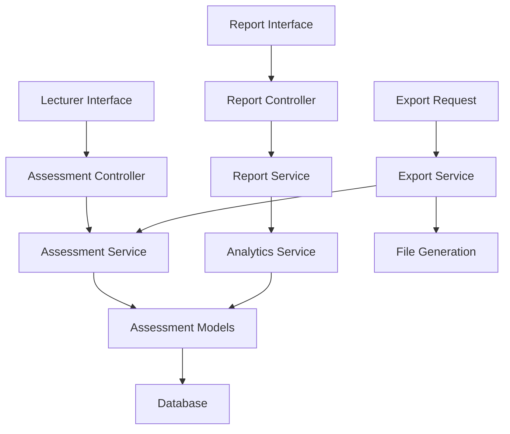

# Design Document

## Overview

The Lecturer Course Assessments system provides a comprehensive interface for lecturers to manage assessment components, grade student submissions, and generate performance reports for their course offerings. The system is built around two main interfaces: an assessment management page and a detailed assessment report page, both leveraging the existing assessment data model with enhanced functionality for grading workflows and analytics.

## Architecture

### System Components

The system follows a layered architecture with clear separation of concerns:

1. **Presentation Layer**: Vue.js components with TypeScript for type safety
2. **API Layer**: Laravel controllers handling HTTP requests and responses
3. **Service Layer**: Business logic services for assessment management and reporting
4. **Data Layer**: Eloquent models with optimized database queries
5. **Export Layer**: Specialized services for data export functionality

### Data Flow



## Components and Interfaces

### Frontend Components

#### AssessmentManagement.vue
- **Purpose**: Main interface for managing course assessments
- **Props**: `courseOfferingId: number`
- **State Management**: Uses Pinia store for assessment data
- **Key Features**:
  - Assessment component listing with hierarchical display
  - Inline editing for weights and properties
  - Grading interface with student/component view modes
  - Real-time validation for weight constraints

#### GradingInterface.vue
- **Purpose**: Dedicated grading interface with multiple view modes
- **Props**: `assessmentId: number, mode: 'by-student' | 'by-component'`
- **Features**:
  - Tabular grading interface with keyboard navigation
  - Bulk operations for common grading tasks
  - Late submission handling with penalty calculations
  - Academic integrity flagging interface

#### AssessmentReport.vue
- **Purpose**: Comprehensive reporting and analytics interface
- **Props**: `courseOfferingId: number`
- **Features**:
  - Statistical overview with charts
  - Grade distribution visualizations
  - Student performance matrix
  - Export functionality

### Backend Controllers

#### AssessmentController
```php
class AssessmentController extends Controller
{
    public function index(CourseOffering $courseOffering): JsonResponse
    public function store(CourseOffering $courseOffering, StoreAssessmentRequest $request): JsonResponse
    public function update(AssessmentComponent $assessment, UpdateAssessmentRequest $request): JsonResponse
    public function destroy(AssessmentComponent $assessment): JsonResponse
    public function gradeByStudent(CourseOffering $courseOffering, Student $student): JsonResponse
    public function gradeByComponent(AssessmentComponent $assessment): JsonResponse
    public function updateGrade(AssessmentComponentDetailScore $score, UpdateGradeRequest $request): JsonResponse
    public function bulkUpdateGrades(BulkUpdateGradesRequest $request): JsonResponse
}
```

#### AssessmentReportController
```php
class AssessmentReportController extends Controller
{
    public function overview(CourseOffering $courseOffering): JsonResponse
    public function gradeMatrix(CourseOffering $courseOffering): JsonResponse
    public function statistics(CourseOffering $courseOffering): JsonResponse
    public function exportExcel(CourseOffering $courseOffering, ExportRequest $request): BinaryFileResponse
    public function exportPdf(CourseOffering $courseOffering, ExportRequest $request): BinaryFileResponse
}
```

### Service Layer

#### AssessmentManagementService
```php
class AssessmentManagementService
{
    public function getAssessmentStructure(CourseOffering $courseOffering): array
    public function createAssessmentComponent(array $data): AssessmentComponent
    public function updateAssessmentComponent(AssessmentComponent $component, array $data): AssessmentComponent
    public function validateWeightConstraints(int $syllabusId, array $components): bool
    public function getGradingData(CourseOffering $courseOffering, string $mode, ?int $entityId = null): array
    public function updateScore(AssessmentComponentDetailScore $score, array $data): AssessmentComponentDetailScore
    public function calculateLatePenalty(Carbon $submissionTime, Carbon $deadline, array $penaltyRules): float
    public function processAcademicIntegrityFlag(AssessmentComponentDetailScore $score, array $data): void
}
```

#### AssessmentReportService
```php
class AssessmentReportService
{
    public function generateOverviewStatistics(CourseOffering $courseOffering): array
    public function generateGradeMatrix(CourseOffering $courseOffering): array
    public function calculateScoreDistribution(CourseOffering $courseOffering): array
    public function identifyAtRiskStudents(CourseOffering $courseOffering): array
    public function generatePerformanceAnalytics(CourseOffering $courseOffering): array
    public function getCompletionStatistics(CourseOffering $courseOffering): array
}
```

#### AssessmentExportService
```php
class AssessmentExportService
{
    public function exportToExcel(CourseOffering $courseOffering, array $filters = []): string
    public function exportToPdf(CourseOffering $courseOffering, array $options = []): string
    public function generateGradeReport(CourseOffering $courseOffering): array
    public function formatExportData(Collection $scores, array $components): array
}
```

## Data Models

### Enhanced Model Relationships

The existing models will be enhanced with additional methods and relationships:

#### AssessmentComponent (Enhanced)
```php
// Additional methods
public function getGradingStatistics(): array
public function getSubmissionCounts(): array
public function validateTotalWeight(): bool
public function getStudentScores(Student $student): Collection
```

#### AssessmentComponentDetailScore (Enhanced)
```php
// Additional methods
public function applyLatePenalty(float $penalty): void
public function flagForPlagiarism(array $data): void
public function processAppeal(array $appealData): void
public function calculateWeightedScore(): float
public function getGradingHistory(): array
```

### New Model: AssessmentGradingSession
```php
class AssessmentGradingSession extends Model
{
    protected $fillable = [
        'lecture_id',
        'course_offering_id',
        'assessment_component_id',
        'session_start',
        'session_end',
        'scores_graded',
        'session_notes'
    ];
    
    // Track grading sessions for analytics
}
```

## Error Handling

### Validation Rules

#### Weight Validation
- Total assessment component weights must not exceed 100%
- Individual component weights must be between 0.01 and 100
- Detail weights within a component must not exceed parent component weight

#### Grade Validation
- Points earned must be within 0 to maximum points range
- Percentage scores must be between 0 and 100
- Letter grades must match institutional grade scale
- Late penalties cannot exceed 100% of original score

#### Academic Integrity Validation
- Plagiarism scores must be between 0 and 100
- Integrity status must be from predefined enum values
- Appeal requests require valid reasoning

### Error Response Format
```json
{
    "success": false,
    "message": "Validation failed",
    "errors": {
        "weight": ["Total weight exceeds 100%"],
        "points_earned": ["Points cannot exceed maximum"]
    },
    "error_code": "VALIDATION_ERROR"
}
```

## Testing Strategy

### Unit Tests
- **Model Tests**: Validate relationships, scopes, and business logic methods
- **Service Tests**: Test business logic, calculations, and data transformations
- **Validation Tests**: Ensure all validation rules work correctly

### Integration Tests
- **Controller Tests**: Test API endpoints with various scenarios
- **Database Tests**: Verify complex queries and data integrity
- **Export Tests**: Validate export functionality and file generation

### Feature Tests
- **Grading Workflow Tests**: End-to-end grading scenarios
- **Report Generation Tests**: Complete report generation workflows
- **Permission Tests**: Ensure proper authorization at all levels

### Performance Tests
- **Load Tests**: Test with large numbers of students and assessments
- **Query Optimization Tests**: Ensure efficient database queries
- **Export Performance Tests**: Validate export performance with large datasets

### Test Data Strategy
```php
// Factory for comprehensive test scenarios
AssessmentComponentDetailScoreFactory::new()
    ->withLateSubmission()
    ->withPlagiarismFlag()
    ->withAppeal()
    ->create();
```

## Security Considerations

### Authorization
- Lecturers can only access assessments for their assigned course offerings
- Grade modifications require proper lecturer authentication
- Academic integrity actions require elevated permissions
- Export functionality requires appropriate access levels

### Data Protection
- Sensitive student information is properly masked in exports
- Grade history maintains audit trails
- Academic integrity data has restricted access
- Personal notes are encrypted at rest

### Input Validation
- All grade inputs are sanitized and validated
- File uploads for submissions are scanned and validated
- SQL injection protection through Eloquent ORM
- XSS protection for all user inputs

## Performance Optimization

### Database Optimization
- Indexed queries for common assessment lookups
- Eager loading for related models to prevent N+1 queries
- Database views for complex reporting queries
- Caching for frequently accessed assessment structures

### Frontend Optimization
- Lazy loading for large grade tables
- Virtual scrolling for extensive student lists
- Debounced input for real-time validation
- Optimistic updates for better user experience

### Caching Strategy
```php
// Cache assessment structure
Cache::remember("assessment_structure_{$courseOfferingId}", 3600, function() {
    return $this->getAssessmentStructure($courseOffering);
});

// Cache grade statistics
Cache::remember("grade_stats_{$courseOfferingId}", 1800, function() {
    return $this->generateOverviewStatistics($courseOffering);
});
```
