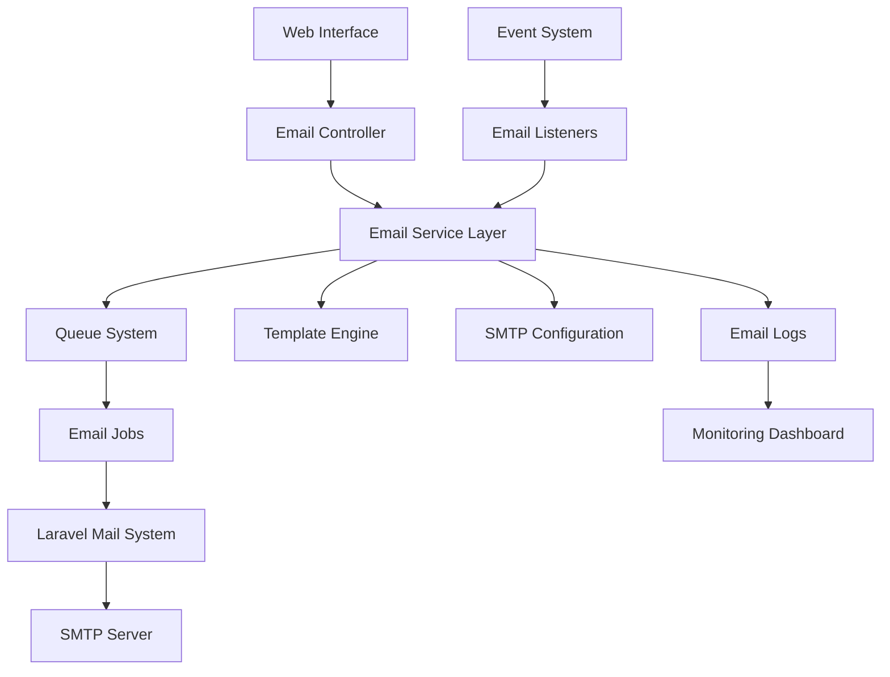

# Design Document

## Overview

The SMTP Email System will provide comprehensive email functionality for the academic management application using Laravel's built-in mail system powered by Symfony Mailer. The system will support both individual and bulk email sending, automated notifications, template management, and comprehensive monitoring capabilities.

The design leverages Laravel's existing mail infrastructure while adding academic-specific features such as role-based notifications, academic event triggers, and institutional email templates.

## Architecture

### High-Level Architecture



### Core Components

1. **Email Service Layer**: Central business logic for email operations
2. **SMTP Configuration Management**: Secure handling of SMTP settings
3. **Template System**: Flexible email template management with variables
4. **Queue System**: Reliable email delivery with retry mechanisms
5. **Event-Driven Notifications**: Automated emails triggered by academic events
6. **Monitoring & Logging**: Comprehensive email tracking and analytics
7. **User Preference Management**: Individual notification settings

## Components and Interfaces

### 1. Email Service Layer

**EmailService**
- `sendSingleEmail(recipient, subject, content, template?, attachments?)`
- `sendBulkEmail(recipients, subject, content, template?, attachments?)`
- `queueEmail(emailData)`
- `validateEmailConfiguration()`
- `testSmtpConnection(config)`

**NotificationService**
- `sendAcademicNotification(event, recipients, data)`
- `scheduleReminder(type, recipients, scheduleTime, data)`
- `processEventNotification(event)`

### 2. SMTP Configuration Management

**SmtpConfigurationService**
- `updateConfiguration(config)`
- `validateConfiguration(config)`
- `testConnection(config)`
- `encryptCredentials(credentials)`
- `getActiveConfiguration()`

### 3. Template Management

**EmailTemplateService**
- `createTemplate(name, content, variables)`
- `updateTemplate(id, content)`
- `renderTemplate(templateId, variables)`
- `getTemplatesByType(type)`
- `validateTemplate(content)`

**Template Types:**
- Welcome emails
- Grade notifications
- Course registration confirmations
- Academic hold notifications
- System announcements
- Reminder emails

### 4. Queue Management

**Email Jobs:**
- `SendSingleEmailJob`
- `SendBulkEmailJob`
- `ProcessNotificationJob`
- `SendReminderJob`

**Queue Configuration:**
- Retry attempts: 3
- Backoff strategy: Exponential (1min, 5min, 15min)
- Timeout: 60 seconds per email
- Batch processing for bulk emails

### 5. Event Listeners

**Academic Event Listeners:**
- `CourseRegistrationListener`
- `GradePublishedListener`
- `AcademicHoldListener`
- `EnrollmentConfirmedListener`
- `AssessmentDeadlineListener`

### 6. User Interface Components

**Admin Email Management:**
- SMTP configuration interface
- Email template editor
- Bulk email composer
- Email logs and monitoring dashboard

**User Preference Management:**
- Notification settings per user
- Email frequency preferences
- Opt-out management

## Data Models

### Email Configuration
```php
class EmailConfiguration extends Model
{
    protected $fillable = [
        'name',
        'host',
        'port',
        'username',
        'password', // encrypted
        'encryption',
        'from_address',
        'from_name',
        'is_active',
        'daily_limit',
        'rate_limit'
    ];
}
```

### Email Template
```php
class EmailTemplate extends Model
{
    protected $fillable = [
        'name',
        'type',
        'subject',
        'html_content',
        'text_content',
        'variables',
        'is_active',
        'version'
    ];
}
```

### Email Log
```php
class EmailLog extends Model
{
    protected $fillable = [
        'recipient',
        'sender',
        'subject',
        'template_id',
        'status',
        'sent_at',
        'delivered_at',
        'failed_at',
        'error_message',
        'retry_count',
        'metadata'
    ];
}
```

### User Email Preference
```php
class UserEmailPreference extends Model
{
    protected $fillable = [
        'user_id',
        'notification_type',
        'is_enabled',
        'frequency',
        'last_sent_at'
    ];
}
```

## Error Handling

### SMTP Connection Errors
- Connection timeout handling
- Authentication failure recovery
- Server unavailability fallback
- Rate limiting compliance

### Email Delivery Failures
- Bounce handling and processing
- Invalid email address detection
- Spam filter avoidance
- Retry logic with exponential backoff

### Queue Management Errors
- Failed job handling
- Dead letter queue processing
- Memory limit management for bulk emails
- Timeout handling for large attachments

### Validation Errors
- Email address format validation
- Template syntax validation
- Attachment size and type validation
- Configuration parameter validation

## Testing Strategy

### Unit Tests
- Email service methods
- Template rendering logic
- Configuration validation
- Queue job processing
- Event listener functionality

### Integration Tests
- SMTP connection testing
- Email delivery end-to-end
- Template system integration
- Queue system integration
- Event-driven notification flow

### Feature Tests
- Admin email management interface
- Bulk email sending workflow
- User preference management
- Email monitoring dashboard
- Automated notification triggers

### Performance Tests
- Bulk email processing performance
- Queue throughput testing
- Memory usage during large sends
- Database query optimization
- Template rendering performance

### Security Tests
- SMTP credential encryption
- Email content sanitization
- Access control for email features
- Rate limiting effectiveness
- Bounce handling security

## Security Considerations

### Credential Management
- SMTP passwords encrypted at rest
- Secure credential rotation
- Environment-based configuration
- Access logging for configuration changes

### Email Content Security
- HTML sanitization in templates
- XSS prevention in dynamic content
- Attachment scanning and validation
- Spam prevention measures

### Access Control
- Role-based email sending permissions
- Template modification restrictions
- Configuration access controls
- Audit logging for all email operations

### Privacy Protection
- Email address encryption in logs
- GDPR compliance for email data
- User consent management
- Data retention policies

## Performance Optimization

### Queue Optimization
- Batch processing for bulk emails
- Priority queues for urgent notifications
- Load balancing across queue workers
- Memory-efficient processing

### Database Optimization
- Indexed email logs for fast queries
- Partitioned tables for large datasets
- Efficient recipient list queries
- Template caching strategies

### SMTP Optimization
- Connection pooling
- Rate limiting compliance
- Optimal batch sizes
- Retry strategy optimization

### Monitoring and Alerting
- Real-time delivery metrics
- Failed email alerting
- Queue backlog monitoring
- Performance threshold alerts
