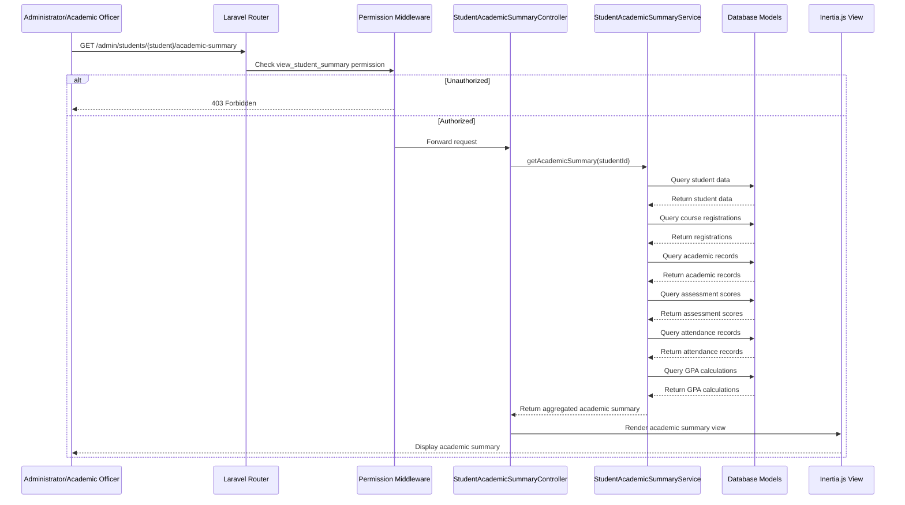

# Design Document: Student Academic Summary

## Overview

The Student Academic Summary feature provides administrators and academic officers with a comprehensive view of a student's academic journey within the education management system. This centralized dashboard presents detailed information about course registrations, scores, attendance, GPA calculations, and graduation progress in an organized, accessible format to facilitate effective academic support and administrative oversight.

This design document outlines the architecture, components, data models, and implementation approach for the Student Academic Summary feature.

## Architecture

### High-Level Architecture

The Student Academic Summary feature will follow the existing application's MVC architecture pattern:

1. **Model Layer**: Leverages existing models (`Student`, `CourseRegistration`, `AcademicRecord`, `AssessmentComponentDetailScore`, `Attendance`, `GpaCalculation`) to access and manipulate data.

2. **Controller Layer**: A new `StudentAcademicSummaryController` will handle requests related to the academic summary view, with appropriate permission checks.

3. **Service Layer**: A new `StudentAcademicSummaryService` will encapsulate business logic for aggregating and processing academic data.

4. **View Layer**: Inertia.js views with Vue.js components will render the tabbed interface and data visualizations.

### Request Flow



## Components and Interfaces

### Controllers

#### StudentAcademicSummaryController

```php
namespace App\Http\Controllers\Web;

class StudentAcademicSummaryController extends Controller
{
    public function __construct(
        private StudentAcademicSummaryService $academicSummaryService
    ) {}

    public function show(Student $student): Response
    {
        $this->authorize('view_student_summary', $student);
        
        $academicSummary = $this->academicSummaryService->getAcademicSummary($student->id);
        
        return Inertia::render('students/AcademicSummary', [
            'student' => $student,
            'academicSummary' => $academicSummary,
        ]);
    }
    
    public function filterBySemester(Student $student, Request $request): JsonResponse
    {
        $this->authorize('view_student_summary', $student);
        
        $validated = $request->validate([
            'semester_id' => 'required|exists:semesters,id',
        ]);
        
        $filteredData = $this->academicSummaryService->filterBySemester(
            $student->id, 
            $validated['semester_id']
        );
        
        return response()->json($filteredData);
    }
    
    public function filterByCourseOffering(Student $student, Request $request): JsonResponse
    {
        $this->authorize('view_student_summary', $student);
        
        $validated = $request->validate([
            'course_offering_id' => 'required|exists:course_offerings,id',
        ]);
        
        $filteredData = $this->academicSummaryService->filterByCourseOffering(
            $student->id, 
            $validated['course_offering_id']
        );
        
        return response()->json($filteredData);
    }
}
```

### Services

#### StudentAcademicSummaryService

```php
namespace App\Services;

class StudentAcademicSummaryService
{
    public function getAcademicSummary(int $studentId): array
    {
        $student = Student::with([
            'campus',
            'program',
            'specialization',
            'curriculumVersion',
        ])->findOrFail($studentId);
        
        return [
            'overview' => $this->getStudentOverview($student),
            'registrations' => $this->getRegistrations($student),
            'scores' => $this->getScores($student),
            'attendance' => $this->getAttendance($student),
            'gpa' => $this->getGpaTranscript($student),
            'graduation' => $this->getGraduationTracker($student),
        ];
    }
    
    private function getStudentOverview(Student $student): array
    {
        // Return student overview data
    }
    
    private function getRegistrations(Student $student): array
    {
        // Return course registrations data
    }
    
    private function getScores(Student $student): array
    {
        // Return assessment scores data
    }
    
    private function getAttendance(Student $student): array
    {
        // Return attendance data
    }
    
    private function getGpaTranscript(Student $student): array
    {
        // Return GPA and transcript data
    }
    
    private function getGraduationTracker(Student $student): array
    {
        // Return graduation progress data
    }
    
    public function filterBySemester(int $studentId, int $semesterId): array
    {
        // Return data filtered by semester
    }
    
    public function filterByCourseOffering(int $studentId, int $courseOfferingId): array
    {
        // Return data filtered by course offering
    }
}
```

### Frontend Components

#### Main Layout Component

```vue
<template>
  <div class="student-academic-summary">
    <StudentHeader :student="student" />
    
    <TabNavigation :tabs="tabs" v-model="activeTab" />
    
    <div class="tab-content">
      <OverviewTab v-if="activeTab === 'overview'" :data="academicSummary.overview" />
      <RegistrationsTab v-if="activeTab === 'registrations'" :data="academicSummary.registrations" />
      <ScoresTab v-if="activeTab === 'scores'" :data="academicSummary.scores" />
      <AttendanceTab v-if="activeTab === 'attendance'" :data="academicSummary.attendance" />
      <GpaTranscriptTab v-if="activeTab === 'gpa'" :data="academicSummary.gpa" />
      <GraduationTrackerTab v-if="activeTab === 'graduation'" :data="academicSummary.graduation" />
    </div>
  </div>
</template>

<script>
export default {
  props: {
    student: Object,
    academicSummary: Object,
  },
  data() {
    return {
      activeTab: 'overview',
      tabs: [
        { id: 'overview', label: 'Overview' },
        { id: 'registrations', label: 'Registrations' },
        { id: 'scores', label: 'Scores' },
        { id: 'attendance', label: 'Attendance' },
        { id: 'gpa', label: 'GPA & Transcript' },
        { id: 'graduation', label: 'Graduation Tracker' },
      ],
    };
  },
};
</script>
```

#### Tab Components

Each tab will be implemented as a separate Vue component:

1. `OverviewTab.vue` - Displays student identification and program details
2. `RegistrationsTab.vue` - Displays course registrations with filtering
3. `ScoresTab.vue` - Displays assessment scores grouped by course offering
4. `AttendanceTab.vue` - Displays attendance summaries and details
5. `GpaTranscriptTab.vue` - Displays GPA calculations and academic standing
6. `GraduationTrackerTab.vue` - Displays graduation progress tracking

## Data Models

The feature will leverage existing data models in the system:

### Primary Models

1. **Student**
   - Contains basic student information, program enrollment, and status
   - Relationships: campus, program, specialization, curriculumVersion

2. **CourseRegistration**
   - Contains course registration records for students
   - Key fields: registration_status, final_grade, is_retake, attempt_number
   - Relationships: student, courseOffering, semester

3. **AcademicRecord**
   - Contains detailed academic records for completed courses
   - Key fields: final_letter_grade, grade_points, credit_hours_earned
   - Relationships: student, courseOffering, semester, unit

4. **AssessmentComponentDetailScore**
   - Contains individual assessment scores for students
   - Key fields: points_earned, percentage_score, letter_grade
   - Relationships: assessmentComponentDetail, student, courseOffering

5. **Attendance**
   - Contains attendance records for class sessions
   - Key fields: status, check_in_time, minutes_late
   - Relationships: classSession, student

6. **GpaCalculation**
   - Contains GPA calculations for students by semester
   - Key fields: gpa, credit_hours_earned, academic_standing
   - Relationships: student, semester, program

### Data Aggregation

The service layer will aggregate data from these models to provide a comprehensive academic summary:

1. **Overview Data**
   - Student profile information
   - Program and specialization details
   - Academic status and standing

2. **Registration Data**
   - Course registrations across all semesters
   - Registration status, grades, and completion dates
   - Retake information and attempt numbers

3. **Score Data**
   - Assessment component scores grouped by course
   - Submission and grading dates
   - Score percentages and letter grades

4. **Attendance Data**
   - Attendance summaries by course
   - Present, absent, and late counts
   - Attendance percentage calculations

5. **GPA Data**
   - Semester and cumulative GPA calculations
   - Academic standing history
   - Dean's list and academic warnings

6. **Graduation Data**
   - Credit requirements and progress
   - Graduation requirement completion status
   - Projected graduation timeline

## Error Handling

### Permission Errors

- Use Laravel's authorization system to check for `view_student_summary` permission
- Return 403 Forbidden response for unauthorized access attempts
- Display appropriate error messages to users

### Data Loading Errors

- Implement try-catch blocks in service methods to handle database query errors
- Return appropriate error responses with meaningful messages
- Log errors for debugging and monitoring

### Empty Data Handling

- Display appropriate messages when no data is available for a section
- Provide guidance on possible reasons for missing data
- Maintain consistent UI even with partial data

## Testing Strategy

### Unit Tests

1. **Service Tests**
   - Test data aggregation methods in `StudentAcademicSummaryService`
   - Test filtering methods for semester and course offering
   - Test error handling for invalid inputs

2. **Controller Tests**
   - Test permission checks for authorized and unauthorized users
   - Test response structure for different data scenarios
   - Test filtering endpoints

### Feature Tests

1. **Integration Tests**
   - Test end-to-end flow from request to response
   - Test data loading with different student profiles
   - Test tab navigation and data display

2. **UI Tests**
   - Test responsive design for different screen sizes
   - Test tab switching and content loading
   - Test filtering and sorting functionality

### Performance Tests

1. **Load Testing**
   - Test performance with large datasets (8+ semesters)
   - Test concurrent access by multiple users
   - Identify and optimize bottlenecks

## Performance Considerations

### Data Loading Optimization

1. **Eager Loading**
   - Use eager loading for related models to reduce N+1 query problems
   - Implement selective loading based on active tab

2. **Pagination**
   - Implement pagination for large datasets (scores, attendance records)
   - Use lazy loading for detailed records

3. **Caching**
   - Cache frequently accessed data like GPA calculations
   - Implement cache invalidation on data updates

### Frontend Optimization

1. **Component Lazy Loading**
   - Load tab components only when needed
   - Implement skeleton loaders for better UX during data loading

2. **Data Chunking**
   - Load data in chunks for large datasets
   - Implement virtual scrolling for long lists

## Security Considerations

1. **Permission Checks**
   - Implement middleware to check for `view_student_summary` permission
   - Add additional permission checks for sensitive data

2. **Data Filtering**
   - Ensure only authorized data is returned in API responses
   - Implement proper data sanitization for user inputs

3. **Audit Logging**
   - Log access to student academic summaries
   - Track filtering and viewing actions for audit purposes

## Implementation Plan

The implementation will follow these phases:

1. **Backend Development**
   - Create controller and service classes
   - Implement data aggregation methods
   - Set up routes and permission checks

2. **Frontend Development**
   - Create main layout component
   - Implement tab components
   - Develop data visualization components

3. **Integration and Testing**
   - Connect frontend and backend
   - Implement filtering and sorting
   - Test with various data scenarios

4. **Optimization and Refinement**
   - Optimize performance for large datasets
   - Refine UI/UX based on feedback
   - Implement caching and lazy loading

## Conclusion

The Student Academic Summary feature will provide administrators and academic officers with a comprehensive view of student academic progress. By leveraging existing data models and following the application's architecture patterns, the implementation will be consistent with the rest of the system while providing the specialized functionality needed for effective academic oversight.
