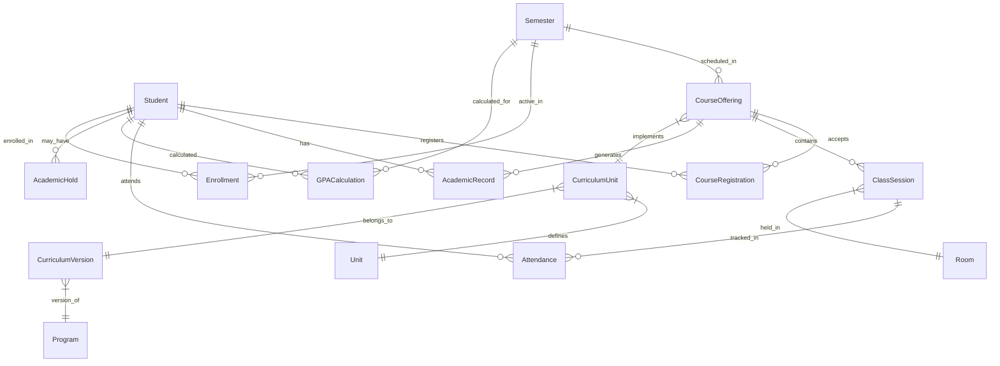

# Design Document

## Overview

The Student Portal API is designed as a RESTful backend service that provides comprehensive academic management capabilities for university students. The system follows a layered architecture with clear separation of concerns, implementing secure authentication, efficient data access patterns, and robust business logic validation.

The API serves as the backend for a student portal frontend, providing endpoints for dashboard management, course registration, academic progress tracking, and administrative functions. The design emphasizes performance, security, and maintainability while supporting multi-campus university operations.

## Architecture

### System Architecture

The Student Portal API follows a layered architecture pattern:

```
┌─────────────────────────────────────────┐
│              Frontend Layer             │
│        (Student Portal Web App)         │
└─────────────────────────────────────────┘
                    │ HTTPS/REST
┌─────────────────────────────────────────┐
│             API Gateway Layer           │
│     (Authentication, Rate Limiting,     │
│      CORS, Request Validation)          │
└─────────────────────────────────────────┘
                    │
┌─────────────────────────────────────────┐
│           Application Layer             │
│    (Controllers, Middleware, Routes)    │
└─────────────────────────────────────────┘
                    │
┌─────────────────────────────────────────┐
│            Business Layer               │
│     (Services, Business Logic,          │
│      Validation, Calculations)          │
└─────────────────────────────────────────┘
                    │
┌─────────────────────────────────────────┐
│             Data Layer                  │
│    (Models, Repositories, Database)     │
└─────────────────────────────────────────┘
                    │
┌─────────────────────────────────────────┐
│           Infrastructure                │
│   (MySQL, Redis, File Storage, Jobs)   │
└─────────────────────────────────────────┘
```

### Technology Stack

- **Framework**: Laravel 12 (PHP 8.2+)
- **Database**: MySQL 8.0 with optimized indexes
- **Caching**: Redis for session storage and data caching
- **Authentication**: JWT tokens with role-based permissions
- **File Storage**: AWS S3 or compatible storage service
- **Queue System**: Laravel Queues with Redis driver
- **Testing**: PHPUnit with Feature and Unit tests

### API Design Principles

1. **RESTful Design**: Standard HTTP methods and status codes
2. **Consistent Response Format**: Standardized JSON response structure
3. **Resource-Based URLs**: Clear, hierarchical endpoint naming
4. **Stateless Operations**: JWT-based authentication without server-side sessions
5. **Idempotent Operations**: Safe retry mechanisms for critical operations
6. **Versioning Strategy**: URL-based versioning for future compatibility

## Components and Interfaces

### Core Components

#### 1. Authentication & Authorization Component

**Purpose**: Manages student authentication and API access control

**Interfaces**:
- `AuthenticationService`: JWT token generation and validation
- `AuthorizationMiddleware`: Request permission verification
- `RateLimitingMiddleware`: API usage throttling

**Key Methods**:
```php
interface AuthenticationService
{
    public function authenticate(array $credentials): ?string;
    public function validateToken(string $token): ?User;
    public function refreshToken(string $token): ?string;
}

interface AuthorizationService  
{
    public function hasPermission(User $user, string $permission): bool;
    public function getStudentPermissions(Student $student): array;
}
```

#### 2. Dashboard Service Component

**Purpose**: Aggregates and presents student dashboard data

**Interfaces**:
- `DashboardService`: Main dashboard data aggregation
- `GPACalculationService`: GPA computation and trend analysis
- `CreditProgressService`: Academic progress tracking

**Key Methods**:
```php
interface DashboardService
{
    public function getDashboardData(Student $student): array;
    public function getCurrentSemesterData(Student $student): array;
    public function getCreditProgress(Student $student): array;
    public function getAcademicHolds(Student $student): Collection;
}
```

#### 3. Course Registration Component

**Purpose**: Handles course enrollment and schedule management

**Interfaces**:
- `CourseRegistrationService`: Registration business logic
- `ConflictDetectionService`: Schedule and prerequisite validation
- `EnrollmentCapacityService`: Course capacity management

**Key Methods**:
```php
interface CourseRegistrationService
{
    public function getAvailableCourses(Student $student, array $filters): Collection;
    public function registerForCourse(Student $student, int $courseOfferingId): CourseRegistration;
    public function dropCourse(Student $student, int $courseOfferingId): bool;
    public function validateRegistration(Student $student, CourseOffering $offering): array;
}
```

#### 4. Academic Progress Component

**Purpose**: Manages grades, assessments, and academic records

**Interfaces**:
- `GradeService`: Grade calculation and retrieval
- `AssessmentService`: Assessment management
- `AcademicRecordService`: Academic history tracking

**Key Methods**:
```php
interface GradeService
{
    public function getStudentGrades(Student $student, ?int $semesterId): Collection;
    public function getGPATrend(Student $student): array;
    public function getCourseGrades(Student $student, int $courseOfferingId): array;
}
```

#### 5. Attendance Tracking Component

**Purpose**: Monitors and reports student attendance

**Interfaces**:
- `AttendanceService`: Attendance calculation and alerts
- `AttendanceReportService`: Attendance reporting and summaries

**Key Methods**:
```php
interface AttendanceService
{
    public function getAttendanceRecords(Student $student, array $filters): Collection;
    public function getAttendanceSummary(Student $student): array;
    public function getAttendanceAlerts(Student $student): Collection;
}
```

#### 6. Notification Component

**Purpose**: Manages student notifications and communication

**Interfaces**:
- `NotificationService`: Notification creation and delivery
- `PushNotificationService`: Push notification handling
- `NotificationPreferenceService`: User preference management

**Key Methods**:
```php
interface NotificationService
{
    public function getNotifications(Student $student, array $filters): Collection;
    public function markAsRead(Student $student, int $notificationId): bool;
    public function createNotification(Student $student, array $data): Notification;
}
```

### Data Access Layer

#### Repository Pattern Implementation

```php
interface StudentRepositoryInterface
{
    public function findByEmail(string $email): ?Student;
    public function findWithAcademicData(int $studentId): ?Student;
    public function updateProfile(int $studentId, array $data): bool;
}

interface CourseOfferingRepositoryInterface
{
    public function getAvailableForStudent(Student $student, array $filters): Collection;
    public function findWithScheduleData(int $courseOfferingId): ?CourseOffering;
    public function getConflictingOfferings(array $courseOfferingIds): Collection;
}

interface AcademicRecordRepositoryInterface
{
    public function getStudentRecords(int $studentId, ?int $semesterId): Collection;
    public function getGPAHistory(int $studentId): Collection;
    public function getCourseRecord(int $studentId, int $courseOfferingId): ?AcademicRecord;
}
```

## Data Models

### Core Entity Relationships



### Key Data Models

#### Student Model Extensions
```php
class Student extends Model
{
    // Core student information
    protected $fillable = [
        'student_id', 'full_name', 'email', 'phone', 'date_of_birth',
        'program_id', 'campus_id', 'curriculum_version_id', 'avatar_url'
    ];
    
    // Relationships for API data
    public function currentEnrollment(): HasOne;
    public function academicRecords(): HasMany;
    public function courseRegistrations(): HasMany;
    public function gpaCalculations(): HasMany;
    public function academicHolds(): HasMany;
    public function attendanceRecords(): HasMany;
}
```

#### Dashboard Data Transfer Objects
```php
class DashboardData
{
    public function __construct(
        public Semester $currentSemester,
        public CreditProgress $creditProgress,
        public GPAData $gpaData,
        public Collection $academicHolds,
        public Collection $upcomingAssessments,
        public ?Enrollment $enrollmentStatus,
        public ?AcademicStanding $academicStanding
    ) {}
}

class CreditProgress
{
    public function __construct(
        public int $earnedCredits,
        public int $requiredCredits,
        public Collection $remainingRequirements,
        public float $completionPercentage
    ) {}
}
```

## Error Handling

### Error Response Strategy

#### Standardized Error Format
```php
class ApiResponse
{
    public static function error(
        string $message,
        array $errors = [],
        string $errorCode = 'GENERAL_ERROR',
        int $statusCode = 400
    ): JsonResponse {
        return response()->json([
            'success' => false,
            'message' => $message,
            'errors' => $errors,
            'error_code' => $errorCode,
            'timestamp' => now()->toISOString()
        ], $statusCode);
    }
}
```

#### Error Categories and Handling

1. **Validation Errors (400)**
   - Invalid input data
   - Missing required fields
   - Format validation failures

2. **Authentication Errors (401)**
   - Invalid or expired JWT tokens
   - Missing authentication headers

3. **Authorization Errors (403)**
   - Insufficient permissions
   - Academic holds preventing access

4. **Resource Not Found (404)**
   - Student records not found
   - Course offerings not available

5. **Business Logic Errors (422)**
   - Prerequisite violations
   - Schedule conflicts
   - Enrollment capacity exceeded

6. **Server Errors (500)**
   - Database connection issues
   - External service failures
   - Unexpected system errors

### Exception Handling Middleware

```php
class ApiExceptionHandler
{
    public function handle(Exception $exception): JsonResponse
    {
        // Log error for monitoring
        Log::error('API Exception', [
            'exception' => $exception->getMessage(),
            'trace' => $exception->getTraceAsString(),
            'request' => request()->all()
        ]);
        
        // Return appropriate error response
        return match(get_class($exception)) {
            ValidationException::class => $this->handleValidationException($exception),
            AuthenticationException::class => $this->handleAuthException($exception),
            ModelNotFoundException::class => $this->handleNotFound($exception),
            BusinessLogicException::class => $this->handleBusinessLogic($exception),
            default => $this->handleGenericException($exception)
        };
    }
}
```

## Testing Strategy

### Testing Pyramid Approach

#### Unit Tests (70%)
- Service layer business logic
- Model relationships and validations
- Utility functions and calculations
- Data transformation logic

#### Integration Tests (20%)
- API endpoint functionality
- Database interactions
- External service integrations
- Authentication flows

#### End-to-End Tests (10%)
- Complete user workflows
- Cross-service interactions
- Performance benchmarks
- Security validations

### Test Implementation Strategy

#### Feature Tests for API Endpoints
```php
class DashboardApiTest extends TestCase
{
    public function test_student_can_access_dashboard()
    {
        $student = Student::factory()->create();
        $token = $this->generateJWTToken($student);
        
        $response = $this->withHeaders([
            'Authorization' => "Bearer {$token}"
        ])->getJson('/api/student/dashboard');
        
        $response->assertOk()
                ->assertJsonStructure([
                    'success',
                    'data' => [
                        'current_semester',
                        'credit_progress',
                        'current_gpa',
                        'academic_holds',
                        'upcoming_assessments'
                    ]
                ]);
    }
}
```

#### Service Layer Unit Tests
```php
class CourseRegistrationServiceTest extends TestCase
{
    public function test_validates_prerequisites_before_registration()
    {
        $student = Student::factory()->create();
        $courseOffering = CourseOffering::factory()->create();
        
        // Mock prerequisite validation
        $this->mock(PrerequisiteService::class)
             ->shouldReceive('validatePrerequisites')
             ->andReturn(['CS101 not completed']);
        
        $service = app(CourseRegistrationService::class);
        $result = $service->validateRegistration($student, $courseOffering);
        
        $this->assertArrayHasKey('prerequisite_errors', $result);
    }
}
```

### Performance Testing

#### Database Query Optimization Tests
```php
class DatabasePerformanceTest extends TestCase
{
    public function test_dashboard_query_performance()
    {
        $student = Student::factory()->create();
        
        DB::enableQueryLog();
        
        $service = app(DashboardService::class);
        $data = $service->getDashboardData($student);
        
        $queries = DB::getQueryLog();
        
        // Assert query count is within acceptable limits
        $this->assertLessThan(10, count($queries));
        
        // Assert no N+1 query problems
        $this->assertNoNPlusOneQueries($queries);
    }
}
```

This design provides a comprehensive foundation for implementing the Student Portal API with proper separation of concerns, robust error handling, and thorough testing strategies. The architecture supports scalability and maintainability while ensuring security and performance requirements are met.
