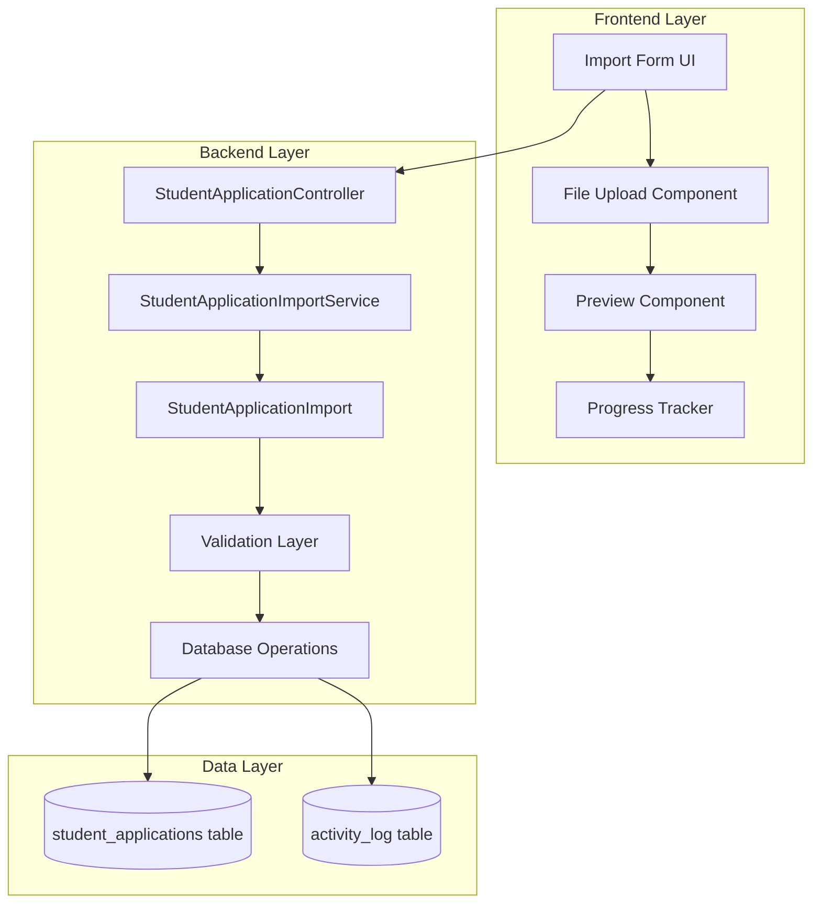
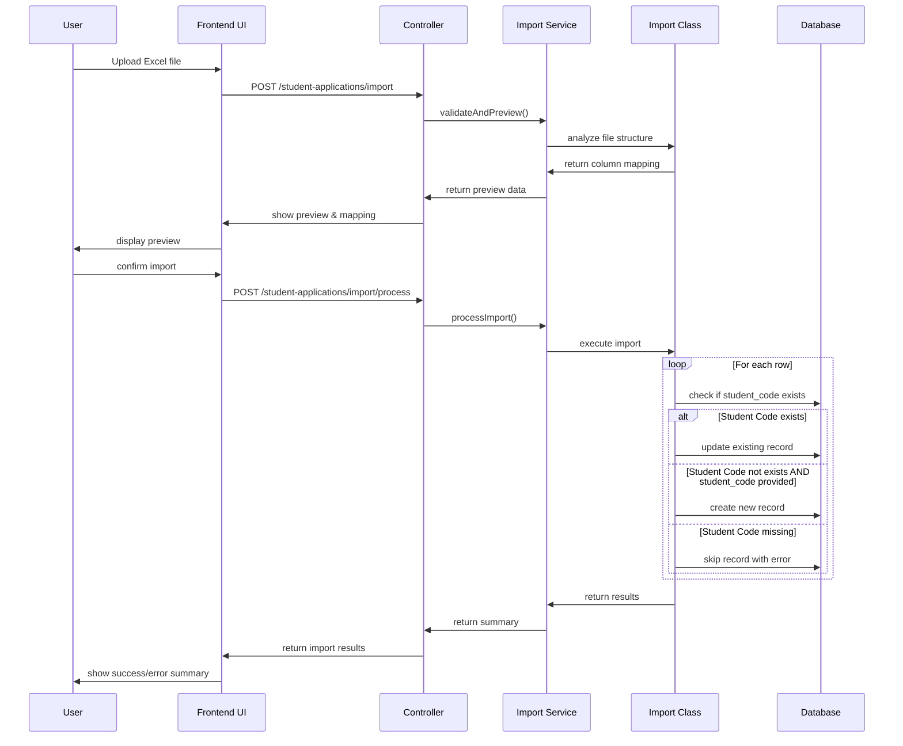
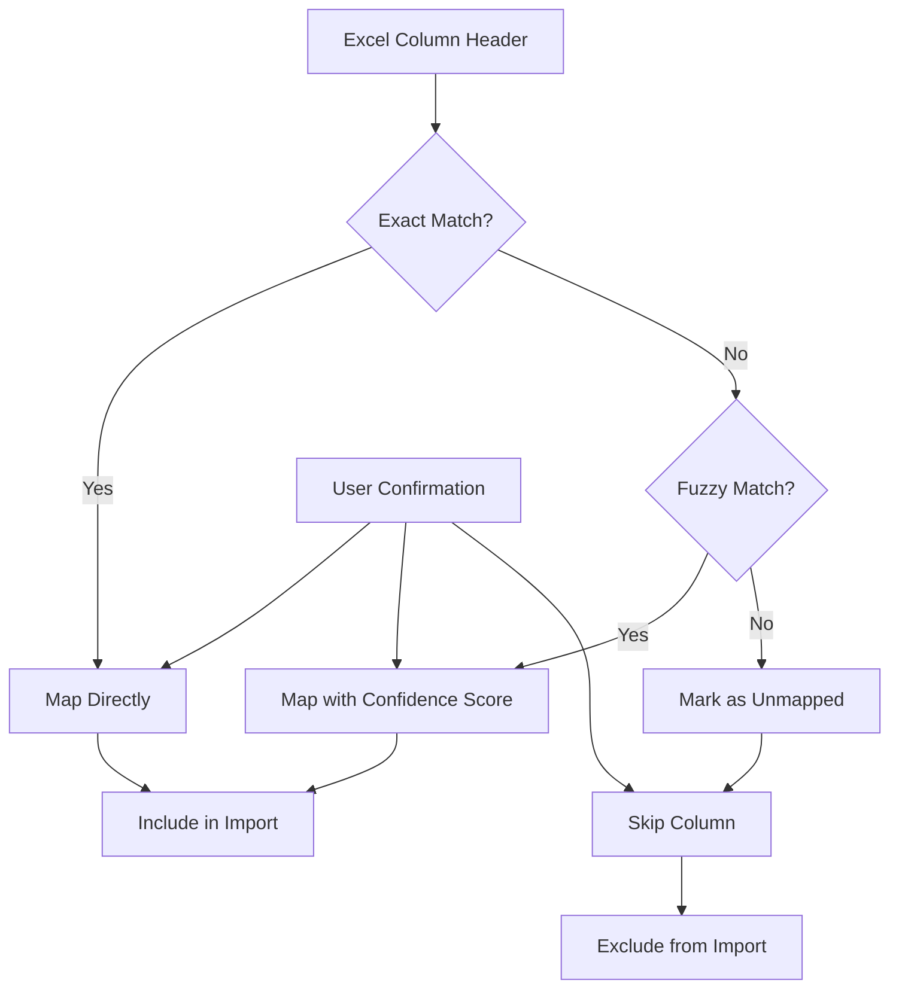
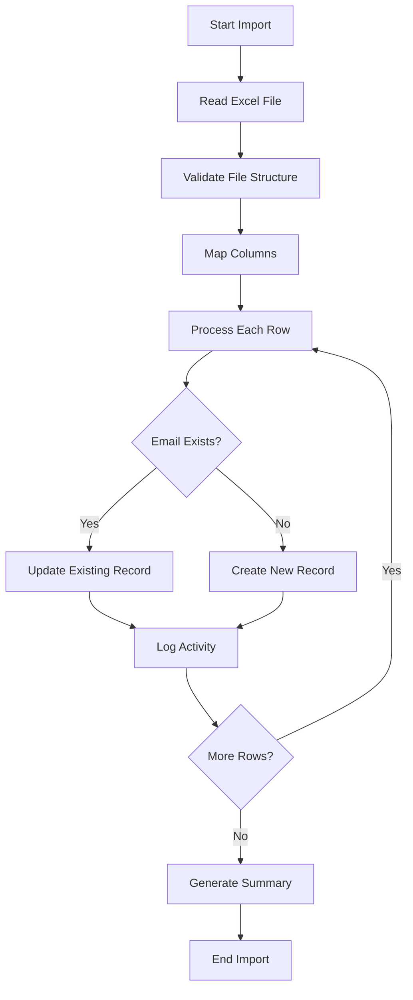
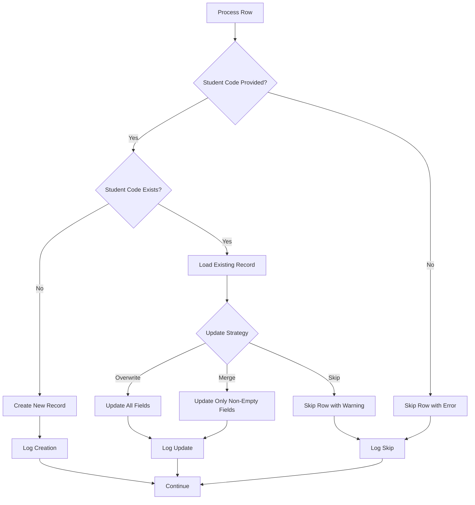
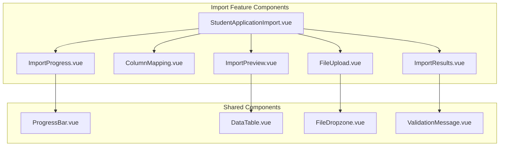
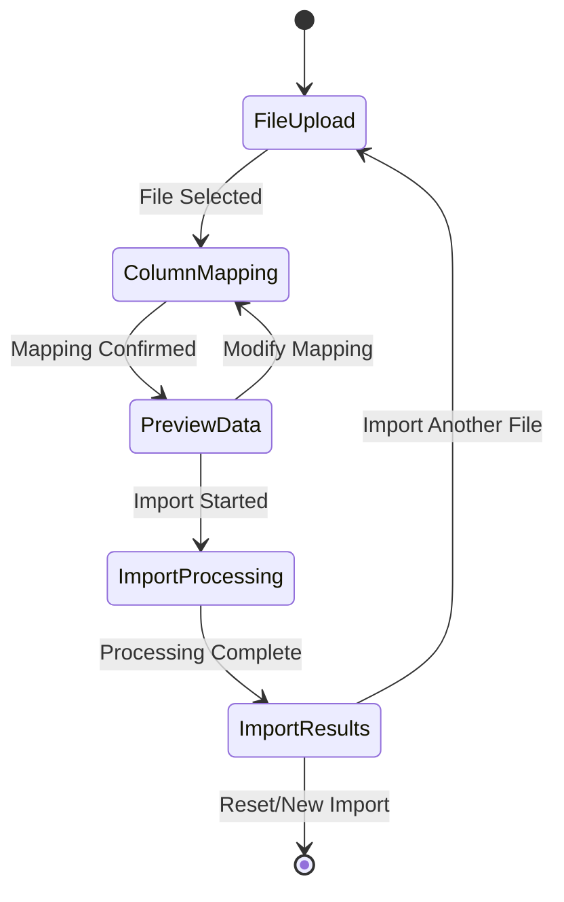

# Excel Student Application Import Feature Design

## Overview

This design document outlines the implementation of an Excel import feature for student applications in the Swinx educational management system. The feature allows importing student application data from Excel files with automatic column mapping, validation, and the ability to create new records or update existing ones based on email address.

### Key Requirements

- Import student application data from Excel files
- Handle column matching with flexible mapping (only use matching columns)
- Create new records for non-existing student codes
- Update existing records for duplicate student codes
- Skip records with missing student_code (required field)
- Validate data integrity and provide detailed feedback
- Follow existing Laravel patterns and use Maatwebsite Excel library

## Architecture

### Component Overview



### Import Process Flow



## API Endpoints Reference

### Import Endpoints

| Method | Endpoint | Description | Permission |
|--------|----------|-------------|------------|
| POST | `/student-applications/import/preview` | Preview import data and column mapping | `import_student_application` |
| POST | `/student-applications/import/process` | Execute the import process | `import_student_application` |
| GET | `/student-applications/import/template` | Download Excel template | `view_student_application` |

### Request/Response Schema

#### Preview Import Request
```php
{
    "file": "UploadedFile", // Excel file (.xlsx, .xls, .csv)
    "options": {
        "skip_header": true,
        "preview_rows": 10
    }
}
```

#### Preview Import Response
```php
{
    "success": true,
    "data": {
        "detected_columns": ["Full Name", "Email", "Phone", ...],
        "column_mapping": {
            "Full Name": "full_name",
            "Student Code": "student_code",
            "Email Address": "email", 
            "Phone Number": "phone"
        },
        "unmapped_columns": ["Extra Column 1"],
        "preview_data": [
            {
                "full_name": "John Doe",
                "student_code": "SWU001234",
        "email": "john@example.com",
                "phone": "1234567890"
            }
        ],
        "total_rows": 150,
        "validation_summary": {
            "valid_rows": 145,
            "invalid_rows": 5,
            "warnings": ["Row 5: Missing phone number"]
        }
    }
}
```

#### Process Import Request
```php
{
    "file": "UploadedFile",
    "column_mapping": {
        "Full Name": "full_name",
        "Student Code": "student_code",
        "Email Address": "email"
    },
    "options": {
        "update_existing": true,
        "skip_invalid": false
    }
}
```

#### Process Import Response
```php
{
    "success": true,
    "data": {
        "total_processed": 150,
        "created": 120,
        "updated": 25,
        "skipped": 5,
        "errors": [
            {
                "row": 15,
                "student_code": "",
                "errors": ["Student code is required"]
            },
            {
                "row": 20,
                "student_code": "SWU123",
                "errors": ["Invalid email format"]
            }
        ],
        "execution_time": "2.5s"
    }
}
```

## Data Models & Column Mapping

### Student Application Table Structure

The import will map to the following database columns from the `student_applications` table:

| Database Column | Expected Excel Headers | Type | Required |
|----------------|------------------------|------|----------|
| `full_name` | Full Name, Name | string(100) | ✓ |
| `student_code` | Student Code, Code, Student ID | string(50) | ✓ |
| `email` | Email, Email Address | string(255) | ✗ |
| `gender` | Gender | enum | ✗ |
| `ethnicity` | Ethnicity, Race | string(100) | ✗ |
| `birth_day` | Birth Day, Day | integer | ✗ |
| `birth_month` | Birth Month, Month | integer | ✗ |
| `birth_year` | Birth Year, Year | integer | ✗ |
| `national_id` | National ID, ID Number | string(20) | ✗ |
| `phone` | Phone, Phone Number, Mobile | string(20) | ✗ |
| `address` | Address | text | ✗ |
| `campus_code` | Campus, Campus Code | string(20) | ✗ |
| `intended_program` | Program, Intended Program | string(100) | ✗ |
| `intended_specialization` | Specialization | string(100) | ✗ |
| `intake` | Intake, Intake Period | string(50) | ✗ |
| `english_test_type` | English Test Type | string(50) | ✗ |
| `listening` | Listening Score | decimal(4,2) | ✗ |
| `reading` | Reading Score | decimal(4,2) | ✗ |
| `writing` | Writing Score | decimal(4,2) | ✗ |
| `speaking` | Speaking Score | decimal(4,2) | ✗ |
| `overall` | Overall Score, Total Score | decimal(4,2) | ✗ |
| `is_international_applicant` | International, Is International | boolean | ✗ |
| `status` | Status, Application Status | enum | ✗ |

### Column Mapping Logic



## Business Logic Layer

### StudentApplicationImportService

```php
class StudentApplicationImportService
{
    public function previewImport(UploadedFile $file, array $options = []): array
    public function processImport(UploadedFile $file, array $columnMapping, array $options = []): array
    public function generateTemplate(): string
    public function validateFile(UploadedFile $file): void
    private function detectColumnMapping(array $headers): array
    private function fuzzyMatchColumn(string $header): ?string
    private function validateRowData(array $row): array
}
```

### Import Processing Strategy



### Validation Rules

#### File Validation
- File format: `.xlsx`, `.xls`, `.csv`
- Maximum file size: 10MB
- Maximum rows: 5000
- Minimum required columns: `full_name`, `student_code`

#### Data Validation
```php
'full_name' => ['required', 'string', 'max:100'],
'student_code' => ['required', 'string', 'max:50'],
'email' => ['nullable', 'email', 'max:255'],
'gender' => ['nullable', 'in:male,female,other'],
'birth_day' => ['nullable', 'integer', 'min:1', 'max:31'],
'birth_month' => ['nullable', 'integer', 'min:1', 'max:12'],
'birth_year' => ['nullable', 'integer', 'min:1900', 'max:' . date('Y')],
'national_id' => ['nullable', 'string', 'max:20'],
'phone' => ['nullable', 'string', 'max:20'],
'campus_code' => ['nullable', 'exists:campuses,code'],
'listening' => ['nullable', 'numeric', 'min:0', 'max:10'],
'reading' => ['nullable', 'numeric', 'min:0', 'max:10'],
'writing' => ['nullable', 'numeric', 'min:0', 'max:10'],
'speaking' => ['nullable', 'numeric', 'min:0', 'max:10'],
'overall' => ['nullable', 'numeric', 'min:0', 'max:10'],
'status' => ['nullable', 'in:pending,reviewed,approved,rejected'],
'is_international_applicant' => ['nullable', 'boolean']
```

### Duplicate Handling Strategy



## Frontend Architecture

### Component Structure



### Import State Management

```typescript
interface ImportState {
  step: 'upload' | 'preview' | 'mapping' | 'processing' | 'results'
  file: File | null
  detectedColumns: string[]
  columnMapping: Record<string, string>
  previewData: StudentApplicationPreview[]
  validationErrors: ValidationError[]
  importResults: ImportResults | null
  isProcessing: boolean
  progress: number
}

interface StudentApplicationPreview {
  rowNumber: number
  data: Partial<StudentApplication>
  errors: string[]
  warnings: string[]
  isValid: boolean
}

interface ImportResults {
  totalProcessed: number
  created: number
  updated: number
  skipped: number
  errors: ImportError[]
  executionTime: string
}
```

### UI Flow



## Testing Strategy

### Unit Tests

#### Service Layer Tests
```php
class StudentApplicationImportServiceTest extends TestCase
{
    public function test_validates_file_format()
    public function test_detects_column_mapping_correctly()
    public function test_creates_new_applications_for_unique_student_codes()
    public function test_updates_existing_applications_for_duplicate_student_codes()
    public function test_skips_records_with_missing_student_code()
    public function test_handles_validation_errors_gracefully()
    public function test_generates_correct_import_summary()
    public function test_processes_large_files_within_memory_limits()
}
```

#### Import Class Tests
```php
class StudentApplicationImportTest extends TestCase
{
    public function test_processes_valid_excel_file()
    public function test_handles_missing_required_columns()
    public function test_validates_data_types_correctly()
    public function test_handles_duplicate_student_codes_in_same_file()
    public function test_validates_required_student_code_field()
    public function test_logs_import_activities()
}
```

### Integration Tests

#### Controller Tests
```php
class StudentApplicationImportControllerTest extends TestCase
{
    public function test_preview_import_requires_authentication()
    public function test_preview_import_requires_permission()
    public function test_preview_import_validates_file_upload()
    public function test_process_import_creates_applications_with_valid_student_codes()
    public function test_process_import_updates_existing_applications_by_student_code()
    public function test_process_import_skips_records_without_student_code()
    public function test_import_respects_validation_rules()
}
```

### Frontend Tests

#### Component Tests
```typescript
describe('StudentApplicationImport', () => {
  it('should upload file and show preview')
  it('should allow column mapping configuration')
  it('should display import progress')
  it('should show import results summary')
  it('should handle import errors gracefully')
  it('should allow retry on failed imports')
})
```

### Performance Tests

#### Load Testing
- Test with 5000 row Excel files
- Verify memory usage stays under 256MB
- Ensure import completes within 60 seconds
- Test concurrent import operations

#### Validation Performance
- Benchmark validation speed for large datasets
- Test column mapping performance with 50+ columns
- Verify database transaction efficiency

## Implementation Details

### File Structure

```
app/
├── Http/Controllers/Web/
│   └── StudentApplicationController.php (add import methods)
├── Imports/
│   └── StudentApplicationImport.php (new)
├── Services/
│   └── StudentApplicationImportService.php (new)
├── Http/Requests/
│   ├── ImportStudentApplicationPreviewRequest.php (new)
│   └── ImportStudentApplicationProcessRequest.php (new)
└── Console/Commands/
    └── GenerateStudentApplicationImportTemplate.php (new)

resources/js/
├── pages/student-applications/
│   └── Import.vue (new)
├── components/imports/
│   ├── FileUpload.vue (new)
│   ├── ColumnMapping.vue (new)
│   ├── ImportPreview.vue (new)
│   ├── ImportProgress.vue (new)
│   └── ImportResults.vue (new)
└── composables/
    └── useStudentApplicationImport.ts (new)

routes/
└── web/student-application.php (add import routes)
```

### Security Considerations

#### File Upload Security
- Validate file MIME types
- Scan uploaded files for malicious content
- Limit file size and processing time
- Store uploaded files in secure temporary location

#### Data Security
- Sanitize all input data
- Validate against injection attacks
- Log all import activities for audit
- Implement rate limiting for import endpoints

#### Permission Security
- Verify `import_student_application` permission
- Campus-based access control if required
- Audit trail for all import operations

### Performance Optimizations

#### Memory Management
```php
// Use chunked reading for large files
public function chunkSize(): int
{
    return 100; // Process 100 rows at a time
}

// Use batch inserts for better performance
public function batchSize(): int
{
    return 50; // Insert 50 records per batch
}
```

#### Database Optimizations
- Use database transactions for data integrity
- Implement batch upsert operations
- Add database indexes for student_code lookups
- Use Laravel's bulk insert capabilities

#### Caching Strategy
- Cache column mapping configurations
- Store file analysis results temporarily
- Cache validation rules and patterns

### Error Handling

#### File Processing Errors
- Invalid file format
- Corrupted Excel files
- Memory limit exceeded
- Timeout errors

#### Data Validation Errors
- Missing required student_code
- Invalid student_code format
- Duplicate student_codes in file
- Invalid email formats
- Duplicate national IDs
- Invalid date formats
- Missing required fields

#### System Errors
- Database connection failures
- Permission denied errors
- Storage space limitations

### Monitoring and Logging

#### Import Metrics
```php
Log::info('Student application import started', [
    'user_id' => auth()->id(),
    'file_name' => $file->getClientOriginalName(),
    'file_size' => $file->getSize(),
    'total_rows' => $totalRows
]);

Log::info('Student application import completed', [
    'duration' => $duration,
    'total_processed' => $results['total_processed'],
    'created' => $results['created'],
    'updated' => $results['updated'],
    'errors' => count($results['errors'])
]);
```

#### Activity Logging
- Log all import operations
- Track user actions and timestamps
- Record data changes with before/after values
- Maintain audit trail for compliance

### Deployment Considerations

#### Configuration
- Set appropriate memory limits in `config/excel-memory.php`
- Configure file upload limits in `php.ini`
- Set processing timeouts for large imports

#### Environment Variables
```env
STUDENT_IMPORT_MAX_FILE_SIZE=10240  # 10MB
STUDENT_IMPORT_MAX_ROWS=5000
STUDENT_IMPORT_TIMEOUT=300          # 5 minutes
STUDENT_IMPORT_CHUNK_SIZE=100
```

#### Queue Configuration
- Configure import jobs for background processing
- Set up failed job handling
- Implement retry mechanisms for failed imports
