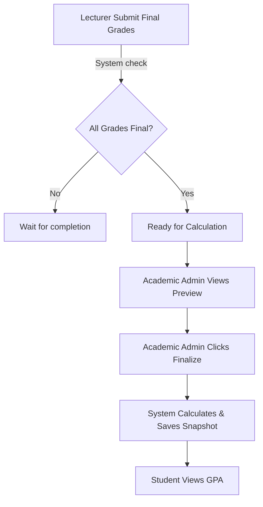

# 📄 REQUIREMENT – GPA MANAGEMENT (PHASE 1)

## 1. Mục tiêu Phase 1

Xây dựng **chức năng GPA cơ bản** để:

1.  **Phòng đào tạo (Academic Admin) chốt GPA học kỳ**
2.  **Hệ thống lưu GPA đã chốt (snapshot) vào `AcademicRecord`**
3.  **Sinh viên xem được GPA của mình trên Portal**
4.  **Nhà trường có căn cứ cho các quyết định học vụ cơ bản**

> ❌ Phase 1 **chưa** làm ranking, học bổng, graduation, dean’s list (Xem Phase 2)

## 2. Phạm vi nghiệp vụ (In scope)

### ✅ In scope (PHASE 1)

- **GPA học kỳ (Semester GPA):** Tính dựa trên điểm tổng kết các môn học trong kỳ.
- **GPA tích lũy (Cumulative GPA):** Tính dựa trên toàn bộ quá trình học.
- **Academic Standing cơ bản:** Xác định trạng thái học vụ (Normal, Warning) dựa trên rule đơn giản.
- **Quy trình chốt (Finalization):** Admin review và chốt GPA thủ công.
- **Hiển thị:** Sinh viên xem GPA trên cổng thông tin.

## 3. Đối tượng sử dụng

| Role               | Mục đích                         | Công nghệ (Gợi ý)    |
| :----------------- | :------------------------------- | :------------------- |
| **Academic Admin** | Chốt GPA, xem báo cáo sơ bộ      | Inertia + Vue 3      |
| **Student**        | Xem GPA, lịch sử học tập         | **Separate API**     |
| **System**         | Tính toán ngầm, lưu trữ snapshot | Laravel Jobs/Actions |

## 4. Quy trình nghiệp vụ (Workflow)

## 5. Chức năng chi tiết

### 5.1 Finalize GPA – Chốt GPA học kỳ (ADMIN)

#### 📍 Vị trí & Route

- **Route:** `/academic/gpa/finalize` (Inertia)
- **Controller:** `App\Http\Controllers\Web\Academic\GpaController`

#### 🎯 Mục đích

Cho phép **Academic Admin** chốt GPA học kỳ cho sinh viên sau khi điểm thành phần đã đầy đủ.

#### 🔹 Business Logic & Actions

1.  **Validation (Pre-check):**
    - Sử dụng `CheckGpaFinalizationEligibilityAction`.
    - Tất cả `CourseEnrollment` trong kỳ phải có điểm final.
    - Không còn điểm quy đổi treo (Provisional).

2.  **Preview GPA:**
    - Admin chọn `Semester` và filter (Department/Campus).
    - System chạy `CalculatePreviewGpaAction` (chưa lưu DB).
    - Hiển thị bảng: Student Info, Semester GPA, Cumulative GPA, Projected Standing.

3.  **Hành động chốt (Finalize):**
    - Admin nhấn **"Finalize GPA"**.
    - Gọi `FinalizeSemesterGpaAction`.
    - Lưu snapshot vào bảng `academic_records` (hoặc bảng GPA riêng nếu có).
    - Cập nhật `academic_standing`.
    - Log người chốt và thời gian chốt `finalized_at`, `finalized_by`.

> 💡 **Lưu ý:** Sau khi chốt, GPA không tự động thay đổi dù điểm thành phần có đổi (trừ khi Re-finalize).

### 5.2 Academic Standing (Phase 1)

#### 📏 Rule mặc định

Logic đơn giản được define trong `DetermineAcademicStandingAction`:

| Điều kiện  | Standing    |
| :--------- | :---------- |
| GPA >= 2.0 | **Normal**  |
| GPA < 2.0  | **Warning** |

### 5.3 Hiển thị GPA cho sinh viên (STUDENT)

#### 📍 Vị trí & API

- **Client:** Student Portal (External App / Mobile App)
- **API Endpoint:** `GET /api/v1/student/academic-records`

#### 🔹 Nội dung Response

API cần trả về JSON structure:

- **Summary:** GPA học kỳ gần nhất, GPA tích lũy.
- **History:** Danh sách các học kỳ, GPA từng kỳ, Academic Standing từng kỳ.

## 6. Yêu cầu kỹ thuật (Technical Requirements)

### 🏗 Architecture Pattern

Tuân thủ **Action-Request-Resource** pattern của dự án:

- **Actions:** Chứa business logic (VD: `CalculateGpaAction`).
- **Requests:** Validate input (VD: `FinalizeGpaRequest`).
- **Resources:** Transform data trả về JSON (VD: `GpaPreviewResource`).

### 🗄 Database (Đề xuất sơ bộ)

Cần đảm bảo các trường sau trong bảng `academic_records` (hoặc bảng tương đương):

- `student_id`
- `semester_id`
- `gpa_semester` (decimal)
- `gpa_cumulative` (decimal)
- `academic_standing` (enum/string)
- `is_finalized` (boolean)
- `finalized_at` (datetime)

## 7. Checklist Development

### Backend (Laravel)

- [ ] Tạo `CalculateSemesterGpaAction`: Tính GPA học kỳ từ `CourseEnrollment`.
- [ ] Tạo `CalculateCumulativeGpaAction`: Tính GPA tích lũy.
- [ ] Tạo `FinalizeSemesterGpaAction`: Orchestrator để chốt và lưu dữ liệu.
- [ ] API Endpoint cho Preview & Submit.

### Frontend (Vue 3 + Shadcn)

- [ ] **Admin:** Page chọn học kỳ & Table Preview (dùng Ag-Grid hoặc Shadcn Table).
- [ ] **Admin:** Dialog confirm finalize.
- [ ] **Student API:** Endpoint `GET /api/v1/student/academic-records` trả về GPA & Standing.
