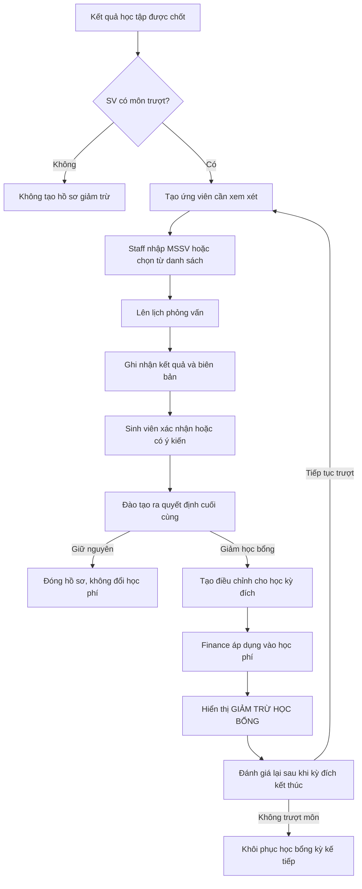

## Đề xuất nghiệp vụ

Nên triển khai theo mô hình “điều chỉnh học bổng theo từng học kỳ”, không sửa hoặc xóa học bổng gốc của sinh viên.

Ví dụ:

- Học bổng gốc: 30%.
- Fall 2026 được quyết định chỉ còn 20%.
- Financial Plan tăng phần phải đóng tương ứng 10%.
- Nếu sinh viên không trượt môn trong Fall 2026, kỳ kế tiếp tự đề xuất khôi phục về 30%.

Cách này giữ được lịch sử, tránh mất thông tin học bổng gốc và phù hợp với nguyên tắc Finance hiện tại.

### Outcome

Từ đợt thu học phí Fall 2026:

- Đào tạo quản lý danh sách sinh viên có nguy cơ bị giảm học bổng.
- Có lịch phỏng vấn, biên bản và xác nhận của sinh viên.
- Đào tạo đưa ra quyết định cuối cùng.
- Finance áp dụng đúng mức học bổng được duyệt vào học phí.
- Financial Plan hiển thị dòng `GIẢM TRỪ HỌC BỔNG`.
- Kỳ sau hệ thống đánh giá để khôi phục hoặc tiếp tục giảm.
- Toàn bộ thao tác có người thực hiện, thời gian, lý do và lịch sử thay đổi.

## Luồng nghiệp vụ đề xuất

### 1. Xác định ứng viên

Một sinh viên được đưa vào danh sách xem xét khi:

- Có ít nhất một kết quả môn chính thức là trượt trong học kỳ nguồn.
- Kết quả đã được chốt, không còn ở trạng thái dự thảo.
- Không có override pass hoặc khiếu nại điểm đang xử lý.
- Có học bổng đang hiệu lực.
- Dự kiến tiếp tục học trong học kỳ áp dụng.

Nên tổng hợp theo sinh viên, không tạo một hồ sơ cho từng môn trượt. Hồ sơ vẫn lưu danh sách các môn làm căn cứ.

Mỗi hồ sơ phải xác định rõ:

- Học kỳ phát sinh môn trượt.
- Học kỳ bị điều chỉnh học bổng.
- Học bổng gốc.
- Các môn trượt và số lần học.
- Người đưa sinh viên vào diện xem xét.
- Nguồn: hệ thống phát hiện hoặc staff nhập MSSV.

Staff có thể nhập MSSV để thêm sinh viên. Nếu sinh viên không thỏa điều kiện tự động nhưng vẫn được thêm thủ công, phải nhập lý do ngoại lệ và nên cần người có thẩm quyền duyệt.

### 2. Lịch phỏng vấn

Hồ sơ phỏng vấn cần có:

- Ngày và giờ.
- Hình thức: trực tiếp hoặc trực tuyến.
- Địa điểm hoặc đường dẫn họp.
- Staff phụ trách.
- Người tham gia.
- Nội dung cần trao đổi.
- Trạng thái: Chưa xếp lịch, Đã xếp lịch, Đã hoàn thành, Sinh viên vắng, Dời lịch, Hủy.
- Biên bản/kết luận phỏng vấn.
- Tài liệu đính kèm nếu có.

Không nên cho ra quyết định giảm học bổng khi lịch vẫn chưa hoàn thành, trừ luồng ngoại lệ có lý do và phê duyệt rõ ràng.

### 3. Xác nhận của sinh viên

Khuyến nghị cho sinh viên tự xác nhận trên Student Portal:

- `Đồng ý với nội dung biên bản`.
- `Không đồng ý/Yêu cầu hiệu chỉnh`.
- Ý kiến của sinh viên.
- Thời gian xác nhận.
- Phiên bản biên bản được xác nhận.

Nếu biên bản bị sửa sau khi sinh viên xác nhận, xác nhận cũ hết hiệu lực và phải xác nhận lại.

Trường hợp sinh viên không phản hồi hoặc từ chối xác nhận không nên làm hồ sơ bị treo vô thời hạn. Cần có trạng thái:

- Chờ xác nhận.
- Đã xác nhận.
- Có ý kiến/Tranh chấp.
- Từ chối xác nhận.
- Quá hạn không phản hồi.

Sau thời hạn do nhà trường quy định, Đào tạo có thể xử lý tiếp nhưng phải ghi nhận căn cứ liên hệ và cần bước phê duyệt bổ sung.

Portal impact: **student**.

### 4. Quyết định cuối cùng

Các kết quả nên hỗ trợ:

- Giữ nguyên học bổng.
- Giảm một phần.
- Tạm ngừng toàn bộ học bổng trong kỳ.
- Hoãn quyết định.
- Hủy hồ sơ do kết quả học tập thay đổi.

Thông tin bắt buộc:

- Mức học bổng gốc.
- Mức học bổng được áp dụng trong kỳ đích.
- Số tiền dự kiến ảnh hưởng.
- Lý do quyết định.
- Người đề xuất.
- Người phê duyệt.
- Ngày quyết định.
- Học kỳ hiệu lực.

Nên áp dụng maker–checker: người lập hồ sơ không đồng thời là người duyệt quyết định làm tăng học phí, ít nhất đối với trường hợp giảm một phần hoặc toàn bộ.

### 5. Áp dụng vào học phí

Trên Financial Plan nên hiển thị rõ:

| Khoản mục | Ví dụ |
|---|---:|
| Học phí gốc | 100.000.000 |
| Học bổng theo chính sách gốc | −30.000.000 |
| GIẢM TRỪ HỌC BỔNG | +10.000.000 |
| Học bổng thực tế Fall 2026 | −20.000.000 |
| Phải đóng | 80.000.000 |

Dòng `GIẢM TRỪ HỌC BỔNG` là phần quyền lợi bị giảm nên làm tăng số phải đóng; không phải một khoản giảm học phí mới.

Cần xử lý theo thời điểm:

- Chưa sinh học phí: dùng mức học bổng đã điều chỉnh khi sinh phí.
- Invoice còn draft: tính lại học bổng trước khi phát hành.
- Đã phát hành DNG: dừng tự động và đưa vào Finance review.
- Sinh viên đã thanh toán: không tự sửa hồi tố; cần luồng đối soát, thu bổ sung hoặc quyết định miễn phần chênh lệch.

Đây là nghiệp vụ quan trọng để tránh yêu cầu DNG cao hơn hoặc thấp hơn Settlement Position.

### 6. Khôi phục học bổng

Sau khi kết quả học kỳ bị điều chỉnh được chốt:

- Nếu sinh viên không trượt môn nào thuộc phạm vi xét: tạo đề xuất khôi phục cho kỳ kế tiếp.
- Nếu tiếp tục trượt: tạo hồ sơ xem xét mới; không tự kéo dài quyết định cũ.
- Nếu chưa có kết quả đầy đủ hoặc đang khiếu nại: giữ trạng thái chờ đánh giá.

Khôi phục phải:

- Trả về mức học bổng gốc, trừ khi có quyết định khác.
- Có note lý do bắt buộc.
- Lưu người thực hiện và người phê duyệt.
- Không xóa bản ghi giảm trừ trước đó.
- Không tự thay đổi invoice đã phát hành của kỳ trước.

## Trạng thái hồ sơ đề xuất

`identified → interview_scheduled → interviewed → awaiting_student_confirmation → ready_for_decision → approved → applied → closed`

Các nhánh bổ sung:

- `student_disputed`
- `student_no_show`
- `confirmation_overdue`
- `no_adjustment`
- `cancelled`
- `finance_review_required`

Quyết định sau khi `approved` không nên được sửa trực tiếp. Nếu sai, tạo bản điều chỉnh/reversal có lý do để giữ audit trail.

## Phân quyền

Nên tách tối thiểu:

- Xem hồ sơ giảm trừ.
- Thêm sinh viên bằng MSSV.
- Quản lý lịch phỏng vấn.
- Ghi biên bản phỏng vấn.
- Ra quyết định học thuật.
- Phê duyệt quyết định.
- Áp dụng điều chỉnh vào Finance.
- Khôi phục học bổng.
- Xem lịch sử/audit.

Các route học bổng hiện tại mới chỉ kiểm tra đăng nhập và FormRequest đang cho phép mặc định, nên chưa đủ an toàn cho nghiệp vụ làm thay đổi học phí. Đây là drift cần xử lý khi triển khai: [student-scholarships.php](/Users/hunt2412/hieupvdev/project/swinx/routes/web/student-scholarships.php) và [AssignScholarshipRequest.php](/Users/hunt2412/hieupvdev/project/swinx/app/Http/Requests/AssignScholarshipRequest.php).

## Phương án thiết kế
Academic sở hữu kết quả trượt và quyết định học thuật; Finance sở hữu học bổng áp dụng, discount và settlement. Hai bên trao đổi qua contract/event, không truy cập trực tiếp model của nhau.

## Phạm vi và non-goals

Trong đợt đầu nên bao gồm Fall 2026, một sinh viên, một học bổng và một điều chỉnh cho mỗi cặp học kỳ nguồn–đích.

Chưa nên hấp thụ:

- Xây dựng engine chính sách tự động theo GPA/số môn trượt.
- Tự gửi yêu cầu thanh toán DNG sau khi giảm.
- Tự xử lý hoàn tiền hoặc truy thu với invoice đã thanh toán.
- Thay đổi định nghĩa học bổng chung cho toàn bộ sinh viên.
- Xây dựng hệ thống lịch dùng chung toàn trường.

## Tiêu chí nghiệm thu chính

- Không thể áp dụng giảm trừ nếu thiếu học kỳ nguồn, học kỳ đích, lý do hoặc quyết định hợp lệ.
- Một sinh viên không có hai điều chỉnh đang hiệu lực cho cùng học bổng và học kỳ.
- Mức học bổng áp dụng không âm và không lớn hơn mức gốc.
- Sinh viên xác nhận đúng phiên bản biên bản.
- Quyết định đã duyệt có lịch sử bất biến.
- Preview và sinh học phí cho cùng dữ liệu cho ra cùng số tiền.
- Financial Plan hiển thị đúng `GIẢM TRỪ HỌC BỔNG`.
- DNG/invoice đã phát hành không bị tự động sửa.
- Kỳ tiếp theo có thể khôi phục mà không mất lịch sử kỳ trước.
- Mọi thao tác được kiểm tra quyền và campus scope.
- “Trượt môn” loại trừ EGC, chỉ dành cho student intake_course
- Mức giảm do Đào tạo nhập tự do nhưng không được lớn hơn học bổng được nhận, nếu không có học bổng thì không cần giảm
- Sinh viên phải tự xác nhận trên portal, hoặc staff được phép xác nhận thay
- Thời hạn phản hồi trước khi chuyển sang `quá hạn không phản hồi` là 1 ngày
- Bắt buộc hai người lập–duyệt cho mọi quyết định (người có quyền)