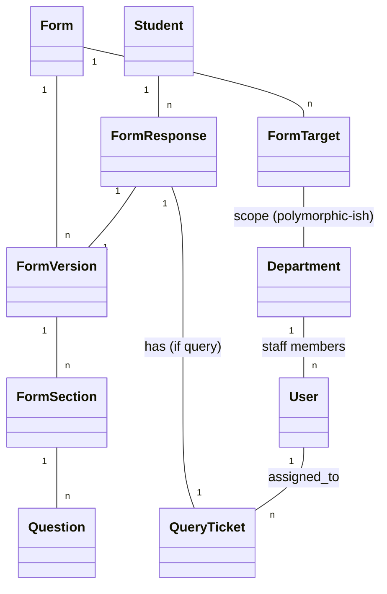

# Form Engine - Database Structure

## 1. New Tables Required

### `departments`

Standardize departments to support dynamic targeting and access control.

- `id` (bigint, pk)
- `code` (string, unique) - e.g., 'HQ', 'IT', 'ACADEMIC'
- `name` (string)
- `description` (text, nullable)
- `is_active` (boolean, default true)
- `timestamps`

## 2. Table Modifications

### `users`

Add link to department for Staff users.

- `department_id` (foreign key -> departments.id, nullable)

### `form_targets`

Enable targeting by department.

- update `scope_type`enum/logic to support 'App\Models\Department'.
- `scope_id` will store `department_id`.
- `status` (string: 'active', 'inactive') - **NEW**
- `is_mandatory` (boolean) - **NEW**
- `start_at` / `end_at` (existing)
- **Logic**: `isActive()` method must check `status === 'active'` AND date range.

## 3. Existing Models to Reuse

### `forms`

- Use existing `App\Models\Form`.

### `form_versions`

- Use existing `App\Models\FormVersion`.

### `form_sections`

- Use existing `App\Models\FormSection`.

### `questions`

- Use existing `App\Models\Question`.

### `form_responses`

- Use existing `App\Models\FormResponse`.
- Ensure `target_scope_type` and `target_scope_id` are populated correctly during submission.

### `query_tickets`

- Reuse `App\Models\QueryTicket`.
- **Workflow**:
    - When a response is submitted with type 'query', create a `query_ticket`.
    - `assigned_to_user_id`: Can only be assigned to users in the **Target Department**.
    - `topic_id`: Optional classification.

## 4. Entity Relationship Diagram (ERD) Conceptual

