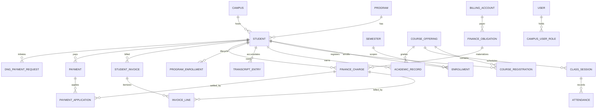
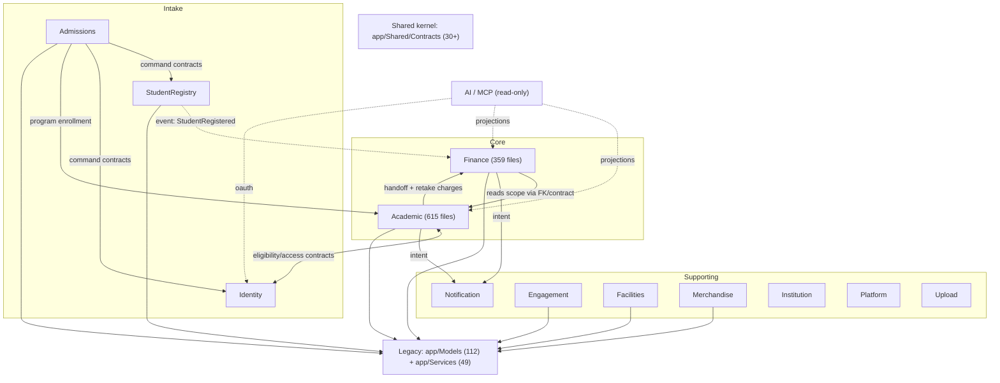

# Bản đồ Kiến trúc Module — Swinx

Phân tích từ source code thực tế (app/Modules, app/Models, database/migrations ~309 file, arch tests). Bổ sung cho [system-architecture.md](system-architecture.md) (canonical). Tài liệu này mô tả **hiện trạng**, gồm cả phần legacy chưa migrate.

## 1. Tổng quan Kiến trúc

- Laravel 13 modular monolith, 13 module nghiệp vụ tại `app/Modules/` + tầng legacy toàn cục (`app/Models` 112 model, `app/Services` 49 service).
- Ranh giới module enforce bằng arch test `tests/Feature/Architecture/DomainBoundaryArchitectureTest.php`: cấm import concrete code giữa module; giao tiếp qua contract tại `app/Shared/Contracts/` (30+ interface).
- 3 cơ chế cross-context: synchronous contract, domain event + outbox, owned projection (xem system-architecture.md).
- **Không có circular dependency giữa các module** (arch test xác nhận). Circular duy nhất nằm ở tầng legacy: `app/Models/Student.php` import `App\Modules\Finance\Models\{FinanceCharge, StudentInvoice, Payment}`.

## 2. Các Module và Trách nhiệm

| Module | Mục đích | Kích thước (file PHP) | Mức modular hoá |
| --- | --- | --- | --- |
| Academic | Catalog/calendar, course delivery, assessment, progression, transcript | 615 | Một phần — model mới trong module, ~48 model core còn ở legacy |
| Finance | Billing accounts, obligations, charges, invoices, payments, DNG, scholarship money | 359 | Đầy đủ — 28 bảng đều có model trong module |
| Identity | Accounts, auth, access grants (lecturer/guardian), token lifecycle | 94 | Đầy đủ (RBAC users/roles/permissions còn ở legacy) |
| AI | Tool catalog/dispatch, MCP exposure, conversations, evaluations | 69 | Đầy đủ — 11 bảng `ai_*` |
| Notification | Message intent, templates, outbox, delivery, retries | vừa | Đầy đủ — 4 bảng `notification_*` (bảng `notifications` legacy stale) |
| Admissions | Applications, CRM ingestion, approve/reject/revoke orchestration | vừa | Một phần — bảng `student_applications` v.v. model ở legacy |
| StudentRegistry | Student identity + guardian relationships | nhỏ | Tối thiểu — `students`, `parents` model ở legacy |
| Institution | Campuses, organizational reference data | <25 | Cố ý nhẹ |
| Platform | System configuration, branding projection | <25 | Cố ý nhẹ |
| Engagement | Clubs, events, forms/surveys, query tickets | nhỏ | Tối thiểu — domain thật nằm ở legacy models |
| Facilities | Buildings, rooms, reservations | nhỏ | Tối thiểu — `rooms`, `room_bookings` model ở legacy |
| Merchandise | Store, redemption, wallet/gold | nhỏ | Tối thiểu — model ở legacy |
| Upload | Managed upload/storage boundary | nhỏ | `upload_records` model ở legacy |

Cấu trúc chuẩn mỗi module: `Providers/`, `routes/{web,api}.php`, `Http/`, `Actions/`, `Queries/`, tuỳ chọn `Models/`, `Services/`, `Events/`, `Listeners/`, `Contracts/`.

Subdomain nội bộ:
- **Academic**: Catalog / Delivery / Progression / FacultyWorkforce (chung `Queries/`, không có event boundary nội bộ).
- **Finance**: core + `Dng/` (provider adapter) + `Events/`.

## 3. Sở hữu Database (186 bảng, bỏ qua bảng hạ tầng logs/cache/sessions/jobs)

### Finance (28 bảng — modular đầy đủ)
`billing_accounts`, `finance_obligations`, `finance_charges`, `finance_charge_installments`, `finance_pricing_catalog_items`, `payments`, `payment_applications`, `payment_allocations`, `payment_surplus_dispositions`, `student_invoices`, `invoice_lines`, `invoice_discounts`, `finance_discount_entitlements`, `finance_credit_entitlements`, `discount_allocations`, `credit_applications`, `egc_retake_discount_links`, `dng_payment_requests`, `dng_payment_request_charges`, `dng_payment_request_reservation_targets`, `dng_webhook_events`, `dng_campus_mappings`, `finance_dng_receipt_exceptions`, `finance_lifecycle_due_exception_reviews(+_events)`, `finance_cancellation_operations`, `finance_cancellation_completion_outbox`, `scholarship_restoration_proposals`, `scholarship_semester_adjustments`.

### Academic (model trong module)
`program_enrollments`, `transcript_entries`, `scholarship_adjustment_dossiers`, `scholarship_definitions`, `campus_period_schedules`, `faculty_access_eligibility_outbox`, `academic_finance_cancellation_handoffs`.

### Academic (bảng thuộc domain nhưng model còn ở legacy `app/Models`)
`students`*, `programs`, `specializations`, `curriculum_versions`, `curriculum_units`, `units`, `equivalent_units`, `semesters`, `syllabus_templates`, `assessment_components(+_details, +_detail_scores)`, `lectures`, `course_offerings`, `course_registrations`, `course_retake_registrations`, `class_sessions`, `attendances`, `academic_records`, `academic_holds`, `academic_standings`, `academic_progression_events`, `academic_warning_settings`, `enrollments`, `exam_resit_attempts`, `exam_resit_sessions`, `exam_room_slots(+_invigilators)`, `graduation_requirements`, `graduation_applications`, `gpa_calculations`.

\* `students` về mặt domain thuộc StudentRegistry (identity) + Academic (progression) — hiện là bảng trung tâm mọi module tham chiếu.

### AI (11 bảng): `ai_conversations`, `ai_chat_runs`, `ai_messages`, `ai_tool_calls`, `ai_agent_traces`, `ai_run_events`, `ai_evaluation_runs(+_cases, +_results)`, `ai_provider_settings`, `ai_provider_usages`, `ai_feedback`.

### Identity (3 bảng module): `lecturer_access_grants`, `lecturer_access_eligibility_handoffs`, `guardian_access_grants`. RBAC legacy: `users`, `roles`, `permissions`, `role_permissions`, `campus_user_roles`.

### Notification (4 bảng): `notification_messages`, `notification_deliveries`, `notification_email_templates`, `notification_event_outbox`. Legacy: `email_configurations`, `email_templates`, `email_logs`, `notifications` (stale).

### Legacy thuộc domain khác (model ở `app/Models`, chưa migrate)
| Domain logic | Bảng | Module đích |
| --- | --- | --- |
| Student profile | `students`, `parents`, `parent_student`, `student_settings`, `student_guardian_relationships`, `student_changes`, `student_decisions` | StudentRegistry |
| Admissions | `student_applications`, `application_documents(+_types)`, `application_guardians` | Admissions |
| Forms/Surveys | `forms`, `form_versions`, `form_sections`, `form_surveys`, `form_targets`, `questions`, `answers`, `responses`, `student_form_*` | Engagement |
| Events/Clubs/Queries | `events`, `event_participants`, `clubs`, `club_members`, `queries_tickets`, `query_*` | Engagement |
| Facilities | `buildings`, `rooms`, `room_bookings`, `room_booking_actions` | Facilities |
| Merchandise/Wallet | `merchandise(+_images, +_variants)`, `redemption_orders(+_items)`, `stock_movements`, `student_wallets`, `student_cash_wallets`, `gold_transactions` | Merchandise |
| Institution | `campuses`, `departments`, `department_memberships` | Institution |
| Upload | `upload_records` | Upload |
| Canvas | `canvas_integrations`, `canvas_course_mappings` | Academic (provider) |

**Không có shared-table violation**: mỗi bảng có đúng 1 model sở hữu (module hoặc legacy).

## 4. Phụ thuộc giữa Module

Enforce: `DomainBoundaryArchitectureTest` cấm import concrete inter-module; chỉ cho phép `App\Shared\Contracts\*`, event, projection.

| Từ | Đến | Kiểu | Bằng chứng |
| --- | --- | --- | --- |
| Admissions | StudentRegistry, Identity, Academic | Command contract (approve orchestration, atomic) | ADR-0042; system-architecture.md |
| StudentRegistry | Finance | Domain event `StudentRegistered` | `Finance/Listeners/ProvisionBillingAccountForRegisteredStudent.php`, đăng ký tại `FinanceServiceProvider` |
| Finance | StudentRegistry | Implement contract của StudentRegistry | `app/Shared/Contracts/` |
| Academic | Finance | Handoff model + charge (retake/resit debit) | `academic_finance_cancellation_handoffs`, ADR-0026 |
| Finance | Academic | Đọc scope (students, semesters, programs, units) qua FK + contract | FK trong migrations |
| Academic | Identity | Contract 2 chiều (faculty eligibility ↔ access grants) | `faculty_access_eligibility_outbox`, `lecturer_access_eligibility_handoffs`, ADR-0038/0039 |
| Academic, Finance, … | Notification | Durable intent → outbox | `notification_event_outbox` |
| AI | Academic, Finance, Identity | Read-only qua ToolDispatcher (projection/reader) | ADR-0008; `app/Mcp` |
| Tất cả module | Legacy `App\Models` | Direct model import (shared kernel de-facto) | grep toàn bộ module |
| Tất cả module | `App\Shared`, `App\Support` | Shared kernel chính thức (contracts + utilities) | `app/Shared/Contracts/` |

Ghi chú:
- Event thực sự dùng cross-module chỉ 1: `StudentRegistered` (StudentRegistry→Finance). Notification listen thêm framework events. Coordination chủ yếu synchronous qua contract.
- Circular legacy: `app/Models/Student.php` → `App\Modules\Finance\Models\*` trong khi Finance FK về `students`. Đây là legacy↔module, không phải module↔module.

## 5. Quan hệ Entity chính

### Academic
- Student N:1 Program (`students.program_id`); Program 1:N Specialization; CurriculumVersion 1:N CurriculumUnit N:1 Unit.
- Student 1:N Enrollment (unique `student_id, semester_id`); Semester 1:N Enrollment.
- CourseOffering 1:N ClassSession 1:N Attendance (unique `class_session_id, student_id`).
- Student 1:N AcademicRecord N:1 CourseOffering (unique `student_id, course_offering_id`).
- Student 1:N CourseRegistration (unique `student_id, course_offering_id, semester_id`).
- ProgramEnrollment: unique `source_type, source_id` (polymorphic nguồn — Admissions application).

### Finance
- Student 1:N FinanceCharge / Payment / StudentInvoice / DngPaymentRequest.
- FinanceObligation 1:N FinanceCharge (`finance_charges.finance_obligation_id`); obligation `source_type/source_id` là varchar, **không FK** — cố ý decoupling (ADR-0027/0028).
- StudentInvoice 1:N InvoiceLine N:1 FinanceCharge; StudentInvoice 1:N InvoiceDiscount.
- Payment N:N FinanceCharge qua `payment_applications`.
- BillingAccount = payer key cho aggregate mới (ADR-0029).

### ER Diagram (entity trọng yếu)



## 6. Sơ đồ Kiến trúc

### Sơ đồ A — Module tổng quan + phụ thuộc



### Sơ đồ B — Chi tiết module lớn

```text
Academic
├─ Catalog:      programs, specializations, curriculum_versions, curriculum_units, units, semesters
├─ Delivery:     course_offerings, course_registrations, class_sessions, attendances,
│                syllabus_templates, assessment_components, exam_resit_*, exam_room_slots
├─ Progression:  program_enrollments, transcript_entries, academic_records, academic_holds,
│                academic_standings, scholarship_adjustment_dossiers, gpa_calculations
└─ FacultyWorkforce: faculty_access_eligibility_outbox

Finance
├─ Obligation:   billing_accounts, finance_obligations, finance_pricing_catalog_items
├─ Ledger:       finance_charges, finance_charge_installments, student_invoices, invoice_lines
├─ Cash:         payments, payment_applications, payment_surplus_dispositions
├─ Reduction:    discount_allocations, credit_applications, finance_*_entitlements
├─ Dng:          dng_payment_requests, dng_webhook_events, dng_campus_mappings
└─ Lifecycle:    finance_cancellation_operations, *_outbox, scholarship_*
```

Sơ đồ trực quan (canvas): `~/Documents/swinx-architecture.tldraw`.

## 7. Vấn đề Phát hiện

1. **Legacy shared kernel de-facto** (nghiêm trọng nhất): mọi module import trực tiếp `App\Models`. Contract abstraction tồn tại nhưng implementation thường wrap legacy model. Migration schema chung → cascading impact mọi module.
2. **Academic split-brain**: ~48 model core (students, course_offerings, academic_records…) ở `app/Models`, model mới ở `app/Modules/Academic`. Contributor dễ đặt sai chỗ; arch test placement chỉ cover file mới.
3. **Circular legacy↔Finance**: `app/Models/Student.php` import Finance models; Finance FK về `students`. Không vi phạm arch test (legacy được miễn) nhưng chặn việc tách Finance sau này.
4. **4 module rỗng ruột**: Engagement, Facilities, Merchandise, StudentRegistry có module skeleton nhưng domain models nằm legacy → ranh giới trên giấy, chưa trong code.
5. **God-module Academic** (615 files): 4 subdomain chung `Queries/`, không có boundary nội bộ. ADR-0041 đã ghi nhận: decompose logically trước khi tách vật lý.
6. **Event coordination mỏng**: 1 domain event cross-module đang hoạt động (`StudentRegistered`). Finance publish 4 event nhưng chỉ Notification consume 1 → nếu cần async coordination nhiều hơn, hạ tầng chưa sẵn.
7. **~140 model không khai báo `$table`** (inferred naming): rename/refactor tool dễ miss reference.
8. **Bảng stale**: `notifications` (thay bởi `notification_messages`), `email_*` legacy song song `notification_email_templates`.

## 8. Đề xuất Cải tiến (ưu tiên giảm dần)

1. **Strangler migration cho Academic models**: chuyển dần 48 legacy model vào `app/Modules/Academic/{Catalog,Delivery,Progression}/Models/` (alias namespace cũ trong giai đoạn chuyển tiếp), mỗi đợt kèm placement arch test.
2. **Cắt circular Student↔Finance**: bỏ quan hệ Finance khỏi `app/Models/Student.php`; consumer chuyển sang Finance contract/query (SettlementPosition đã tồn tại).
3. **Điền ruột 4 module rỗng**: mỗi module nhận model + policy + route của domain mình từ legacy (Facilities: rooms/bookings; Merchandise: store/wallet; Engagement: forms/events/queries; StudentRegistry: students/parents/guardians).
4. **Khai tử bảng/model stale**: `notifications`, `email_*` legacy — xác nhận không còn read path rồi drop.
5. **Khai báo `$table` tường minh** khi migrate model vào module (nhân tiện, không làm riêng).
6. Academic decompose theo ADR-0041 trước khi cân nhắc bất kỳ physical extraction nào.

## Câu hỏi Chưa giải quyết

- `app/Models` là legacy tạm hay shared space vĩnh viễn? (development-rules nói module-first, nhưng chưa có roadmap migrate)
- Engagement/Facilities/Merchandise/StudentRegistry: có kế hoạch điền ruột không, hay giữ nguyên legacy?
- Finance publish 4 events không ai consume — giữ hay cắt?
- `student_wallets`/`gold_transactions`: owner là Merchandise hay Finance? (liên quan tiền → cần quyết định boundary)
