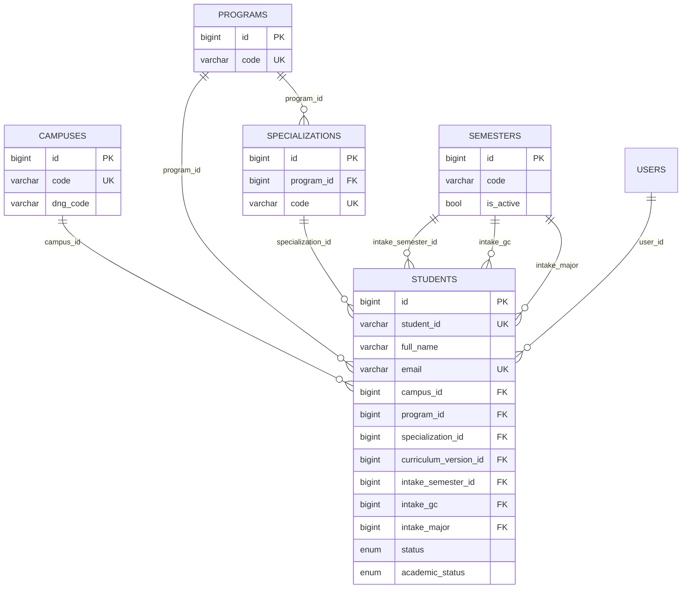
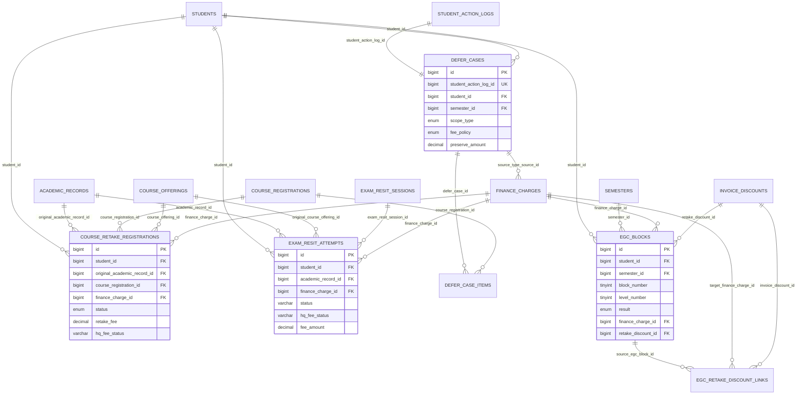
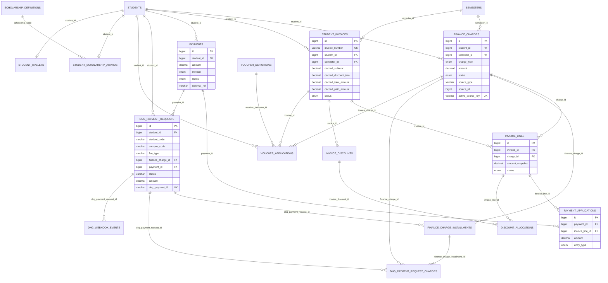

# Student Academic and Finance Schema Map

Last updated: 2026-07-07
Owner: Platform Team
Status: Current-state schema map
Source of truth: dev DB `asia` schema, Eloquent model relations, and current Finance/Academic architecture docs

## Scope

This document maps the current tables that connect a student to Academic and Finance data. It focuses on relationship shape and source-of-truth boundaries, not every column in every table.

In scope:

- Student identity/context tables that anchor Academic and Finance joins.
- Academic enrollment, attendance, grading, progression, decision, defer, retake, and exam-resit tables.
- Finance billing, invoice-line settlement, cash, discount, DNG, EGC, scholarship, voucher, and auxiliary wallet tables.

Out of scope:

- Generic Identity/Auth internals unless directly referenced by these tables.
- Notification, survey, form, room, upload, and lecturer details except where a table stores a direct FK.
- Legacy settlement tables that are not present in the current DB (`payment_allocations`, `invoice_items`, `student_balance_ledger`).

## Key Conventions

- `students.id` is the internal primary key and the normal FK target.
- `students.student_id` is the unique student code/MSSV. DNG stores this again as `dng_payment_requests.student_code` for external payment audit and callback matching.
- `students.status`, `students.intake_gc`, `students.intake_major`, and `students.intake_semester_id` are academic lifecycle fields that Finance uses for charge timing.
- `student_invoices.cached_*` columns are rebuildable snapshots. Current payable truth comes from `invoice_lines`, `payment_applications`, and `discount_allocations`.
- `finance_charges.source_type` + `source_id` is a polymorphic source pointer. It is a business relationship, not a physical FK. **⚠️ Current/legacy coupling — rejected as target by ADR-0026.** This pointer stores Academic class names/ids inside Finance; the target replaces it with the neutral `source_system` + `source_kind` + `source_ref` triple as the *only* cross-context correlation. `finance_obligation_id` is Finance-internal (charge → obligation) and is **never** stored on an Academic source table (ADR-0026 §2.1). Read this document as the *current* coupling map, not the design to extend.

## Core Student Context



| Table | Student relationship | Key columns | Role |
|---|---|---|---|
| `students` | Hub | `id`, `student_id`, `campus_id`, `program_id`, `specialization_id`, `intake_semester_id`, `intake_gc`, `intake_major`, `status`, `academic_status` | Canonical student identity and lifecycle stage. |
| `campuses` | `students.campus_id` | `code`, `dng_code` | Campus scope and DNG campus mapping. |
| `programs` | `students.program_id` | `code` | Program dimension. |
| `specializations` | `students.specialization_id` | `program_id`, `code` | Major/specialization dimension under a program. |
| `semesters` | many FKs | `code`, `start_date`, `end_date`, `is_active` | Intake, academic operation, charge, and invoice periods. |
| `users` | `students.user_id`, staff actor fields | `id`, `email`, `type` | Portal user identity and staff actor/audit references. |

## Academic Schema Around Student

```mermaid
erDiagram
    STUDENTS ||--o{ COURSE_REGISTRATIONS : student_id
    COURSE_OFFERINGS ||--o{ COURSE_REGISTRATIONS : course_offering_id
    SEMESTERS ||--o{ COURSE_REGISTRATIONS : semester_id
    COURSE_REGISTRATIONS ||--o{ COURSE_REGISTRATIONS : original_registration_id

    COURSE_OFFERINGS ||--o{ CLASS_SESSIONS : course_offering_id
    CLASS_SESSIONS ||--o{ ATTENDANCES : class_session_id
    STUDENTS ||--o{ ATTENDANCES : student_id

    COURSE_OFFERINGS ||--o{ ASSESSMENT_COMPONENT_DETAIL_SCORES : course_offering_id
    ASSESSMENT_COMPONENT_DETAILS ||--o{ ASSESSMENT_COMPONENT_DETAIL_SCORES : assessment_component_detail_id
    ASSESSMENT_COMPONENTS ||--o{ ASSESSMENT_COMPONENT_DETAILS : assessment_component_id
    STUDENTS ||--o{ ASSESSMENT_COMPONENT_DETAIL_SCORES : student_id

    STUDENTS ||--o{ ACADEMIC_RECORDS : student_id
    COURSE_OFFERINGS ||--o{ ACADEMIC_RECORDS : course_offering_id
    UNITS ||--o{ ACADEMIC_RECORDS : unit_id
    SEMESTERS ||--o{ ACADEMIC_RECORDS : semester_id

    STUDENTS ||--o{ GPA_CALCULATIONS : student_id
    STUDENTS ||--o{ ACADEMIC_STANDINGS : student_id
    STUDENTS ||--o{ ACADEMIC_HOLDS : student_id

    STUDENTS ||--o{ STUDENT_ACTION_LOGS : student_id
    STUDENT_DECISIONS ||--o{ STUDENT_ACTION_LOGS : decision_id
    STUDENT_DECISIONS ||--o{ ACADEMIC_PROGRESSION_EVENTS : decision_id
    STUDENTS ||--o{ ACADEMIC_PROGRESSION_EVENTS : student_id
    SEMESTERS ||--o{ ACADEMIC_PROGRESSION_EVENTS : semester_id
    STUDENT_DECISIONS ||--o{ STUDENT_DECISION_STUDENT : student_decision_id
    STUDENTS ||--o{ STUDENT_DECISION_STUDENT : student_id

    COURSE_REGISTRATIONS {
        bigint id PK
        bigint student_id FK
        bigint course_offering_id FK
        bigint semester_id FK
        enum registration_status
        varchar final_grade
        bool is_retake
        bigint original_registration_id FK
    }
    ACADEMIC_RECORDS {
        bigint id PK
        bigint student_id FK
        bigint course_offering_id FK
        bigint semester_id FK
        bigint unit_id FK
        enum grade_status
        enum completion_status
        decimal attendance_percentage
        varchar failure_reason
    }
    STUDENT_ACTION_LOGS {
        bigint id PK
        bigint student_id FK
        varchar action_type
        bigint decision_id FK
        bigint from_semester_id FK
        bigint return_semester_id FK
        bigint effective_semester_id FK
        bigint from_campus_id FK
        bigint to_campus_id FK
    }
    ACADEMIC_PROGRESSION_EVENTS {
        bigint id PK
        bigint student_id FK
        varchar event_type
        bigint semester_id FK
        varchar from_course_stage
        varchar to_course_stage
        tinyint from_english_level
        tinyint to_english_level
        bigint decision_id FK
    }
```



| Table | Student relationship | Key related tables | Role |
|---|---|---|---|
| `course_registrations` | `student_id -> students.id` | `course_offerings`, `semesters`, self `original_registration_id` | Student roster/enrollment per offering and semester. |
| `course_offerings` | through registrations/records/scores | `semesters`, `units`, `campuses`, `lectures`, `syllabus_templates` | Class/offering container. |
| `class_sessions` | through `attendances` | `course_offerings`, rooms/lecturers | Scheduled class sessions. |
| `attendances` | `student_id -> students.id` | `class_sessions`, lecturer actor fields | Per-student attendance evidence. |
| `assessment_components` | through detail scores | `syllabus_templates` | Grade component header from syllabus. |
| `assessment_component_details` | through detail scores | `assessment_components` | Individual grade item/detail. |
| `assessment_component_detail_scores` | `student_id -> students.id` | `assessment_component_details`, `course_offerings` | Per-student assessment scores. |
| `academic_records` | `student_id -> students.id` | `course_offerings`, `semesters`, `units`, `programs`, `campuses` | Finalized/provisional academic result snapshot per student/offering. |
| `gpa_calculations` | `student_id -> students.id` | `semesters`, `programs` | Semester and cumulative GPA summary. |
| `academic_standings` | `student_id -> students.id` | `semesters`, staff `users` | Academic standing/probation state. |
| `academic_holds` | `student_id -> students.id` | staff `users` | Academic/financial/admin holds that can block operations. |
| `student_action_logs` | `student_id -> students.id` | `student_decisions`, `semesters`, `campuses`, staff `users` | Administrative lifecycle actions: defer/resume/dropout/transfer/enrollment. |
| `student_decisions` | linked by `student_action_logs.decision_id` and roster pivot | `student_decision_student`, `upload_records` | Decision registry metadata. |
| `student_decision_student` | `student_id -> students.id` | `student_decisions` | Coverage roster for a decision. |
| `academic_progression_events` | `student_id -> students.id` | `semesters`, `student_decisions`, staff `users` | Canonical academic progression event store for level/stage changes. |
| `student_action_attachments` | through `student_action_log_id` | `student_action_logs`, `upload_records` | Uploaded evidence for action logs. |
| `student_warning_logs` | `student_id -> students.id` | `course_offerings`, `class_sessions`, `gpa_calculations` | Warning/audit records for attendance or academic-standing alerts. |

## Academic-Finance Boundary Tables



| Table | Boundary meaning | Finance link | Academic link |
|---|---|---|---|
| `course_retake_registrations` | Course retake request/lifecycle. | `finance_charge_id -> finance_charges.id`, `retake_fee`, `hq_fee_status`. | `student_id`, `original_academic_record_id`, optional `course_registration_id`, `course_offering_id`, semester fields. |
| `exam_resit_attempts` | Exam resit request/scheduling/result lifecycle. | `finance_charge_id -> finance_charges.id`, `fee_amount`, `hq_fee_status`, payment deadline fields. | `student_id`, `academic_record_id`, `original_course_offering_id`, `exam_resit_session_id`, operation/original/charge semesters. |
| `exam_resit_sessions` | Scheduled resit session. | No direct money truth. | `unit_id`, `semester_id`, `campus_id`, room slot, scheduled/cancelled actor fields. |
| `defer_cases` | Finance policy created from an Academic defer action. | May create a `finance_charges` credit through polymorphic source (`source_type = App\\Models\\DeferCase`). | 1-1 with `student_action_logs`, plus `student_id`, `semester_id`, `applies_until_semester_id`, `applied_semester_id`. |
| `defer_case_items` | Course-level defer details. | May influence preserved/forfeit fee handling. | `course_registration_id -> course_registrations.id`. |
| `egc_blocks` | EGC block result tracking and charge mapping. | Optional `finance_charge_id`, optional `retake_discount_id`. | `student_id`, `semester_id`, block/level/result/attendance. |
| `egc_retake_discount_links` | Links failed source EGC block to discount on a later target charge. | `invoice_discount_id`, unique `target_finance_charge_id`. | `source_egc_block_id`. |

## Finance Settlement and DNG Schema



| Table | Student relationship | Key related tables | Role |
|---|---|---|---|
| `finance_charges` | `student_id -> students.id` | `semesters`, `billing_cycles`, `invoice_lines`, actor `users` | Canonical charge/credit event. `charge_type` includes tuition, EGC, retake, exam resit, defer credit, scholarship/voucher credit, admission, BHYT, adjustment. |
| `student_invoices` | `student_id -> students.id` | `semesters`, `invoice_lines`, `invoice_discounts` | Invoice header and cached totals. Not the primary settlement ledger. |
| `invoice_lines` | through invoice and charge | `student_invoices`, `finance_charges` | Canonical billable line. `status` tracks active/void without deleting history. |
| `payments` | `student_id -> students.id` | `payment_applications`, DNG requests | Canonical cash receipt ledger. |
| `payment_applications` | through payment and line | `payments`, `invoice_lines` | Line-level cash application/reversal. |
| `invoice_discounts` | through invoice | `student_invoices`, actor `users` | Non-cash discount header: scholarship, voucher, EGC retake. |
| `discount_allocations` | through discount and line | `invoice_discounts`, `invoice_lines` | Line-level discount allocation/release/reversal. |
| `finance_charge_installments` | through charge | `finance_charges`, optional `dng_payment_requests` | Installment schedule for a charge. |
| `dng_payment_requests` | `student_id -> students.id` plus `student_code` snapshot | `finance_charges`, `payments`, `semesters`, DNG webhooks | Gateway request/audit state. `student_code`, `campus_code`, `item_id`, `dng_payment_id` are external correlation fields. |
| `dng_payment_request_charges` | through DNG request | `dng_payment_requests`, `finance_charges`, optional installment | Pivot/allocation rows for multi-charge or installment DNG requests. |
| `dng_webhook_events` | through DNG request | `dng_payment_requests` | Raw webhook inbox and processing status. |
| `finance_lifecycle_due_exception_reviews` | nullable `student_id -> students.id` | `dng_payment_requests`, actor `users` | Staff review state for lifecycle/DNG due exceptions. |
| `finance_lifecycle_due_exception_review_events` | nullable `student_id -> students.id` | review row, DNG request, actor `users` | Audit event log for exception review transitions. |
| `voucher_applications` | `student_id -> students.id` | `voucher_definitions`, optional invoice/charge | Student voucher application and discount source metadata. |
| `voucher_definitions` | through applications | none direct to student | Voucher catalog. |
| `student_scholarship_awards` | unique `student_id -> students.id` | `scholarship_definitions.code` | Student scholarship award record. |
| `scholarship_definitions` | through awards/discount reference | none direct to student | Scholarship catalog. |
| `student_wallets` | unique `student_id -> students.id` | none | Auxiliary student wallet/gold balance. It is not the tuition settlement ledger. |

## Important Cardinality and Constraints

| Constraint | Meaning |
|---|---|
| `students.student_id` unique | One internal student row per MSSV/student code. |
| `course_registrations(student_id, course_offering_id, semester_id)` unique | A student has one registration row per offering per semester. |
| `academic_records(student_id, course_offering_id)` unique | One academic result record per student/offering. |
| `student_decision_student(student_decision_id, student_id)` unique | A student appears once in a decision coverage roster. |
| `defer_cases.student_action_log_id` unique | One Finance defer case per Academic defer action log. |
| `defer_case_items(defer_case_id, course_registration_id)` unique | A course registration appears once per defer case. |
| `egc_blocks(student_id, semester_id, block_number)` unique | One EGC block result per student/semester/block. |
| `finance_charges.active_source_key` unique | Active source-backed charges are deduplicated by source key. |
| `student_invoices.invoice_number` unique | Invoice number is globally unique. |
| `invoice_lines(invoice_id, charge_id)` unique | A charge appears once on a given invoice. |
| `finance_charge_installments(finance_charge_id, installment_no)` unique | Installment numbering is unique per charge. |
| `dng_payment_requests.dng_payment_id` unique | External DNG payment id is unique when present. |
| `dng_payment_request_charges(dng_payment_request_id, finance_charge_id)` unique | A DNG request links to a charge once. |
| `egc_retake_discount_links.target_finance_charge_id` unique | A target retake charge has one EGC retake discount link. |
| `invoice_discounts(invoice_id, discount_type, reference_key, discount_source)` unique | Prevents duplicate active discount headers for the same source identity. |
| `voucher_applications(student_id, semester_id, voucher_definition_id)` unique | A student can apply a voucher once per semester. |
| `student_scholarship_awards.student_id` unique | Current schema stores one scholarship award row per student. |
| `student_wallets.student_id` unique | One wallet row per student. |

## Source-of-Truth Notes

1. Academic progression truth is `academic_progression_events`; `student_changes` is a generic field-diff audit and should not be treated as canonical progression history.
2. Course roster truth starts at `course_registrations`, but attendance truth is `attendances` joined to `class_sessions`.
3. Final/provisional grade truth for reporting is `academic_records`; raw score input lives in `assessment_component_detail_scores`.
4. Retake course and exam resit are explicit Academic-Finance bridge flows because they carry both academic lifecycle state and `finance_charge_id`. **⚠️ Current/legacy coupling only** — ADR-0026 removes the `finance_charge_id` FK; the target correlation is the neutral `source_system`/`source_kind`/`source_ref` triple only. Academic stores **no** Finance id — neither `finance_charge_id` nor `finance_obligation_id`; `finance_obligation_id` lives only inside Finance-owned aggregates/projections. Do not extend this bridge.
5. Invoice totals should be derived from active `invoice_lines`, `payment_applications`, and `discount_allocations`; `student_invoices.cached_*` is for display/performance cache.
6. Cash truth is `payments`; cash allocation truth is `payment_applications`.
7. Discount truth is `invoice_discounts`; line-level discount truth is `discount_allocations`.
8. DNG request truth is split: `dng_payment_requests` stores local request state and external identifiers; `dng_webhook_events` stores raw callback/audit events; bridged cash lands in `payments`.
9. `finance_charges.source_type/source_id` must be interpreted through application code. The DB cannot enforce which source table a charge points to. **⚠️ Current/legacy coupling only** — this polymorphic pointer stores Academic class names/ids inside Finance and is rejected as target by ADR-0026, which replaces it with the neutral `source_system`/`source_kind`/`source_ref` triple owned by the source. Read as migration context, not target.
10. `student_wallets` exists, but current settlement architecture does not use it as tuition cash or outstanding-balance truth.

## Practical Join Paths

### Student academic summary

```text
students
  -> course_registrations -> course_offerings -> units / semesters
  -> attendances -> class_sessions -> course_offerings
  -> assessment_component_detail_scores -> assessment_component_details -> assessment_components
  -> academic_records -> units / course_offerings / semesters
  -> gpa_calculations / academic_standings
  -> student_action_logs -> student_decisions
  -> academic_progression_events
```

### Student finance summary

```text
students
  -> finance_charges -> invoice_lines -> student_invoices
  -> payments -> payment_applications -> invoice_lines
  -> student_invoices -> invoice_discounts -> discount_allocations -> invoice_lines
  -> dng_payment_requests -> dng_payment_request_charges -> finance_charges
  -> voucher_applications / student_scholarship_awards
```

### Cross-boundary fee flows (current legacy join paths)

> **⚠️ Current-state legacy — not target.** These paths join Academic source tables straight into `finance_charges` via `finance_charge_id` / `source_type/source_id`. ADR-0026 rejects this: the target routes through the Finance Intake Contract and the neutral `source_system`/`source_kind`/`source_ref` triple, with no cross-context join. Read below as migration context only.

```text
course_retake_registrations -> finance_charges -> invoice_lines -> student_invoices
exam_resit_attempts -> finance_charges -> invoice_lines -> student_invoices
defer_cases -> finance_charges(source_type/source_id) -> invoice_lines
egc_blocks -> finance_charges
egc_retake_discount_links -> invoice_discounts -> discount_allocations
```

