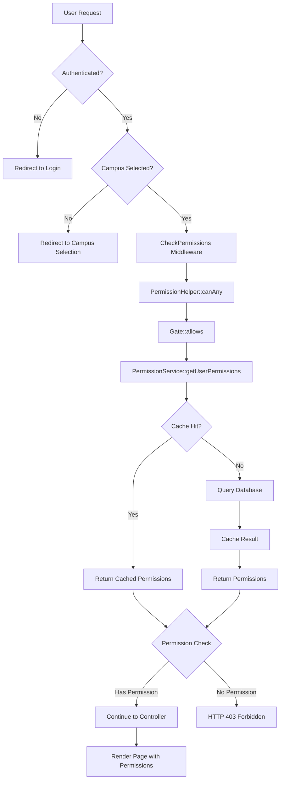

# Permission System Implementation

This document describes the improved permission system implementation for the Swinburne Education Management System.

## Overview

The permission system has been enhanced with the following features:
- **Caching**: Reduces database queries by caching user permissions
- **Lazy Loading**: Optimizes memory usage and processing time
- **Helper Functions**: Simplifies permission checking throughout the application
- **Custom Middleware**: Provides flexible permission checking in routes
- **Frontend Integration**: Seamless permission checking in Vue.js components
- **Automatic Cache Management**: Ensures data consistency

## Module-Based Permission Structure

The system uses a **module-based approach** instead of traditional parent-child hierarchy for better organization and maintainability.

### Permission Organization

#### Traditional Approach (Avoided)
```
Users (parent_id: null)
├── View User (parent_id: 1)
├── Create User (parent_id: 1) 
├── Edit User (parent_id: 1)
└── Delete User (parent_id: 1)
```

#### Module-Based Approach (Implemented)
```php
// config/permission.php
'access' => [
    'users' => [
        'view_user' => 'view_user',
        'create_user' => 'create_user',
        'edit_user' => 'edit_user',
        'delete_user' => 'delete_user',
    ],
    'students' => [
        'view_student' => 'view_student',
        'create_student' => 'create_student',
        // ...
    ],
    // ...
],
```

#### Database Structure
```sql
-- permissions table
+----+-------------+-------------+------------------+--------+
| id | name        | code        | display_name     | module |
+----+-------------+-------------+------------------+--------+
| 1  | view_user   | view_user   | View User        | users  |
| 2  | create_user | create_user | Create User      | users  |
| 3  | edit_user   | edit_user   | Edit User        | users  |
+----+-------------+-------------+------------------+--------+
```

### Benefits of Module-Based Structure

1. **Flat Structure**: No complex hierarchical queries needed
2. **Semantic Clarity**: Module names are self-explanatory (`users`, `students`, `roles`)
3. **Environment Independence**: No reliance on auto-increment IDs
4. **Easy Grouping**: Simple `GROUP BY module` for UI display
5. **Maintainable**: Adding/removing modules doesn't affect existing structure

### Role Management Interface

#### Frontend Grouping
```vue
<!-- Permissions grouped by module for better UX -->
<div v-for="permissionGroup in permissions" :key="permissionGroup.module">
  <h3>{{ permissionGroup.display_name }}</h3> <!-- "Users", "Students" -->
  <div v-for="permission in permissionGroup.permissions">
    <Checkbox :value="permission.code" /> {{ permission.display_name }}
  </div>
</div>
```

#### Backend Controller
```php
// Group permissions by module for role management
$permissions = Permission::all()
    ->groupBy('module')
    ->map(function ($modulePermissions, $module) {
        return [
            'module' => $module,
            'display_name' => ucfirst(str_replace('_', ' ', $module)),
            'permissions' => $modulePermissions->values()
        ];
    })
    ->values();
```

## Architecture

### Backend Components

1. **PermissionService** (`app/Services/PermissionService.php`)
   - Manages permission caching and retrieval
   - Provides methods to get user permissions by campus
   - Handles cache invalidation

2. **RoleAssignmentService** (`app/Services/RoleAssignmentService.php`)
   - Manages role and permission assignments
   - Automatically clears cache when permissions change
   - Ensures data consistency

3. **LazyPermissions Trait** (`app/Traits/LazyPermissions.php`)
   - Provides lazy loading of permissions
   - Implements hasPermission, hasAnyPermission, and hasAllPermissions methods
   - Used by the User model

4. **PermissionHelper** (`app/Helpers/PermissionHelper.php`)
   - Provides static helper methods for permission checking
   - Supports both campus-specific and current campus checks

5. **CheckPermissions Middleware** (`app/Http/Middleware/CheckPermissions.php`)
   - Allows route-level permission checking
   - Supports OR (any) and AND (all) logic

### Frontend Components

1. **usePermissions Composable** (`resources/js/composables/usePermissions.ts`)
   - Vue.js composable for permission checking
   - Provides can, canAny, and canAll methods
   - Reactive permission state management

2. **Permission Directives** (`resources/js/directives/permission.ts`)
   - `v-can`: Check single permission
   - `v-can-any`: Check multiple permissions with OR logic

## Usage Examples

### Backend Usage

#### Route Protection
```php
// Single permission
Route::get('/students', [StudentController::class, 'index'])
    ->middleware('permissions:view_student');

// Multiple permissions (OR logic)
Route::post('/students', [StudentController::class, 'store'])
    ->middleware('permissions:create_student,edit_student');

// Multiple permissions (AND logic)
Route::delete('/students/{id}', [StudentController::class, 'destroy'])
    ->middleware('permissions:all,view_student,delete_student');
```

#### Controller Usage
```php
// Using Gate
if (Gate::allows('edit_student')) {
    // User can edit students
}

// Using Helper
if (can_permission('edit_student')) {
    // User can edit students
}

// Using User Model
if ($user->hasPermission('edit_student')) {
    // User can edit students
}
```

#### Service Usage
```php
// Assign role to user
$assignmentService->assignRoleToUser($user, $role, $campusId);

// Remove role from user
$assignmentService->removeRoleFromUser($user, $role, $campusId);

// Add permission to role
$assignmentService->addPermissionToRole($role, $permission);
```

### Frontend Usage

#### Component Usage
```vue
<template>
  <div>
    <!-- Using composable -->
    <button v-if="can('create_student')" @click="createStudent">
      Add Student
    </button>
    
    <!-- Using directive -->
    <div v-can="'view_student'">
      Student List
    </div>
    
    <!-- Multiple permissions -->
    <div v-can-any="['edit_student', 'delete_student']">
      Student Management
    </div>
  </div>
</template>

<script setup>
import { usePermissions } from '@/composables/usePermissions';

const { can, canAny, canAll } = usePermissions();

// Check permissions in script
if (can('edit_student')) {
  // Enable editing
}
</script>
```

## System Flow Summary



## Commands

### Sync Permissions
```bash
php artisan permissions:sync
```
This command synchronizes permissions from the config file to the database.

### Clear Permission Cache
```bash
php artisan cache:clear
# OR specifically clear permission cache
php artisan tinker
>>> Cache::forget('user_permissions_*');
```

## Testing

Unit tests are provided for:
- PermissionService caching functionality
- LazyPermissions trait behavior
- Middleware permission checking
- RoleAssignmentService cache clearing

Run tests with:
```bash
php artisan test tests/Unit/PermissionServiceTest.php
```

## Performance Benefits

1. **Reduced Database Queries**: Permissions are cached for 24 hours
2. **Lazy Loading**: Permissions are only loaded when needed
3. **Efficient Cache Management**: Only affected users' caches are cleared
4. **Optimized Frontend**: Permissions are loaded once and reused

## Security Considerations

1. Permissions are always checked server-side
2. Frontend permission checks are for UI/UX only
3. Cache is automatically cleared when permissions change
4. Campus-specific permissions ensure proper isolation

## Permission Flow: Step-by-Step Process

This section describes the detailed flow when a user attempts to access a protected page.

### Scenario: User accessing `/users` page

#### Step 1: Route Registration
```php
// routes/web.php
Route::get('/users', [UserController::class, 'index'])
    ->middleware('permissions:view_user')
    ->name('users.index');
```

#### Step 2: User Makes Request
When user clicks on "Users" menu or navigates to `/users`:

1. **Browser sends HTTP GET request** to `http://domain.com/users`
2. **Laravel router** matches the route and identifies required middleware

#### Step 3: Middleware Chain Execution

##### 3.1 Authentication Check
```php
// Laravel's auth middleware (if applied)
if (!auth()->check()) {
    return redirect()->route('login');
}
```

##### 3.2 Campus Selection Check
```php
// CheckCampusSelected middleware
if (!session('current_campus_id')) {
    return redirect()->route('select-campus');
}
```

##### 3.3 Permission Check (`CheckPermissions` middleware)
```php
// app/Http/Middleware/CheckPermissions.php
public function handle(Request $request, Closure $next, ...$permissions)
{
    // Parse permissions: ['view_user']
    $requiredPermissions = $permissions; // ['view_user']
    
    // Check if user has any of the required permissions
    $hasPermission = PermissionHelper::canAny($requiredPermissions);
    
    if (!$hasPermission) {
        abort(403, 'Unauthorized action.');
    }
    
    return $next($request);
}
```

#### Step 4: Permission Verification Process

##### 4.1 PermissionHelper::canAny() Call
```php
// app/Helpers/PermissionHelper.php
public static function canAny(array $permissions)
{
    foreach ($permissions as $permission) {
        if (self::can($permission)) { // Check 'view_user'
            return true;
        }
    }
    return false;
}
```

##### 4.2 Gate::allows() Check
```php
// PermissionHelper::can() calls Gate::allows()
public static function can($permission)
{
    return Gate::allows($permission); // Gate::allows('view_user')
}
```

##### 4.3 Gate Definition Execution
```php
// app/Providers/PermissionServiceProvider.php
Gate::define('view_user', function ($user) {
    // Get current campus from session
    $currentCampusId = session('current_campus_id'); // e.g., 1
    
    // Use PermissionService to get cached permissions
    $permissionService = app(PermissionService::class);
    $permissions = $permissionService->getUserPermissions($user, $currentCampusId);
    
    // Check if 'view_user' is in user's permissions
    return in_array('view_user', $permissions);
});
```

#### Step 5: Permission Retrieval (Caching Layer)

##### 5.1 Cache Check
```php
// app/Services/PermissionService.php
public function getUserPermissions(User $user, int $campusId = null)
{
    $cacheKey = "user_permissions_{$user->id}_campus_{$campusId}";
    // Example: "user_permissions_1_campus_1"
    
    return Cache::remember($cacheKey, now()->addDay(), function () use ($user, $campusId) {
        // If cache miss, execute database query
        return $this->fetchPermissionsFromDatabase($user, $campusId);
    });
}
```

##### 5.2 Database Query (if cache miss)
```sql
-- Generated SQL query
SELECT DISTINCT permissions.code 
FROM permissions
JOIN role_permissions ON permissions.id = role_permissions.permission_id
JOIN campus_user_roles ON role_permissions.role_id = campus_user_roles.role_id
WHERE campus_user_roles.user_id = 1 
  AND campus_user_roles.campus_id = 1
```

Result example: `['view_user', 'create_user', 'edit_user', 'view_student', ...]`

#### Step 6: Permission Decision

##### 6.1 Permission Found
```php
// 'view_user' found in permissions array
return in_array('view_user', $permissions); // true
```

##### 6.2 Gate Returns True
```php
Gate::allows('view_user'); // returns true
PermissionHelper::can('view_user'); // returns true
PermissionHelper::canAny(['view_user']); // returns true
```

##### 6.3 Middleware Allows Request
```php
// CheckPermissions middleware
if (!$hasPermission) { // $hasPermission = true
    abort(403); // This line is NOT executed
}

return $next($request); // Request continues to controller
```

#### Step 7: Controller Execution
```php
// app/Http/Controllers/UserController.php
public function index()
{
    // User has permission, controller executes normally
    $users = User::paginate(10);
    
    return Inertia::render('users/Index', [
        'users' => $users
    ]);
}
```

#### Step 8: Frontend Permission Integration

##### 8.1 Inertia Props Sharing
```php
// app/Http/Middleware/HandleInertiaRequests.php
'auth' => function () use ($user, $currentCampusId) {
    $permissionService = app(PermissionService::class);
    
    return [
        'user' => $user->only('id', 'name', 'email'),
        'permissions' => $permissionService->getUserPermissions($user, $currentCampusId),
        'current_campus_id' => $currentCampusId,
    ];
},
```

##### 8.2 Vue Component Permission Check
```vue
<!-- resources/js/pages/users/Index.vue -->
<template>
  <div>
    <!-- Permission directive hides/shows elements -->
    <Button v-can="'create_user'" @click="createUser">
      Add User
    </Button>
    
    <!-- Conditional rendering based on permissions -->
    <div v-if="can('edit_user')">
      Edit Actions Available
    </div>
  </div>
</template>

<script setup>
import { usePermissions } from '@/composables/usePermissions';

const { can } = usePermissions();
// can('create_user') checks if 'create_user' is in props.auth.permissions
</script>
```

### Error Scenarios

#### Scenario A: User Lacks Permission
```php
// Step 4.3: Gate definition returns false
return in_array('view_user', []); // false - user has no permissions

// Step 6.2: Permission check fails  
PermissionHelper::canAny(['view_user']); // returns false

// Step 6.3: Middleware blocks request
if (!$hasPermission) { // $hasPermission = false
    abort(403, 'Unauthorized action.'); // HTTP 403 Forbidden
}
```

#### Scenario B: User Not Authenticated
```php
// Step 3.1: Authentication check fails
if (!auth()->check()) { // User not logged in
    return redirect()->route('login'); // Redirect to login page
}
```

#### Scenario C: No Campus Selected
```php
// Step 3.2: Campus check fails
if (!session('current_campus_id')) { // No campus in session
    return redirect()->route('select-campus'); // Redirect to campus selection
}
```

### Performance Optimizations

1. **Cache Hit**: Permissions loaded from Redis/file cache (< 1ms)
2. **Cache Miss**: Database query executed once, then cached for 24 hours
3. **Lazy Loading**: User model loads permissions only when needed
4. **Frontend Caching**: Permissions shared once per page load via Inertia

### Security Layers

1. **Server-side Validation**: All permission checks happen on server
2. **Middleware Protection**: Routes protected at middleware level
3. **Controller Validation**: Additional checks can be added in controllers
4. **Frontend UX**: Vue directives hide/show elements for better UX
5. **Campus Isolation**: Permissions are campus-specific for data security

## Future Enhancements

1. Permission groups/categories for better organization
2. Permission inheritance system
3. Audit logging for permission changes
4. Real-time permission updates via WebSockets
5. Permission delegation system 
