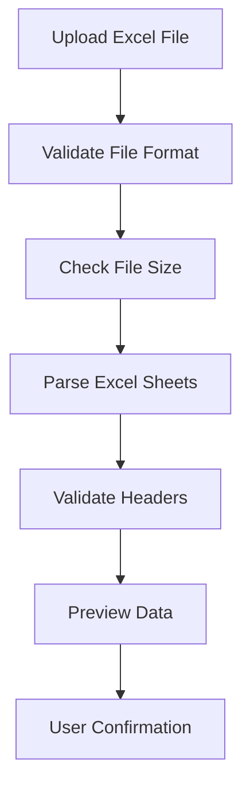
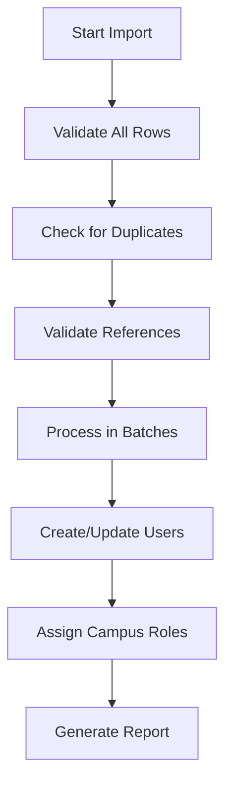

# User Data Import Plan - Excel Import

## Overview
This plan outlines the implementation for importing user data from Excel format, including their associated campuses and roles. The system supports many-to-many relationships where users can belong to multiple campuses and have different roles in each campus. This complements the existing export functionality.

## Database Structure Analysis

### Current Tables
- **users**: Basic user information (id, name, email, password, etc.)
- **campuses**: Campus information (id, name, code, address)
- **roles**: Role definitions (id, name) - 11 predefined roles
- **permissions**: Permission definitions with hierarchical structure
- **campus_user_roles**: Junction table linking users, campuses, and roles
- **role_permissions**: Junction table linking roles and permissions

### Import Considerations
- **User Creation**: Create new users or update existing ones
- **Campus Matching**: Match campuses by code or name
- **Role Matching**: Match roles by name or ID
- **Relationship Management**: Handle many-to-many relationships properly
- **Data Validation**: Ensure data integrity and consistency

## Import Requirements

### Supported Import Formats

#### 1. **Simple Format (Single Sheet)**
Users with concatenated campus and role information:
```
Name | Email | Password | Campuses | Roles | Campus Codes
John Doe | john@example.com | password123 | Campus A, Campus B | Super Admin, Giám Đốc Đào Tạo | CA, CB
```

#### 2. **Detailed Format (Multiple Sheets)**
- **Sheet 1**: User basic information
- **Sheet 2**: User-Campus-Role relationships
- **Sheet 3**: Campus reference data (optional)
- **Sheet 4**: Role reference data (optional)

#### 3. **Relationship Format (Single Sheet)**
One row per user-campus-role relationship:
```
User Name | User Email | Campus Code | Campus Name | Role Name | Password
John Doe | john@example.com | CA | Campus A | Super Admin | password123
John Doe | john@example.com | CB | Campus B | Giám Đốc Đào Tạo | password123
```

### Data Validation Rules
1. **Required Fields**: Name, Email for users; Campus identification; Role identification
2. **Email Uniqueness**: Prevent duplicate email addresses
3. **Campus Validation**: Campus must exist or be created
4. **Role Validation**: Role must exist in predefined roles
5. **Relationship Validation**: Prevent duplicate user-campus-role combinations

## Implementation Plan

### Phase 1: Backend Implementation

#### 1.1 Create Import Service
**File**: `app/Services/UserExcelImportService.php`
- Handle Excel file parsing and validation
- Support multiple import formats
- Implement data transformation and mapping
- Handle batch processing for large datasets
- Provide detailed import reports

#### 1.2 Create Import Controller
**File**: `app/Http/Controllers/UserImportController.php`
- Handle file upload and validation
- Process import requests
- Return import results and error reports
- Support preview functionality before actual import

#### 1.3 Create Import Request
**File**: `app/Http/Requests/UserImportRequest.php`
- Validate uploaded files
- Check file format and size limits
- Validate import parameters

#### 1.4 Create Import Job
**File**: `app/Jobs/ImportUsersFromExcelJob.php`
- Background processing for large imports
- Progress tracking and notifications
- Error handling and rollback capabilities

#### 1.5 Add Import Routes
**File**: `routes/import.php`
- Import endpoints with proper authentication
- File upload and processing routes
- Preview and validation endpoints

### Phase 2: Data Processing Components

#### 2.1 Import Validators
**Files**: `app/Validators/ImportValidators/`
- `UserDataValidator.php`: Validate user information
- `CampusDataValidator.php`: Validate campus information
- `RoleDataValidator.php`: Validate role assignments
- `RelationshipValidator.php`: Validate user-campus-role relationships

#### 2.2 Data Processors
**Files**: `app/Processors/ImportProcessors/`
- `UserProcessor.php`: Handle user creation/updates
- `CampusProcessor.php`: Handle campus matching/creation
- `RoleProcessor.php`: Handle role matching
- `RelationshipProcessor.php`: Handle relationship creation

#### 2.3 Import Models
**File**: `app/Models/ImportLog.php`
- Track import history and results
- Store error logs and success metrics
- Enable import auditing

### Phase 3: Frontend Implementation

#### 3.1 Import Interface
**File**: `resources/js/pages/users/Import.vue`
- File upload component with drag-and-drop
- Format selection and configuration
- Import preview functionality
- Progress tracking and results display

#### 3.2 Import Components
**Files**: `resources/js/components/Import/`
- `FileUploader.vue`: Handle file uploads
- `ImportPreview.vue`: Show data preview before import
- `ImportProgress.vue`: Display import progress
- `ImportResults.vue`: Show import results and errors

#### 3.3 Import Button Integration
- Add import functionality to user list page
- Bulk import options with templates
- Import history and logs access

### Phase 4: Import Templates and Examples

#### 4.1 Excel Templates
Create downloadable templates for each import format:

**Template 1: Simple Format**
```excel
Sheet: Users
| Name* | Email* | Password | Campus Codes | Role Names | Phone | Address |
|-------|--------|----------|--------------|------------|-------|---------|
| John Doe | john@example.com | password123 | CA,CB | Super Admin,Giám Đốc Đào Tạo | +1234567890 | 123 Main St |
```

**Template 2: Detailed Format**
```excel
Sheet 1: Users
| Name* | Email* | Password | Phone | Address | Email Verified |
|-------|--------|----------|-------|---------|----------------|

Sheet 2: User Campus Roles
| User Email* | Campus Code* | Role Name* | Assigned Date |
|-------------|--------------|------------|---------------|

Sheet 3: Campus Reference (Optional)
| Code* | Name* | Address |
|-------|-------|---------|

Sheet 4: Role Reference (Optional)
| Name* | Description |
|-------|-------------|
```

**Template 3: Relationship Format**
```excel
Sheet: User Relationships
| User Name* | User Email* | Campus Code* | Campus Name | Role Name* | Password | Phone |
|------------|-------------|--------------|-------------|------------|----------|-------|
```

#### 4.2 Sample Data Files
- Provide sample Excel files with realistic data
- Include examples of common scenarios
- Document best practices and common pitfalls

## Technical Implementation Details

### Service Class Methods
```php
class UserExcelImportService
{
    public function importUsersFromExcel(string $filePath, array $options = [])
    public function validateImportFile(string $filePath)
    public function previewImportData(string $filePath, int $previewRows = 10)
    public function processSimpleFormat(array $data)
    public function processDetailedFormat(array $sheets)
    public function processRelationshipFormat(array $data)
    public function createOrUpdateUser(array $userData)
    public function assignUserToCampusWithRole(User $user, Campus $campus, Role $role)
    public function generateImportReport(array $results)
}
```

### Controller Methods
```php
class UserImportController
{
    public function showImportForm()
    public function uploadFile(UserImportRequest $request)
    public function previewImport(Request $request)
    public function processImport(Request $request)
    public function downloadTemplate(string $format)
    public function getImportHistory()
    public function getImportStatus(string $jobId)
}
```

### Import Job Structure
```php
class ImportUsersFromExcelJob implements ShouldQueue
{
    public function handle()
    {
        // Process import in chunks
        // Update progress in cache/database
        // Handle errors and rollbacks
        // Send completion notification
    }
    
    public function failed(\Throwable $exception)
    {
        // Handle job failure
        // Log errors
        // Notify administrators
    }
}
```

### Validation Rules
```php
// User validation rules
$userRules = [
    'name' => 'required|string|max:255',
    'email' => 'required|email|unique:users,email',
    'password' => 'nullable|string|min:8',
    'phone' => 'nullable|string|max:20',
    'address' => 'nullable|string|max:500'
];

// Campus validation rules
$campusRules = [
    'code' => 'required|string|exists:campuses,code',
    'name' => 'nullable|string|exists:campuses,name'
];

// Role validation rules
$roleRules = [
    'name' => 'required|string|exists:roles,name'
];
```

## Import Processing Workflow

### 1. File Upload and Validation


### 2. Data Processing Pipeline


### 3. Error Handling Strategy
- **Validation Errors**: Collect all errors before processing
- **Partial Success**: Allow partial imports with error reporting
- **Rollback Options**: Provide rollback for failed imports
- **Duplicate Handling**: Options to skip, update, or error on duplicates

## Security Considerations

### 1. File Security
- Validate file types and extensions
- Scan for malicious content
- Limit file size and processing time
- Secure temporary file storage

### 2. Data Security
- Validate all input data
- Sanitize user inputs
- Hash passwords before storage
- Audit all import activities

### 3. Access Control
- Require appropriate permissions for import
- Log all import activities with user attribution
- Implement rate limiting for import requests

## Performance Considerations

### 1. Large File Handling
- Process files in chunks (1000 rows per batch)
- Use background jobs for large imports
- Implement progress tracking
- Memory-efficient file reading

### 2. Database Optimization
- Use bulk insert operations
- Implement transaction management
- Optimize queries for relationship creation
- Use database indexes effectively

### 3. User Experience
- Real-time progress updates
- Responsive UI during processing
- Clear error messaging
- Import history and logs

## Error Handling and Reporting

### 1. Import Report Structure
```php
[
    'summary' => [
        'total_rows' => 1000,
        'successful' => 950,
        'failed' => 50,
        'skipped' => 0,
        'processing_time' => '2.5 minutes'
    ],
    'errors' => [
        [
            'row' => 15,
            'field' => 'email',
            'value' => 'invalid-email',
            'error' => 'Invalid email format'
        ]
    ],
    'warnings' => [
        [
            'row' => 25,
            'message' => 'User already exists, updated information'
        ]
    ]
]
```

### 2. Error Categories
- **Validation Errors**: Invalid data format or values
- **Reference Errors**: Missing campus or role references
- **Duplicate Errors**: Duplicate email addresses
- **System Errors**: Database or processing errors

## Testing Strategy

### 1. Unit Tests
```php
// Test import service methods
public function test_import_service_validates_excel_file()
public function test_import_service_processes_simple_format()
public function test_import_service_handles_duplicate_emails()
public function test_import_service_creates_campus_relationships()
```

### 2. Integration Tests
```php
// Test full import workflow
public function test_complete_import_workflow()
public function test_import_with_validation_errors()
public function test_large_file_import_performance()
```

### 3. Feature Tests
```php
// Test controller endpoints
public function test_authenticated_user_can_upload_import_file()
public function test_import_preview_shows_correct_data()
public function test_import_processing_creates_users_and_relationships()
```

## File Structure

```
app/
├── Http/
│   ├── Controllers/
│   │   └── UserImportController.php
│   └── Requests/
│       └── UserImportRequest.php
├── Services/
│   └── UserExcelImportService.php
├── Jobs/
│   └── ImportUsersFromExcelJob.php
├── Models/
│   └── ImportLog.php
├── Validators/
│   └── ImportValidators/
│       ├── UserDataValidator.php
│       ├── CampusDataValidator.php
│       ├── RoleDataValidator.php
│       └── RelationshipValidator.php
└── Processors/
    └── ImportProcessors/
        ├── UserProcessor.php
        ├── CampusProcessor.php
        ├── RoleProcessor.php
        └── RelationshipProcessor.php

resources/
├── js/
│   └── pages/
│       └── users/
│           ├── Import.vue
│           └── components/
│               ├── FileUploader.vue
│               ├── ImportPreview.vue
│               ├── ImportProgress.vue
│               └── ImportResults.vue
└── templates/
    └── import/
        ├── users_simple_template.xlsx
        ├── users_detailed_template.xlsx
        └── users_relationship_template.xlsx

routes/
└── import.php

database/
└── migrations/
    └── create_import_logs_table.php

tests/
├── Unit/
│   ├── UserExcelImportServiceTest.php
│   └── ImportValidatorsTest.php
└── Feature/
    ├── UserImportTest.php
    └── ImportWorkflowTest.php
```

## Database Schema for Import Logging

```sql
CREATE TABLE import_logs (
    id BIGINT UNSIGNED AUTO_INCREMENT PRIMARY KEY,
    user_id BIGINT UNSIGNED NOT NULL,
    filename VARCHAR(255) NOT NULL,
    format ENUM('simple', 'detailed', 'relationship') NOT NULL,
    status ENUM('pending', 'processing', 'completed', 'failed') NOT NULL,
    total_rows INT UNSIGNED DEFAULT 0,
    successful_rows INT UNSIGNED DEFAULT 0,
    failed_rows INT UNSIGNED DEFAULT 0,
    skipped_rows INT UNSIGNED DEFAULT 0,
    processing_time INT UNSIGNED DEFAULT 0, -- in seconds
    error_log JSON NULL,
    summary JSON NULL,
    created_at TIMESTAMP DEFAULT CURRENT_TIMESTAMP,
    updated_at TIMESTAMP DEFAULT CURRENT_TIMESTAMP ON UPDATE CURRENT_TIMESTAMP,
    
    FOREIGN KEY (user_id) REFERENCES users(id) ON DELETE CASCADE,
    INDEX idx_user_id (user_id),
    INDEX idx_status (status),
    INDEX idx_created_at (created_at)
);
```

## Configuration Options

### Import Settings
```php
// config/import.php
return [
    'max_file_size' => '10MB',
    'allowed_extensions' => ['xlsx', 'xls'],
    'chunk_size' => 1000,
    'max_processing_time' => 300, // 5 minutes
    'default_password' => 'TempPassword123!',
    'duplicate_handling' => 'update', // skip, update, error
    'create_missing_campuses' => false,
    'notification_email' => env('IMPORT_NOTIFICATION_EMAIL'),
    'templates' => [
        'simple' => 'templates/import/users_simple_template.xlsx',
        'detailed' => 'templates/import/users_detailed_template.xlsx',
        'relationship' => 'templates/import/users_relationship_template.xlsx'
    ]
];
```

### Required PHP Packages
```json
{
    "maatwebsite/excel": "^3.1",
    "phpoffice/phpspreadsheet": "^1.29",
    "spatie/laravel-query-builder": "^5.0",
    "league/flysystem": "^3.0"
}
```

### Frontend Dependencies
```json
{
    "file-saver": "^2.0.5",
    "vue-sonner": "^2.0.0"
}
```

## Success Metrics

### Import Performance
- **Processing Speed**: 1000+ rows per minute
- **Memory Usage**: < 512MB for 10k rows
- **Error Rate**: < 1% for well-formatted data
- **User Satisfaction**: Easy-to-use interface with clear feedback

### Data Quality
- **Validation Accuracy**: 99%+ correct validation
- **Relationship Integrity**: No orphaned relationships
- **Duplicate Prevention**: 100% duplicate detection
- **Error Reporting**: Clear, actionable error messages

## Future Enhancements

### 1. Advanced Features
- **CSV Import Support**: Additional file format support
- **API Import**: RESTful API for programmatic imports
- **Scheduled Imports**: Automated recurring imports
- **Data Mapping**: Custom field mapping interface

### 2. Integration Options
- **LDAP Integration**: Import from Active Directory
- **Database Import**: Direct database-to-database imports
- **Third-party APIs**: Integration with HR systems
- **Webhook Support**: Real-time import notifications

### 3. Analytics and Reporting
- **Import Analytics**: Dashboard with import statistics
- **Data Quality Reports**: Analysis of imported data quality
- **User Activity Tracking**: Monitor import usage patterns
- **Performance Metrics**: Import performance optimization

## Conclusion

This comprehensive import plan provides a robust, scalable solution for importing user data with complex many-to-many relationships. The implementation emphasizes data integrity, user experience, and system performance while maintaining security and providing detailed error reporting. The modular design allows for incremental implementation and future enhancements. 
