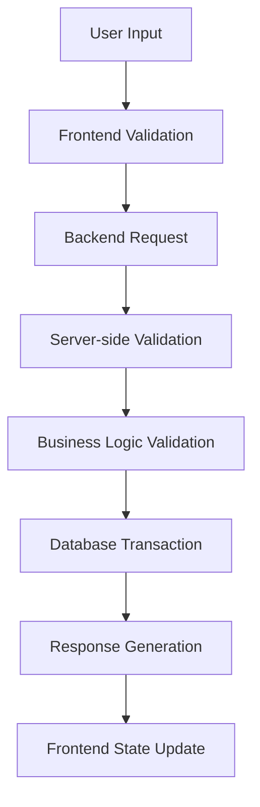

# Unit Management System - CRUD Implementation Plan

## Overview

This comprehensive plan outlines the implementation of CRUD (Create, Read, Update, Delete) operations for the Unit
Management System using Inertia.js for seamless Laravel-Vue.js integration. The system manages three interconnected
academic models with complex relationships and validation requirements:

- **Unit** - Academic units/subjects with credit points and identification codes
- **UnitPrerequisite** - Prerequisites relationships between units (prerequisite, corequisite, antirequisite)
- **EquivalentUnit** - Unit equivalency relationships with semester validity tracking

## Database Structure Analysis

### Current Tables

- **units**: Core academic unit information (id, code, name, credit_points)
- **unit_prerequisites**: Prerequisite relationships (unit_id, required_unit_id, type)
- **equivalent_units**: Unit equivalencies (unit_id, equivalent_unit_id, reason)
- **semesters**: Semester reference data for equivalency validity

### Relationship Considerations

- **Self-referential Relationships**: Units can reference other units as prerequisites or equivalents
- **Circular Dependency Prevention**: Complex validation to prevent prerequisite loops
- **Temporal Validity**: Equivalencies valid from specific semesters
- **Data Integrity**: Cascade rules and referential integrity constraints

## Implementation Requirements

### Validation Strategy

#### Backend Validation Requirements

1. **Unit Validation**
    - Code uniqueness and format validation
    - Credit points range and decimal precision
    - Name length and character restrictions
    - Soft delete handling for referenced units

2. **Prerequisite Validation**
    - Circular dependency detection algorithms
    - Self-reference prevention
    - Duplicate relationship checking
    - Type-specific business rules

3. **Equivalency Validation**
    - Bidirectional relationship consistency
    - Semester validity checking
    - Reason documentation requirements
    - Temporal logic validation

#### Frontend Validation Requirements

1. **Real-time Form Validation**
    - Immediate feedback for invalid inputs
    - Dynamic prerequisite tree visualization
    - Autocomplete with validation
    - Bulk operation previews

2. **User Experience Validation**
    - Progress indicators for complex operations
    - Confirmation dialogs for destructive actions
    - Error state management
    - Loading state handling

### Data Processing Pipeline



## Phase 1: Backend Implementation

### 1.1 Unit CRUD Implementation

#### Controller: `app/Http/Controllers/UnitController.php`

```php
<?php

declare(strict_types=1);

namespace App\Http\Controllers;

use App\Http\Requests\StoreUnitRequest;
use App\Http\Requests\UpdateUnitRequest;
use App\Models\Unit;
use App\Services\UnitValidationService;
use App\Services\UnitRelationshipService;
use Illuminate\Http\Request;
use Illuminate\Support\Facades\DB;
use Inertia\Inertia;
use Inertia\Response;

class UnitController extends Controller
{
    public function __construct(
        private UnitValidationService $validationService,
        private UnitRelationshipService $relationshipService
    ) {
        $this->middleware('auth');
        $this->middleware('permission:view-units')->only(['index', 'show']);
        $this->middleware('permission:create-units')->only(['create', 'store']);
        $this->middleware('permission:edit-units')->only(['edit', 'update']);
        $this->middleware('permission:delete-units')->only(['destroy']);
    }

    public function index(Request $request): Response
    {
        $validated = $request->validate([
            'search' => 'nullable|string|max:255',
            'sort' => 'nullable|string|in:code,name,credit_points,created_at',
            'direction' => 'nullable|string|in:asc,desc',
            'per_page' => 'nullable|integer|min:5|max:100',
            'filter_credit_points' => 'nullable|array',
            'filter_credit_points.*' => 'numeric|min:0|max:999.99',
        ]);

        $units = Unit::query()
            ->when($validated['search'] ?? null, function ($query, $search) {
                $query->where(function ($q) use ($search) {
                    $q->where('code', 'like', "%{$search}%")
                      ->orWhere('name', 'like', "%{$search}%");
                });
            })
            ->when($validated['filter_credit_points'] ?? null, function ($query, $creditPoints) {
                if (count($creditPoints) === 2) {
                    $query->whereBetween('credit_points', $creditPoints);
                }
            })
            ->when($validated['sort'] ?? null, function ($query, $sort) use ($validated) {
                $direction = $validated['direction'] ?? 'asc';
                $query->orderBy($sort, $direction);
            })
            ->withCount(['prerequisites', 'equivalentUnits', 'curriculumUnits'])
            ->paginate($validated['per_page'] ?? 15)
            ->withQueryString();

        return Inertia::render('Units/Index', [
            'units' => $units,
            'filters' => $request->only(['search', 'sort', 'direction', 'per_page', 'filter_credit_points']),
            'statistics' => [
                'total_units' => Unit::count(),
                'units_with_prerequisites' => Unit::has('prerequisites')->count(),
                'units_with_equivalents' => Unit::has('equivalentUnits')->count(),
                'avg_credit_points' => Unit::avg('credit_points'),
            ],
        ]);
    }

    public function create(): Response
    {
        return Inertia::render('Units/Create', [
            'formDefaults' => [
                'code' => '',
                'name' => '',
                'credit_points' => 3.00,
            ],
            'validationRules' => $this->getValidationRules(),
        ]);
    }

    public function store(StoreUnitRequest $request)
    {
        try {
            DB::beginTransaction();

            $unit = Unit::create($request->validated());

            // Log activity
            activity()
                ->performedOn($unit)
                ->causedBy(auth()->user())
                ->log('Unit created');

            DB::commit();

            return redirect()->route('units.index')
                ->with('success', "Unit '{$unit->code}' created successfully.");

        } catch (\Exception $e) {
            DB::rollBack();
            
            return redirect()->back()
                ->withErrors(['error' => 'Failed to create unit: ' . $e->getMessage()])
                ->withInput();
        }
    }

    public function show(Unit $unit): Response
    {
        $unit->load([
            'equivalentUnits.equivalentUnit',
            'equivalentTo.unit',
            'prerequisites.requiredUnit',
            'requiredFor.unit',
            'curriculumUnits.curriculum'
        ]);

        return Inertia::render('Units/Show', [
            'unit' => $unit,
            'relationshipStats' => [
                'prerequisite_count' => $unit->prerequisites()->where('type', 'prerequisite')->count(),
                'corequisite_count' => $unit->prerequisites()->where('type', 'corequisite')->count(),
                'antirequisite_count' => $unit->prerequisites()->where('type', 'antirequisite')->count(),
                'equivalent_count' => $unit->equivalentUnits()->count(),
                'curriculum_count' => $unit->curriculumUnits()->count(),
            ],
            'canEdit' => auth()->user()->can('edit-units'),
            'canDelete' => auth()->user()->can('delete-units') && $this->validationService->canDeleteUnit($unit),
        ]);
    }

    public function edit(Unit $unit): Response
    {
        // Check if unit can be edited
        if (!$this->validationService->canEditUnit($unit)) {
            return redirect()->route('unit.show', $unit)
                ->with('error', 'Unit cannot be edited due to active relationships.');
        }

        return Inertia::render('Units/Edit', [
            'unit' => $unit,
            'validationRules' => $this->getValidationRules($unit->id),
            'editRestrictions' => $this->validationService->getEditRestrictions($unit),
        ]);
    }

    public function update(UpdateUnitRequest $request, Unit $unit)
    {
        try {
            DB::beginTransaction();

            $oldData = $unit->toArray();
            $unit->update($request->validated());

            // Log activity with changes
            activity()
                ->performedOn($unit)
                ->causedBy(auth()->user())
                ->withProperties(['old' => $oldData, 'new' => $unit->fresh()->toArray()])
                ->log('Unit updated');

            DB::commit();

            return redirect()->route('units.index')
                ->with('success', "Unit '{$unit->code}' updated successfully.");

        } catch (\Exception $e) {
            DB::rollBack();
            
            return redirect()->back()
                ->withErrors(['error' => 'Failed to update unit: ' . $e->getMessage()])
                ->withInput();
        }
    }

    public function destroy(Unit $unit)
    {
        // Comprehensive deletion validation
        $canDelete = $this->validationService->canDeleteUnit($unit);
        
        if (!$canDelete['allowed']) {
            return redirect()->route('units.index')
                ->with('error', $canDelete['reason']);
        }

        try {
            DB::beginTransaction();

            // Store unit data for logging
            $unitData = $unit->toArray();

            // Soft delete to maintain referential integrity
            $unit->delete();

            // Log activity
            activity()
                ->performedOn($unit)
                ->causedBy(auth()->user())
                ->withProperties(['deleted_unit' => $unitData])
                ->log('Unit deleted');

            DB::commit();

            return redirect()->route('units.index')
                ->with('success', "Unit '{$unit->code}' deleted successfully.");

        } catch (\Exception $e) {
            DB::rollBack();
            
            return redirect()->route('units.index')
                ->with('error', 'Failed to delete unit: ' . $e->getMessage());
        }
    }

    // API endpoints for AJAX calls
    public function search(Request $request)
    {
        $validated = $request->validate([
            'q' => 'required|string|min:1|max:255',
            'exclude' => 'nullable|array',
            'exclude.*' => 'integer|exists:units,id',
            'limit' => 'nullable|integer|min:1|max:50',
        ]);

        $units = Unit::query()
            ->where(function ($query) use ($validated) {
                $query->where('code', 'like', "%{$validated['q']}%")
                      ->orWhere('name', 'like', "%{$validated['q']}%");
            })
            ->when($validated['exclude'] ?? [], function ($query, $exclude) {
                $query->whereNotIn('id', $exclude);
            })
            ->limit($validated['limit'] ?? 10)
            ->get(['id', 'code', 'name', 'credit_points']);

        return response()->json($units);
    }

    public function validateCode(Request $request)
    {
        $request->validate([
            'code' => 'required|string|max:20',
            'unit_id' => 'nullable|integer|exists:units,id',
        ]);

        $exists = Unit::where('code', $request->code)
            ->when($request->unit_id, function ($query, $unitId) {
                $query->where('id', '!=', $unitId);
            })
            ->exists();

        return response()->json([
            'valid' => !$exists,
            'message' => $exists ? 'Unit code already exists' : 'Unit code is available',
        ]);
    }

    public function bulkDelete(Request $request)
    {
        $validated = $request->validate([
            'unit_ids' => 'required|array|min:1|max:100',
            'unit_ids.*' => 'integer|exists:units,id',
        ]);

        try {
            DB::beginTransaction();

            $units = Unit::whereIn('id', $validated['unit_ids'])->get();
            $deleted = [];
            $failed = [];

            foreach ($units as $unit) {
                $canDelete = $this->validationService->canDeleteUnit($unit);
                
                if ($canDelete['allowed']) {
                    $unit->delete();
                    $deleted[] = $unit->code;
                } else {
                    $failed[] = [
                        'code' => $unit->code,
                        'reason' => $canDelete['reason']
                    ];
                }
            }

            DB::commit();

            return response()->json([
                'success' => true,
                'deleted' => $deleted,
                'failed' => $failed,
                'message' => count($deleted) . ' units deleted successfully.'
            ]);

        } catch (\Exception $e) {
            DB::rollBack();
            
            return response()->json([
                'success' => false,
                'message' => 'Bulk delete failed: ' . $e->getMessage()
            ], 500);
        }
    }

    private function getValidationRules(?int $unitId = null): array
    {
        return [
            'code' => [
                'required',
                'string',
                'max:20',
                'regex:/^[A-Z0-9]{2,}$/',
                $unitId ? "unique:units,code,{$unitId}" : 'unique:units,code',
            ],
            'name' => [
                'required',
                'string',
                'max:255',
                'min:3',
            ],
            'credit_points' => [
                'required',
                'numeric',
                'min:0.25',
                'max:999.99',
                'decimal:0,2',
            ],
        ];
    }
}
```

#### Form Request Validation

**File**: `app/Http/Requests/StoreUnitRequest.php`

```php
<?php

declare(strict_types=1);

namespace App\Http\Requests;

use Illuminate\Foundation\Http\FormRequest;
use Illuminate\Validation\Rule;

class StoreUnitRequest extends FormRequest
{
    public function authorize(): bool
    {
        return auth()->user()->can('create-units');
    }

    public function rules(): array
    {
        return [
            'code' => [
                'required',
                'string',
                'max:20',
                'min:2',
                'regex:/^[A-Z0-9]{2,}$/',
                Rule::unique('units', 'code')->whereNull('deleted_at'),
            ],
            'name' => [
                'required',
                'string',
                'max:255',
                'min:3',
                'regex:/^[\pL\pN\s\-\.\,\(\)]+$/u',
            ],
            'credit_points' => [
                'required',
                'numeric',
                'min:0.25',
                'max:999.99',
                'decimal:0,2',
            ],
        ];
    }

    public function messages(): array
    {
        return [
            'code.required' => 'Unit code is required.',
            'code.unique' => 'This unit code already exists.',
            'code.regex' => 'Unit code must contain only uppercase letters and numbers.',
            'code.min' => 'Unit code must be at least 2 characters.',
            'code.max' => 'Unit code cannot exceed 20 characters.',
            
            'name.required' => 'Unit name is required.',
            'name.min' => 'Unit name must be at least 3 characters.',
            'name.max' => 'Unit name cannot exceed 255 characters.',
            'name.regex' => 'Unit name contains invalid characters.',
            
            'credit_points.required' => 'Credit points are required.',
            'credit_points.min' => 'Credit points must be at least 0.25.',
            'credit_points.max' => 'Credit points cannot exceed 999.99.',
            'credit_points.decimal' => 'Credit points can have at most 2 decimal places.',
        ];
    }

    public function attributes(): array
    {
        return [
            'code' => 'unit code',
            'name' => 'unit name',
            'credit_points' => 'credit points',
        ];
    }

    protected function prepareForValidation(): void
    {
        $this->merge([
            'code' => strtoupper(trim($this->code ?? '')),
            'name' => trim($this->name ?? ''),
            'credit_points' => is_numeric($this->credit_points) ? 
                round((float) $this->credit_points, 2) : $this->credit_points,
        ]);
    }
}
```

**File**: `app/Http/Requests/UpdateUnitRequest.php`

```php
<?php

declare(strict_types=1);

namespace App\Http\Requests;

use Illuminate\Foundation\Http\FormRequest;
use Illuminate\Validation\Rule;

class UpdateUnitRequest extends FormRequest
{
    public function authorize(): bool
    {
        return auth()->user()->can('edit-units') && 
               app(\App\Services\UnitValidationService::class)->canEditUnit($this->unit);
    }

    public function rules(): array
    {
        return [
            'code' => [
                'required',
                'string',
                'max:20',
                'min:2',
                'regex:/^[A-Z0-9]{2,}$/',
                Rule::unique('units', 'code')
                    ->ignore($this->unit->id)
                    ->whereNull('deleted_at'),
            ],
            'name' => [
                'required',
                'string',
                'max:255',
                'min:3',
                'regex:/^[\pL\pN\s\-\.\,\(\)]+$/u',
            ],
            'credit_points' => [
                'required',
                'numeric',
                'min:0.25',
                'max:999.99',
                'decimal:0,2',
            ],
        ];
    }

    public function messages(): array
    {
        return [
            'code.required' => 'Unit code is required.',
            'code.unique' => 'This unit code already exists.',
            'code.regex' => 'Unit code must contain only uppercase letters and numbers.',
            'name.required' => 'Unit name is required.',
            'name.min' => 'Unit name must be at least 3 characters.',
            'credit_points.required' => 'Credit points are required.',
            'credit_points.min' => 'Credit points must be at least 0.25.',
            'credit_points.max' => 'Credit points cannot exceed 999.99.',
        ];
    }

    protected function prepareForValidation(): void
    {
        $this->merge([
            'code' => strtoupper(trim($this->code ?? '')),
            'name' => trim($this->name ?? ''),
            'credit_points' => is_numeric($this->credit_points) ? 
                round((float) $this->credit_points, 2) : $this->credit_points,
        ]);
    }
}
```

## 2. UnitPrerequisite CRUD

### Backend Implementation

#### Controller: `app/Http/Controllers/UnitPrerequisiteController.php`

```php
<?php

declare(strict_types=1);

namespace App\Http\Controllers;

use App\Http\Requests\StoreUnitPrerequisiteRequest;
use App\Http\Requests\UpdateUnitPrerequisiteRequest;
use App\Models\Unit;
use App\Models\UnitPrerequisite;
use Illuminate\Http\Request;
use Inertia\Inertia;
use Inertia\Response;

class UnitPrerequisiteController extends Controller
{
    public function index(Request $request): Response
    {
        $prerequisites = UnitPrerequisite::with(['unit', 'requiredUnit'])
            ->when($request->search, function ($query, $search) {
                $query->whereHas('unit', function ($q) use ($search) {
                    $q->where('code', 'like', "%{$search}%")
                      ->orWhere('name', 'like', "%{$search}%");
                });
            })
            ->paginate(15)
            ->withQueryString();

        return Inertia::render('UnitPrerequisites/Index', [
            'prerequisites' => $prerequisites,
            'filters' => $request->only(['search']),
        ]);
    }

    public function create(): Response
    {
        return Inertia::render('UnitPrerequisites/Create');
    }

    public function store(StoreUnitPrerequisiteRequest $request)
    {
        UnitPrerequisite::create($request->validated());

        return redirect()->route('unit-prerequisites.index')
            ->with('success', 'Prerequisite created successfully.');
    }

    public function edit(UnitPrerequisite $unitPrerequisite): Response
    {
        $unitPrerequisite->load(['unit', 'requiredUnit']);
        
        return Inertia::render('UnitPrerequisites/Edit', [
            'prerequisite' => $unitPrerequisite,
        ]);
    }

    public function update(UpdateUnitPrerequisiteRequest $request, UnitPrerequisite $unitPrerequisite)
    {
        $unitPrerequisite->update($request->validated());

        return redirect()->route('unit-prerequisites.index')
            ->with('success', 'Prerequisite updated successfully.');
    }

    public function destroy(UnitPrerequisite $unitPrerequisite)
    {
        $unitPrerequisite->delete();

        return redirect()->route('unit-prerequisites.index')
            ->with('success', 'Prerequisite deleted successfully.');
    }

    // API endpoint for bulk operations
    public function bulkStore(Request $request)
    {
        $validated = $request->validate([
            'prerequisites' => 'required|array',
            'prerequisites.*.unit_id' => 'required|exists:units,id',
            'prerequisites.*.required_unit_id' => 'required|exists:units,id',
            'prerequisites.*.type' => 'required|string|in:prerequisite,corequisite,antirequisite',
        ]);

        foreach ($validated['prerequisites'] as $prerequisite) {
            UnitPrerequisite::create($prerequisite);
        }

        return response()->json(['message' => 'Prerequisites created successfully']);
    }
}
```

#### Validation Rules

```php
'unit_id' => 'required|exists:units,id',
'required_unit_id' => 'required|exists:units,id|different:unit_id',
'type' => 'required|string|in:prerequisite,corequisite,antirequisite'
```

#### Routes

```php
// routes/web.php
Route::resource('unit-prerequisites', UnitPrerequisiteController::class);

// routes/api.php
Route::post('unit-prerequisites/bulk', [UnitPrerequisiteController::class, 'bulkStore']);
```

### Frontend Implementation

#### Vue Pages

- `resources/js/Pages/UnitPrerequisites/Index.vue` - List prerequisites with DataTable
- `resources/js/Pages/UnitPrerequisites/Create.vue` - Add prerequisite form
- `resources/js/Pages/UnitPrerequisites/Edit.vue` - Edit prerequisite

#### Prerequisite Manager Component

```vue
<!-- resources/js/Components/PrerequisiteManager.vue -->
<template>
    <div class="prerequisite-manager">
        <div class="mb-4">
            <h3 class="text-lg font-semibold">Manage Prerequisites</h3>
        </div>

        <div class="grid grid-cols-1 md:grid-cols-2 gap-6">
            <!-- Unit Selection -->
            <div>
                <label class="block text-sm font-medium mb-2">Unit</label>
                <UnitSelector v-model="selectedUnit" />
            </div>

            <!-- Prerequisites List -->
            <div>
                <label class="block text-sm font-medium mb-2">Prerequisites</label>
                <div class="space-y-2">
                    <div
                        v-for="prerequisite in prerequisites"
                        :key="prerequisite.id"
                        class="flex items-center justify-between p-2 border rounded"
                    >
                        <span>{{ prerequisite.requiredUnit.code }} - {{ prerequisite.requiredUnit.name }}</span>
                        <button
                            @click="removePrerequisite(prerequisite.id)"
                            class="text-red-600 hover:text-red-800"
                        >
                            Remove
                        </button>
                    </div>
                </div>
            </div>
        </div>

        <!-- Add Prerequisite Form -->
        <div class="mt-6 p-4 border rounded">
            <h4 class="font-medium mb-3">Add Prerequisite</h4>
            <div class="grid grid-cols-1 md:grid-cols-3 gap-4">
                <UnitSelector v-model="newPrerequisite.required_unit_id" placeholder="Select prerequisite unit" />
                <select v-model="newPrerequisite.type" class="form-select">
                    <option value="prerequisite">Prerequisite</option>
                    <option value="corequisite">Corequisite</option>
                    <option value="antirequisite">Antirequisite</option>
                </select>
                <button @click="addPrerequisite" class="btn btn-primary">Add</button>
            </div>
        </div>
    </div>
</template>

<script setup>
    import { ref, watch } from 'vue'
    import { useUnitStore } from '@/stores/unitStore'
    import UnitSelector from '@/Components/UnitSelector.vue'
    import axios from 'axios'

    const props = defineProps({
        unitId: Number,
    })

    const unitStore = useUnitStore()
    const selectedUnit = ref(props.unitId)
    const prerequisites = ref([])
    const newPrerequisite = ref({
        required_unit_id: null,
        type: 'prerequisite'
    })

    const addPrerequisite = async () => {
        try {
            await axios.post('/api/unit-prerequisites/bulk', {
                prerequisites: [{
                    unit_id: selectedUnit.value,
                    required_unit_id: newPrerequisite.value.required_unit_id,
                    type: newPrerequisite.value.type
                }]
            })

            // Refresh prerequisites list
            await fetchPrerequisites()

            // Reset form
            newPrerequisite.value = {
                required_unit_id: null,
                type: 'prerequisite'
            }
        } catch (error) {
            console.error('Error adding prerequisite:', error)
        }
    }

    const removePrerequisite = async (prerequisiteId) => {
        try {
            await axios.delete(`/api/unit-prerequisites/${prerequisiteId}`)
            await fetchPrerequisites()
        } catch (error) {
            console.error('Error removing prerequisite:', error)
        }
    }

    const fetchPrerequisites = async () => {
        if (!selectedUnit.value) return

        try {
            const response = await axios.get(`/api/units/${selectedUnit.value}/prerequisites`)
            prerequisites.value = response.data
        } catch (error) {
            console.error('Error fetching prerequisites:', error)
        }
    }

    watch(selectedUnit, fetchPrerequisites, { immediate: true })
</script>
```

## 3. EquivalentUnit CRUD

### Backend Implementation

#### Controller: `app/Http/Controllers/EquivalentUnitController.php`

```php
<?php

declare(strict_types=1);

namespace App\Http\Controllers;

use App\Http\Requests\StoreEquivalentUnitRequest;
use App\Http\Requests\UpdateEquivalentUnitRequest;
use App\Models\EquivalentUnit;
use App\Models\Semester;
use Illuminate\Http\Request;
use Inertia\Inertia;
use Inertia\Response;

class EquivalentUnitController extends Controller
{
    public function index(Request $request): Response
    {
        $equivalentUnits = EquivalentUnit::with(['unit', 'equivalentUnit', 'validFromSemester'])
            ->when($request->search, function ($query, $search) {
                $query->whereHas('unit', function ($q) use ($search) {
                    $q->where('code', 'like', "%{$search}%")
                      ->orWhere('name', 'like', "%{$search}%");
                });
            })
            ->paginate(15)
            ->withQueryString();

        return Inertia::render('EquivalentUnits/Index', [
            'equivalentUnits' => $equivalentUnits,
            'filters' => $request->only(['search']),
        ]);
    }

    public function create(): Response
    {
        $semesters = Semester::orderBy('year', 'desc')
            ->orderBy('term')
            ->get(['id', 'year', 'term']);

        return Inertia::render('EquivalentUnits/Create', [
            'semesters' => $semesters,
        ]);
    }

    public function store(StoreEquivalentUnitRequest $request)
    {
        EquivalentUnit::create($request->validated());

        return redirect()->route('equivalent-units.index')
            ->with('success', 'Equivalent unit created successfully.');
    }

    public function edit(EquivalentUnit $equivalentUnit): Response
    {
        $equivalentUnit->load(['unit', 'equivalentUnit', 'validFromSemester']);
        $semesters = Semester::orderBy('year', 'desc')
            ->orderBy('term')
            ->get(['id', 'year', 'term']);

        return Inertia::render('EquivalentUnits/Edit', [
            'equivalentUnit' => $equivalentUnit,
            'semesters' => $semesters,
        ]);
    }

    public function update(UpdateEquivalentUnitRequest $request, EquivalentUnit $equivalentUnit)
    {
        $equivalentUnit->update($request->validated());

        return redirect()->route('equivalent-units.index')
            ->with('success', 'Equivalent unit updated successfully.');
    }

    public function destroy(EquivalentUnit $equivalentUnit)
    {
        $equivalentUnit->delete();

        return redirect()->route('equivalent-units.index')
            ->with('success', 'Equivalent unit deleted successfully.');
    }
}
```

#### Validation Rules

```php
'unit_id' => 'required|exists:units,id',
'equivalent_unit_id' => 'required|exists:units,id|different:unit_id',
'reason' => 'nullable|string|max:500',
'valid_from_semester_id' => 'required|exists:semesters,id'
```

#### Routes

```php
// routes/web.php
Route::resource('equivalent-units', EquivalentUnitController::class);
```

## 4. Shared Components & Features

### DataTable Configuration (Inertia.js Compatible)

```vue
<!-- resources/js/Components/DataTable.vue -->
<template>
    <div class="overflow-x-auto">
        <table class="min-w-full divide-y divide-gray-200">
            <thead class="bg-gray-50">
            <tr>
                <th
                    v-for="column in columns"
                    :key="column.field"
                    class="px-6 py-3 text-left text-xs font-medium text-gray-500 uppercase tracking-wider cursor-pointer"
                    @click="column.sortable && $emit('sort', column.field)"
                >
                    {{ column.header }}
                    <span v-if="column.sortable" class="ml-1">↕</span>
                </th>
            </tr>
            </thead>
            <tbody class="bg-white divide-y divide-gray-200">
            <tr v-for="item in data" :key="item.id">
                <td
                    v-for="column in columns"
                    :key="column.field"
                    class="px-6 py-4 whitespace-nowrap text-sm text-gray-900"
                >
                    <slot :name="column.field" :item="item">
                        {{ getNestedValue(item, column.field) }}
                    </slot>
                </td>
            </tr>
            </tbody>
        </table>
    </div>
</template>

<script setup>
    defineEmits(['sort'])

    defineProps({
        data: Array,
        columns: Array,
    })

    const getNestedValue = (obj, path) => {
        return path.split('.').reduce((current, key) => current?.[key], obj)
    }
</script>
```

### Unit Selector Component with Axios

```vue
<!-- resources/js/Components/UnitSelector.vue -->
<template>
    <div class="relative">
        <input
            v-model="searchQuery"
            @input="searchUnits"
            @focus="showDropdown = true"
            type="text"
            :placeholder="placeholder"
            class="form-input w-full"
        />

        <div
            v-if="showDropdown && (searchResults.length > 0 || loading)"
            class="absolute z-10 w-full mt-1 bg-white border border-gray-300 rounded-md shadow-lg"
        >
            <div v-if="loading" class="p-2 text-center text-gray-500">
                Searching...
            </div>
            <div
                v-for="unit in searchResults"
                :key="unit.id"
                @click="selectUnit(unit)"
                class="p-2 hover:bg-gray-100 cursor-pointer"
            >
                {{ unit.code }} - {{ unit.name }}
            </div>
        </div>
    </div>
</template>

<script setup>
    import { ref, watch } from 'vue'
    import { debounce } from 'lodash'
    import { useUnitStore } from '@/stores/unitStore'

    const props = defineProps({
        modelValue: [Number, String],
        placeholder: {
            type: String,
            default: 'Search units...'
        }
    })

    const emit = defineEmits(['update:modelValue'])

    const unitStore = useUnitStore()
    const searchQuery = ref('')
    const showDropdown = ref(false)
    const searchResults = ref([])
    const loading = ref(false)

    const searchUnits = debounce(async () => {
        if (searchQuery.value.length < 2) {
            searchResults.value = []
            return
        }

        loading.value = true
        await unitStore.searchUnits(searchQuery.value)
        searchResults.value = unitStore.searchResults
        loading.value = false
    }, 300)

    const selectUnit = (unit) => {
        emit('update:modelValue', unit.id)
        searchQuery.value = `${unit.code} - ${unit.name}`
        showDropdown.value = false
    }

    // Close dropdown when clicking outside
    document.addEventListener('click', (e) => {
        if (!e.target.closest('.relative')) {
            showDropdown.value = false
        }
    })
</script>
```

## 5. Axios Configuration

### Setup Axios with CSRF Token

```javascript
// resources/js/bootstrap.js
import axios from 'axios'

window.axios = axios

window.axios.defaults.headers.common['X-Requested-With'] = 'XMLHttpRequest'

// CSRF token for Laravel
const token = document.head.querySelector('meta[name="csrf-token"]')
if (token) {
    window.axios.defaults.headers.common['X-CSRF-TOKEN'] = token.content
} else {
    console.error('CSRF token not found')
}

// Request interceptor
axios.interceptors.request.use(
    config => {
        // Add loading state if needed
        return config
    },
    error => {
        return Promise.reject(error)
    }
)

// Response interceptor
axios.interceptors.response.use(
    response => {
        return response
    },
    error => {
        if (error.response?.status === 422) {
            // Handle validation errors
            console.error('Validation errors:', error.response.data.errors)
        } else if (error.response?.status === 419) {
            // CSRF token mismatch
            window.location.reload()
        }
        return Promise.reject(error)
    }
)
```

## 6. Database Considerations

### Indexes (Same as before)

```sql
-- Units table
CREATE INDEX idx_units_code ON units (code);
CREATE INDEX idx_units_name ON units (name);

-- Unit Prerequisites table
CREATE INDEX idx_unit_prerequisites_unit_id ON unit_prerequisites (unit_id);
CREATE INDEX idx_unit_prerequisites_required_unit_id ON unit_prerequisites (required_unit_id);
CREATE UNIQUE INDEX idx_unit_prerequisites_unique ON unit_prerequisites (unit_id, required_unit_id);

-- Equivalent Units table
CREATE INDEX idx_equivalent_units_unit_id ON equivalent_units (unit_id);
CREATE INDEX idx_equivalent_units_equivalent_unit_id ON equivalent_units (equivalent_unit_id);
CREATE INDEX idx_equivalent_units_semester ON equivalent_units (valid_from_semester_id);
CREATE UNIQUE INDEX idx_equivalent_units_unique ON equivalent_units (unit_id, equivalent_unit_id);
```

## 7. Key Differences with Inertia.js

### Advantages

- **Seamless Integration**: No need for separate API endpoints for basic CRUD
- **Server-Side Rendering**: Better SEO and initial page load
- **Simplified State Management**: Less complex than pure SPA approach
- **Laravel Integration**: Direct use of Laravel features (validation, middleware, etc.)

### When to Use Axios

- **Search/Autocomplete**: Real-time search functionality
- **Bulk Operations**: Complex operations that don't require page refresh
- **Background Tasks**: Operations that shouldn't interrupt user flow
- **Dynamic Content**: Loading content without page navigation

### Hybrid Approach Benefits

- **Best of Both Worlds**: Inertia.js for page navigation, Axios for dynamic features
- **Performance**: Reduced API calls for standard CRUD operations
- **User Experience**: Smooth page transitions with dynamic interactions
- **Maintainability**: Cleaner code structure with proper separation of concerns

## 8. Implementation Timeline (Revised)

### Phase 1: Inertia.js Setup & Unit CRUD (Week 1-2)

- Configure Inertia.js with Laravel and Vue.js
- Implement Unit CRUD with Inertia.js
- Create shared components (DataTable, DataPagination)
- Setup Axios for search functionality

### Phase 2: Relationships with Hybrid Approach (Week 3-4)

- UnitPrerequisite CRUD with Inertia.js
- EquivalentUnit CRUD with Inertia.js
- Dynamic components using Axios for real-time features

### Phase 3: Advanced Features & Polish (Week 5-6)

- Bulk operations with Axios
- Advanced search and filtering
- Visual relationship components
- Performance optimization

### Phase 4: Testing & Documentation (Week 7-8)

- Comprehensive testing for both Inertia.js and Axios features
- Performance optimization
- Documentation and deployment preparation

## 9. Future Enhancements

- Unit dependency visualization
- Automated prerequisite validation
- Unit recommendation system
- Integration with academic planning tools
- Mobile-responsive design improvements
- Real-time collaboration features

#### Form Request Validation for Prerequisites

**File**: `app/Http/Requests/StoreUnitPrerequisiteRequest.php`

```php
<?php

declare(strict_types=1);

namespace App\Http\Requests;

use App\Services\UnitValidationService;
use Illuminate\Foundation\Http\FormRequest;
use Illuminate\Validation\Validator;

class StoreUnitPrerequisiteRequest extends FormRequest
{
    public function authorize(): bool
    {
        return auth()->user()->can('create-unit-prerequisites');
    }

    public function rules(): array
    {
        return [
            'unit_id' => [
                'required',
                'integer',
                'exists:units,id',
            ],
            'required_unit_id' => [
                'required',
                'integer',
                'exists:units,id',
                'different:unit_id',
            ],
            'type' => [
                'required',
                'string',
                'in:prerequisite,corequisite,antirequisite',
            ],
        ];
    }

    public function withValidator(Validator $validator): void
    {
        $validator->after(function (Validator $validator) {
            if (!$validator->errors()->any()) {
                $validationService = app(UnitValidationService::class);
                
                $relationshipValidation = $validationService->validatePrerequisiteRelationship(
                    $this->unit_id,
                    $this->required_unit_id,
                    $this->type
                );

                if (!$relationshipValidation['valid']) {
                    foreach ($relationshipValidation['errors'] as $error) {
                        $validator->errors()->add('relationship', $error);
                    }
                }
            }
        });
    }

    public function messages(): array
    {
        return [
            'unit_id.required' => 'Please select a unit.',
            'unit_id.exists' => 'Selected unit does not exist.',
            'required_unit_id.required' => 'Please select a prerequisite unit.',
            'required_unit_id.exists' => 'Selected prerequisite unit does not exist.',
            'required_unit_id.different' => 'Unit cannot be a prerequisite to itself.',
            'type.required' => 'Please select a prerequisite type.',
            'type.in' => 'Invalid prerequisite type selected.',
        ];
    }

    public function attributes(): array
    {
        return [
            'unit_id' => 'unit',
            'required_unit_id' => 'prerequisite unit',
            'type' => 'prerequisite type',
        ];
    }
}
```

**File**: `app/Http/Requests/UpdateUnitPrerequisiteRequest.php`

```php
<?php

declare(strict_types=1);

namespace App\Http\Requests;

use App\Services\UnitValidationService;
use Illuminate\Foundation\Http\FormRequest;
use Illuminate\Validation\Validator;

class UpdateUnitPrerequisiteRequest extends FormRequest
{
    public function authorize(): bool
    {
        return auth()->user()->can('edit-unit-prerequisites');
    }

    public function rules(): array
    {
        return [
            'unit_id' => [
                'required',
                'integer',
                'exists:units,id',
            ],
            'required_unit_id' => [
                'required',
                'integer',
                'exists:units,id',
                'different:unit_id',
            ],
            'type' => [
                'required',
                'string',
                'in:prerequisite,corequisite,antirequisite',
            ],
        ];
    }

    public function withValidator(Validator $validator): void
    {
        $validator->after(function (Validator $validator) {
            if (!$validator->errors()->any()) {
                $validationService = app(UnitValidationService::class);
                
                // Skip validation if no changes
                $prerequisite = $this->route('unitPrerequisite');
                if ($prerequisite->unit_id == $this->unit_id && 
                    $prerequisite->required_unit_id == $this->required_unit_id && 
                    $prerequisite->type == $this->type) {
                    return;
                }

                $relationshipValidation = $validationService->validatePrerequisiteRelationship(
                    $this->unit_id,
                    $this->required_unit_id,
                    $this->type
                );

                if (!$relationshipValidation['valid']) {
                    foreach ($relationshipValidation['errors'] as $error) {
                        $validator->errors()->add('relationship', $error);
                    }
                }
            }
        });
    }

    public function messages(): array
    {
        return [
            'unit_id.required' => 'Please select a unit.',
            'required_unit_id.required' => 'Please select a prerequisite unit.',
            'required_unit_id.different' => 'Unit cannot be a prerequisite to itself.',
            'type.required' => 'Please select a prerequisite type.',
            'type.in' => 'Invalid prerequisite type selected.',
        ];
    }
}
```

## Phase 3: Frontend Implementation (Inertia.js + Vue.js)

### 3.1 Unit Management Pages

#### Index Page: `resources/js/Pages/Units/Index.vue`

```vue

<template>
    <AppLayout title="Units">
        <template #header>
            <div class="flex justify-between items-center">
                <h2 class="font-semibold text-xl text-gray-800 leading-tight">
                    Units Management
                </h2>
                <div class="flex gap-2">
                    <SecondaryButton @click="showExportModal = true">
                        <DocumentArrowDownIcon class="w-4 h-4 mr-2" />
                        Export
                    </SecondaryButton>
                    <PrimaryButton
                        v-if="can('create-units')"
                        @click="$inertia.visit(route('units.create'))"
                    >
                        <PlusIcon class="w-4 h-4 mr-2" />
                        Add Unit
                    </PrimaryButton>
                </div>
            </div>
        </template>

        <div class="py-12">
            <div class="max-w-7xl mx-auto sm:px-6 lg:px-8">
                <!-- Statistics Cards -->
                <div class="grid grid-cols-1 md:grid-cols-4 gap-4 mb-6">
                    <StatCard
                        title="Total Units"
                        :value="statistics.total_units"
                        icon="AcademicCapIcon"
                        color="blue"
                    />
                    <StatCard
                        title="With Prerequisites"
                        :value="statistics.units_with_prerequisites"
                        icon="ArrowRightIcon"
                        color="green"
                    />
                    <StatCard
                        title="With Equivalents"
                        :value="statistics.units_with_equivalents"
                        icon="LinkIcon"
                        color="purple"
                    />
                    <StatCard
                        title="Avg Credit Points"
                        :value="statistics.avg_credit_points?.toFixed(2) || '0.00'"
                        icon="ChartBarIcon"
                        color="orange"
                    />
                </div>

                <div class="bg-white overflow-hidden shadow-xl sm:rounded-lg">
                    <div class="p-6">
                        <!-- Search and Filters -->
                        <div class="mb-6">
                            <div class="grid grid-cols-1 md:grid-cols-4 gap-4">
                                <!-- Search Input -->
                                <div class="md:col-span-2">
                                    <label class="block text-sm font-medium text-gray-700 mb-1">
                                        Search Units
                                    </label>
                                    <div class="relative">
                                        <input
                                            v-model="form.search"
                                            @input="debouncedSearch"
                                            type="text"
                                            placeholder="Search by code or name..."
                                            class="block w-full rounded-md border-gray-300 shadow-sm focus:border-blue-500 focus:ring-blue-500 sm:text-sm pl-10"
                                        />
                                        <MagnifyingGlassIcon class="absolute left-3 top-2.5 h-4 w-4 text-gray-400" />
                                        <button
                                            v-if="form.search"
                                            @click="clearSearch"
                                            class="absolute right-3 top-2.5 text-gray-400 hover:text-gray-600"
                                        >
                                            <XMarkIcon class="h-4 w-4" />
                                        </button>
                                    </div>
                                </div>

                                <!-- Credit Points Filter -->
                                <div>
                                    <label class="block text-sm font-medium text-gray-700 mb-1">
                                        Credit Points Range
                                    </label>
                                    <div class="flex gap-2">
                                        <input
                                            v-model.number="form.filter_credit_points[0]"
                                            @change="search"
                                            type="number"
                                            min="0"
                                            max="999.99"
                                            step="0.25"
                                            placeholder="Min"
                                            class="block w-full rounded-md border-gray-300 shadow-sm focus:border-blue-500 focus:ring-blue-500 sm:text-sm"
                                        />
                                        <input
                                            v-model.number="form.filter_credit_points[1]"
                                            @change="search"
                                            type="number"
                                            min="0"
                                            max="999.99"
                                            step="0.25"
                                            placeholder="Max"
                                            class="block w-full rounded-md border-gray-300 shadow-sm focus:border-blue-500 focus:ring-blue-500 sm:text-sm"
                                        />
                                    </div>
                                </div>

                                <!-- Items Per Page -->
                                <div>
                                    <label class="block text-sm font-medium text-gray-700 mb-1">
                                        Items Per Page
                                    </label>
                                    <select
                                        v-model="form.per_page"
                                        @change="search"
                                        class="block w-full rounded-md border-gray-300 shadow-sm focus:border-blue-500 focus:ring-blue-500 sm:text-sm"
                                    >
                                        <option value="15">15</option>
                                        <option value="25">25</option>
                                        <option value="50">50</option>
                                        <option value="100">100</option>
                                    </select>
                                </div>
                            </div>

                            <!-- Active Filters Display -->
                            <div v-if="hasActiveFilters" class="mt-3 flex flex-wrap gap-2">
                                <span class="text-sm text-gray-600">Active filters:</span>
                                <span
                                    v-if="form.search"
                                    class="inline-flex items-center px-2.5 py-0.5 rounded-full text-xs font-medium bg-blue-100 text-blue-800"
                                >
                  Search: "{{ form.search }}"
                  <button @click="form.search = ''; search()" class="ml-1 text-blue-600 hover:text-blue-800">
                    <XMarkIcon class="h-3 w-3" />
                  </button>
                </span>
                                <span
                                    v-if="form.filter_credit_points.length === 2"
                                    class="inline-flex items-center px-2.5 py-0.5 rounded-full text-xs font-medium bg-green-100 text-green-800"
                                >
                  Credit Points: {{ form.filter_credit_points[0] }} - {{ form.filter_credit_points[1] }}
                  <button @click="form.filter_credit_points = []; search()"
                          class="ml-1 text-green-600 hover:text-green-800">
                    <XMarkIcon class="h-3 w-3" />
                  </button>
                </span>
                                <button
                                    @click="clearAllFilters"
                                    class="text-sm text-gray-500 hover:text-gray-700 underline"
                                >
                                    Clear all filters
                                </button>
                            </div>
                        </div>

                        <!-- Bulk Actions -->
                        <div v-if="selectedUnits.length > 0" class="mb-4 p-3 bg-blue-50 rounded-lg">
                            <div class="flex items-center justify-between">
                <span class="text-sm text-blue-800">
                  {{ selectedUnits.length }} unit(s) selected
                </span>
                                <div class="flex gap-2">
                                    <SecondaryButton
                                        @click="exportSelected"
                                        class="text-blue-700 border-blue-300 hover:bg-blue-100"
                                    >
                                        <DocumentArrowDownIcon class="w-4 h-4 mr-1" />
                                        Export Selected
                                    </SecondaryButton>
                                    <DangerButton
                                        v-if="can('delete-units')"
                                        @click="confirmBulkDelete"
                                        class="ml-2"
                                    >
                                        <TrashIcon class="w-4 h-4 mr-1" />
                                        Delete Selected
                                    </DangerButton>
                                </div>
                            </div>
                        </div>

                        <!-- DataTable Component -->
                        <DataTable
                            :data="units.data"
                            :columns="columns"
                            :loading="loading"
                            :sortable="true"
                            @sort="handleSort"
                            @select="handleSelection"
                            @select-all="handleSelectAll"
                            :selected="selectedUnits"
                            :show-selection="can('delete-units')"
                        >
                            <!-- Custom column templates -->
                            <template #code="{ item }">
                                <div class="flex items-center">
                  <span class="font-mono font-medium text-gray-900">
                    {{ item.code }}
                  </span>
                                    <span
                                        v-if="item.curriculum_units_count > 0"
                                        class="ml-2 inline-flex items-center px-1.5 py-0.5 rounded-full text-xs font-medium bg-green-100 text-green-800"
                                        :title="`Used in ${item.curriculum_units_count} curriculum(s)`"
                                    >
                    {{ item.curriculum_units_count }}
                  </span>
                                </div>
                            </template>

                            <template #name="{ item }">
                                <div>
                                    <div class="text-sm font-medium text-gray-900">
                                        {{ item.name }}
                                    </div>
                                    <div class="text-xs text-gray-500">
                                        {{ item.credit_points }} credit points
                                    </div>
                                </div>
                            </template>

                            <template #relationships="{ item }">
                                <div class="flex gap-2">
                  <span
                      v-if="item.prerequisites_count > 0"
                      class="inline-flex items-center px-2 py-1 rounded-full text-xs font-medium bg-blue-100 text-blue-800"
                      :title="`${item.prerequisites_count} prerequisite(s)`"
                  >
                    <ArrowRightIcon class="w-3 h-3 mr-1" />
                    {{ item.prerequisites_count }}
                  </span>
                                    <span
                                        v-if="item.equivalent_units_count > 0"
                                        class="inline-flex items-center px-2 py-1 rounded-full text-xs font-medium bg-purple-100 text-purple-800"
                                        :title="`${item.equivalent_units_count} equivalent unit(s)`"
                                    >
                    <LinkIcon class="w-3 h-3 mr-1" />
                    {{ item.equivalent_units_count }}
                  </span>
                                </div>
                            </template>

                            <template #actions="{ item }">
                                <div class="flex items-center gap-2">
                                    <SecondaryButton
                                        @click="$inertia.visit(route('units.show', item.id))"
                                        size="sm"
                                    >
                                        <EyeIcon class="w-4 h-4" />
                                    </SecondaryButton>
                                    <SecondaryButton
                                        v-if="can('edit-units')"
                                        @click="$inertia.visit(route('units.edit', item.id))"
                                        size="sm"
                                    >
                                        <PencilIcon class="w-4 h-4" />
                                    </SecondaryButton>
                                    <DangerButton
                                        v-if="can('delete-units') && canDeleteUnit(item)"
                                        @click="confirmDelete(item)"
                                        size="sm"
                                    >
                                        <TrashIcon class="w-4 h-4" />
                                    </DangerButton>
                                </div>
                            </template>
                        </DataTable>

                        <!-- DataPagination Component -->
                        <div class="mt-6">
                            <DataPagination
                                :links="units.links"
                                :from="units.from"
                                :to="units.to"
                                :total="units.total"
                                :per-page="units.per_page"
                                :current-page="units.current_page"
                                :last-page="units.last_page"
                                @navigate="handlePagination"
                            />
                        </div>
                    </div>
                </div>
            </div>
        </div>

        <!-- Delete Confirmation Modal -->
        <ConfirmationModal
            :show="showDeleteModal"
            @close="showDeleteModal = false"
            @confirm="deleteUnit"
            title="Delete Unit"
            :message="`Are you sure you want to delete unit '${unitToDelete?.code}'? This action cannot be undone.`"
            confirm-text="Delete"
            cancel-text="Cancel"
            type="danger"
        />

        <!-- Bulk Delete Confirmation Modal -->
        <ConfirmationModal
            :show="showBulkDeleteModal"
            @close="showBulkDeleteModal = false"
            @confirm="bulkDeleteUnits"
            title="Delete Multiple Units"
            :message="`Are you sure you want to delete ${selectedUnits.length} selected unit(s)? This action cannot be undone.`"
            confirm-text="Delete All"
            cancel-text="Cancel"
            type="danger"
        />

        <!-- Export Modal -->
        <ExportModal
            :show="showExportModal"
            @close="showExportModal = false"
            @export="handleExport"
            entity-type="units"
            :total-records="units.total"
            :selected-count="selectedUnits.length"
        />
    </AppLayout>
</template>

<script setup>
    import { ref, computed, watch } from 'vue'
    import { router, usePage } from '@inertiajs/vue3'
    import { debounce } from 'lodash'
    import AppLayout from '@/Layouts/AppLayout.vue'
    import DataTable from '@/Components/DataTable.vue'
    import DataPagination from '@/Components/DataPagination.vue'
    import StatCard from '@/Components/StatCard.vue'
    import PrimaryButton from '@/Components/PrimaryButton.vue'
    import SecondaryButton from '@/Components/SecondaryButton.vue'
    import DangerButton from '@/Components/DangerButton.vue'
    import ConfirmationModal from '@/Components/ConfirmationModal.vue'
    import ExportModal from '@/Components/ExportModal.vue'
    import {
        PlusIcon,
        MagnifyingGlassIcon,
        XMarkIcon,
        EyeIcon,
        PencilIcon,
        TrashIcon,
        DocumentArrowDownIcon,
        ArrowRightIcon,
        LinkIcon,
        AcademicCapIcon,
        ChartBarIcon,
    } from '@heroicons/vue/24/outline'
    import { useToast } from '@/Composables/useToast'
    import { usePermissions } from '@/Composables/usePermissions'

    // Props
    const props = defineProps({
        units: Object,
        filters: Object,
        statistics: Object,
    })

    // Composables
    const { toast } = useToast()
    const { can } = usePermissions()
    const page = usePage()

    // Reactive state
    const loading = ref(false)
    const selectedUnits = ref([])
    const showDeleteModal = ref(false)
    const showBulkDeleteModal = ref(false)
    const showExportModal = ref(false)
    const unitToDelete = ref(null)

    // Form state
    const form = ref({
        search: props.filters.search || '',
        sort: props.filters.sort || 'code',
        direction: props.filters.direction || 'asc',
        per_page: props.filters.per_page || 15,
        filter_credit_points: props.filters.filter_credit_points || [],
    })

    // Table columns
    const columns = [
        { field: 'code', header: 'Code', sortable: true, width: '150px' },
        { field: 'name', header: 'Name', sortable: true },
        { field: 'credit_points', header: 'Credit Points', sortable: true, width: '130px' },
        { field: 'relationships', header: 'Relationships', sortable: false, width: '150px' },
        { field: 'actions', header: 'Actions', sortable: false, width: '120px' },
    ]

    // Computed
    const hasActiveFilters = computed(() => {
        return form.value.search ||
            form.value.filter_credit_points.length === 2
    })

    // Methods
    const search = () => {
        loading.value = true
        router.get(route('units.index'), form.value, {
            preserveState: true,
            replace: true,
            onFinish: () => {
                loading.value = false
            },
        })
    }

    const debouncedSearch = debounce(search, 300)

    const clearSearch = () => {
        form.value.search = ''
        search()
    }

    const clearAllFilters = () => {
        form.value.search = ''
        form.value.filter_credit_points = []
        search()
    }

    const handleSort = (field) => {
        if (form.value.sort === field) {
            form.value.direction = form.value.direction === 'asc' ? 'desc' : 'asc'
        } else {
            form.value.sort = field
            form.value.direction = 'asc'
        }
        search()
    }

    const handlePagination = (url) => {
        if (url) {
            loading.value = true
            router.visit(url, {
                preserveState: true,
                onFinish: () => {
                    loading.value = false
                },
            })
        }
    }

    const handleSelection = (unit, selected) => {
        if (selected) {
            selectedUnits.value.push(unit.id)
        } else {
            selectedUnits.value = selectedUnits.value.filter(id => id !== unit.id)
        }
    }

    const handleSelectAll = (selected) => {
        if (selected) {
            selectedUnits.value = props.units.data.map(unit => unit.id)
        } else {
            selectedUnits.value = []
        }
    }

    const canDeleteUnit = (unit) => {
        return unit.curriculum_units_count === 0 &&
            unit.prerequisites_count === 0 &&
            unit.equivalent_units_count === 0
    }

    const confirmDelete = (unit) => {
        unitToDelete.value = unit
        showDeleteModal.value = true
    }

    const deleteUnit = async () => {
        try {
            await router.delete(route('units.destroy', unitToDelete.value.id), {
                onSuccess: () => {
                    toast.success(`Unit '${unitToDelete.value.code}' deleted successfully`)
                    selectedUnits.value = selectedUnits.value.filter(id => id !== unitToDelete.value.id)
                },
                onError: () => {
                    toast.error('Failed to delete unit')
                },
            })
        } finally {
            showDeleteModal.value = false
            unitToDelete.value = null
        }
    }

    const confirmBulkDelete = () => {
        showBulkDeleteModal.value = true
    }

    const bulkDeleteUnits = async () => {
        try {
            await axios.delete(route('api.units.bulk-delete'), {
                data: { unit_ids: selectedUnits.value }
            })

            toast.success(`${selectedUnits.value.length} units deleted successfully`)
            selectedUnits.value = []
            search() // Refresh the list
        } catch (error) {
            toast.error('Failed to delete units: ' + error.response?.data?.message)
        } finally {
            showBulkDeleteModal.value = false
        }
    }

    const exportSelected = () => {
        // Implementation for exporting selected units
        console.log('Exporting selected units:', selectedUnits.value)
    }

    const handleExport = (options) => {
        // Implementation for export functionality
        console.log('Export options:', options)
    }

    // Watch for flash messages
    watch(() => page.props.flash, (flash) => {
        if (flash.success) {
            toast.success(flash.success)
        }
        if (flash.error) {
            toast.error(flash.error)
        }
    }, { immediate: true })
</script>
```
