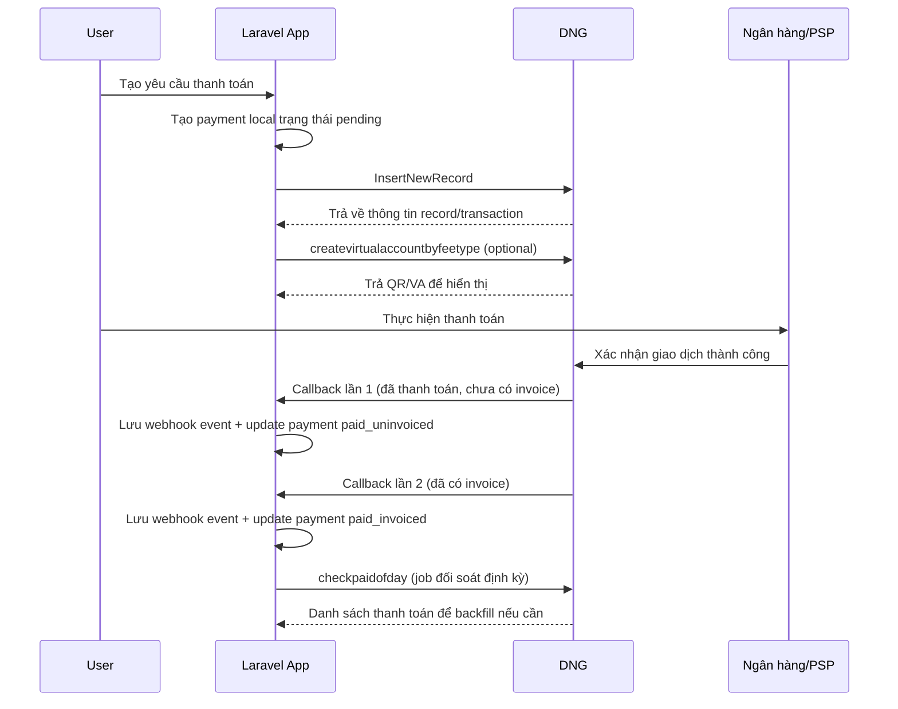

# Tài liệu flow thanh toán DNG cho triển khai Laravel

## 1. Mục tiêu tài liệu

Tài liệu này mô tả đầy đủ flow thanh toán với DNG dựa trên code hiện có của project này, đồng thời chuyển hóa thành kiến trúc triển khai phù hợp cho Laravel.

Project hiện tại đang có 3 luồng tích hợp ra DNG:

- Tạo bản ghi công nợ / bản ghi thanh toán: `InsertNewRecord`
- Lấy QR thanh toán theo sinh viên và fee type: `createvirtualaccountbyfeetype`
- Đối soát danh sách đã thanh toán theo ngày: `checkpaidofday`

Các file tham chiếu trong repo:

- `./GetCheckSum.php`: tính checksum HMAC-SHA1
- `./push-debt-to-dng.php`: client gọi DNG
- `./example.php`: ví dụ tạo công nợ
- `./example-pull-qr.php`: ví dụ lấy QR
- `./example-check-paid.php`: ví dụ đối soát thanh toán trong ngày

## 2. Endpoint DNG đang dùng trong project

Theo code hiện tại:

- `https://googleauthensite02.fpt.edu.vn:90/api/apiv2/InsertNewRecord`
- `https://googleauthensite02.fpt.edu.vn:90/api/dng/createvirtualaccountbyfeetype`
- `https://googleauthensite02.fpt.edu.vn:90/api/checkpaid/checkpaidofday`

## 3. Checksum đang dùng trong project

Project hiện dùng HMAC-SHA1 và encode base64, sau đó thay:

- `=` thành `%3d`
- dấu cách thành `+`

Pseudo logic hiện tại:

```php
$hash = hash_hmac('sha1', $value, $hashKey, true);
$checksum = str_replace(['=', ' '], ['%3d', '+'], base64_encode($hash));
```

### 3.1 Chuỗi checksum cho từng API outbound trong repo hiện tại

#### Tạo công nợ `InsertNewRecord`

```php
$checksumString =
    $accessCode
    . $apiCode
    . $campusCode
    . $amount
    . $itemId
    . mb_strtolower($studentId, 'UTF-8');
```

#### Lấy QR `createvirtualaccountbyfeetype`

```php
$checksumString = mb_strtolower(
    $accessCode . $apiCode . $studentCode,
    'UTF-8',
);
```

#### Đối soát `checkpaidofday`

```php
$checksumString = $campusCode . $accessCode . $date;
```

Lưu ý:

- Khi triển khai webhook nhận từ DNG, cần xác nhận lại với DNG chuỗi dữ liệu dùng để verify `CheckSum` ở chiều callback.
- Không nên giả định chắc chắn chuỗi verify callback giống hệt chuỗi dùng lúc gửi request sang DNG nếu chưa có tài liệu chính thức.

## 4. Điểm cần xác nhận với DNG trước khi code Laravel

Trong sample response tạo công nợ hiện có của repo, dữ liệu trả về chứa các field:

- `Id`
- `OtherId`
- `TransactionID`

Trong khi callback phía DNG lại gửi:

- `PaymentId`

Đây là điểm bắt buộc phải xác nhận với DNG:

- `PaymentId` trong callback map với field nào của response tạo công nợ
- nếu không map trực tiếp, hệ thống phải truyền giá trị nào sang DNG để callback trả lại đúng khóa đối chiếu

Nếu bỏ qua bước này, hệ thống Laravel có rủi ro lớn:

- callback nhận được nhưng không tìm đúng payment local
- update nhầm bản ghi
- đối soát phải xử lý thủ công

Khuyến nghị:

- thống nhất duy nhất một khóa nghiệp vụ để đối chiếu end-to-end
- ưu tiên dùng một trường external reference rõ ràng và lưu unique trong `payment_orders`

## 5. Flow nghiệp vụ tổng thể

### 5.1 Flow chuẩn end-to-end



### 5.2 Điều quan trọng nhất

DNG sẽ có thể gọi callback 2 lần cho cùng một giao dịch:

- Lần 1: báo thanh toán thành công, nhưng `InvoiceSerialNumber` và `InvoiceDate` chưa có dữ liệu.
- Lần 2: báo đầy đủ sau khi đã có hóa đơn điện tử.

Vì vậy:

- Không được coi lần 2 là giao dịch mới.
- Phải coi đây là 2 event khác nhau của cùng một payment.
- Phải cập nhật cùng một bản ghi theo `PaymentId`.

## 6. Payload callback DNG

Ví dụ payload DNG gửi sang:

```json
{
  "StudentId": "FSC0664",
  "StudentName": "Trương Ngọc Hân",
  "PaymentId": "12345678",
  "PSPCode": "BIDV",
  "FeeType": "HP",
  "Amount": 10000.0,
  "CampusCode": "FAN1HCM",
  "ItemId": "HP0ISH4BdH0S",
  "InvoiceSerialNumber": "1/001;K23TAA-00004142",
  "InvoiceDate": "2023-03-20T03:08:02",
  "CheckSum": "9kzQqcnhSboOl1qACVQR4dTYTqs%3d"
}
```

Ví dụ lỗi:

```json
{"Code":402,"Type":"Error","Message":"Mã sinh viên FSC0664 không chính xác","data":null}
```

## 7. Thiết kế dữ liệu đề xuất cho Laravel

Nên tách thành ít nhất 2 bảng:

- `payment_orders`: lưu trạng thái nghiệp vụ của mỗi payment
- `payment_webhook_events`: lưu từng lần DNG callback sang hệ thống

### 7.1 Bảng `payment_orders`

Các cột tối thiểu:

- `id`
- `student_id`
- `student_name`
- `payment_id` - unique
- `item_id`
- `fee_type`
- `amount`
- `campus_code`
- `psp_code` - nullable
- `status`
- `invoice_serial_number` - nullable
- `invoice_date` - nullable
- `paid_at` - nullable
- `dng_created_payload` - json nullable
- `dng_created_response` - json nullable
- `last_callback_payload` - json nullable
- `created_at`
- `updated_at`

### 7.2 Bảng `payment_webhook_events`

Các cột tối thiểu:

- `id`
- `provider` - mặc định `dng`
- `payment_id`
- `event_type`
- `payload_hash` - unique
- `headers` - json nullable
- `payload` - json
- `is_valid_checksum` - boolean
- `processed_at` - nullable
- `processing_status`
- `error_message` - nullable
- `created_at`
- `updated_at`

### 7.3 Giá trị `status` đề xuất cho `payment_orders`

- `pending`
- `pushed_to_dng`
- `qr_ready`
- `paid_uninvoiced`
- `paid_invoiced`
- `reconciled`
- `failed`

## 8. Mapping flow sang Laravel

### 8.1 Khi user tạo thanh toán

Luồng backend:

1. User chọn khoản cần thanh toán.
2. Laravel tạo bản ghi `payment_orders` với trạng thái ban đầu `pending`.
3. Laravel gọi `InsertNewRecord` sang DNG.
4. Nếu DNG trả về thành công:
   - cập nhật `status = pushed_to_dng`
   - lưu response trả về từ DNG
5. Nếu cần QR:
   - gọi `createvirtualaccountbyfeetype`
   - lưu thông tin QR/virtual account
   - cập nhật `status = qr_ready`

Điểm cần lưu:

- `payment_id` của local system nên map rõ với `PaymentId` từ DNG.
- Nếu `PaymentId` do DNG sinh ra ở response, phải lưu ngay vào DB.
- Nếu `PaymentId` do hệ thống tự cấp và gửi sang DNG, phải đảm bảo unique toàn hệ thống.

### 8.2 Khi DNG callback lần 1

Payload thường có:

- `PaymentId`
- `Amount`
- `StudentId`
- `ItemId`
- `InvoiceSerialNumber = null/empty`
- `InvoiceDate = null/empty`

Việc cần làm:

1. Verify `CheckSum`.
2. Ghi log raw payload vào `payment_webhook_events`.
3. Dedupe event theo `payload_hash`.
4. Tìm payment theo `payment_id`.
5. Nếu tìm thấy:
   - update `psp_code`
   - update `last_callback_payload`
   - set `paid_at` nếu chưa có
   - set `status = paid_uninvoiced`
6. Trả HTTP `200` nhanh.

### 8.3 Khi DNG callback lần 2

Payload thường có thêm:

- `InvoiceSerialNumber`
- `InvoiceDate`

Việc cần làm:

1. Verify `CheckSum`.
2. Ghi log raw payload vào `payment_webhook_events`.
3. Dedupe event theo `payload_hash`.
4. Tìm payment theo `payment_id`.
5. Update cùng bản ghi payment trước đó:
   - `invoice_serial_number`
   - `invoice_date`
   - `last_callback_payload`
   - `status = paid_invoiced`
6. Trả HTTP `200` nhanh.

### 8.4 Khi callback bị miss

Đây là lý do phải có job đối soát:

1. Laravel chạy scheduler định kỳ.
2. Job gọi `checkpaidofday` theo ngày.
3. Với từng payment DNG trả về:
   - nếu local chưa có trạng thái thanh toán thì cập nhật bù
   - nếu local đã `paid_uninvoiced` nhưng dữ liệu invoice chưa có, thì backfill
4. Đánh dấu `reconciled` hoặc lưu cờ đã đối soát.

## 9. Endpoint Laravel đề xuất

### 9.1 API nhận callback

```php
POST /api/webhooks/dng/payment
```

Controller đề xuất:

- `App\Http\Controllers\Api\Webhooks\DngPaymentWebhookController`

Method đề xuất:

- `__invoke(Request $request)`

### 9.2 API nội bộ tạo payment

Ví dụ:

```php
POST /api/payments
```

Controller/service đề xuất:

- `App\Http\Controllers\Api\Payments\CreatePaymentController`
- `App\Services\Payments\DngPaymentService`

### 9.3 Job đối soát

- `App\Jobs\ReconcileDngPaymentsJob`

Schedule gợi ý:

- mỗi 10 hoặc 15 phút với ngày hiện tại
- chạy thêm cuối ngày để quét lại toàn bộ giao dịch trong ngày

## 10. Quy tắc idempotency bắt buộc

Đây là phần quan trọng nhất để không bị miss hoặc xử lý trùng.

### 10.1 Theo payment

- `payment_orders.payment_id` phải unique.
- Mọi callback từ DNG luôn update theo `payment_id`.

### 10.2 Theo event

- Mỗi callback phải lưu một fingerprint riêng, ví dụ:
  - hash của raw body
  - hoặc hash của các trường chính: `PaymentId`, `InvoiceSerialNumber`, `InvoiceDate`, `Amount`, `PSPCode`
- `payload_hash` nên unique để tránh xử lý lại cùng một callback.

### 10.3 Theo state transition

Không cho state đi lùi:

- `pending -> pushed_to_dng -> qr_ready -> paid_uninvoiced -> paid_invoiced`

Nếu callback cũ tới muộn:

- Không overwrite invoice đã có bằng dữ liệu rỗng.
- Không reset `paid_invoiced` về `paid_uninvoiced`.

## 11. Cách xử lý request webhook đúng trong Laravel

Không nên xử lý nặng trực tiếp trong controller.

Flow nên là:

1. Nhận request.
2. Verify format và checksum.
3. Ghi `payment_webhook_events`.
4. Dispatch job xử lý nghiệp vụ.
5. Trả `200 OK` ngay.

Pseudo code:

```php
public function __invoke(Request $request)
{
    $payload = $request->all();

    $this->dngWebhookValidator->validate($payload);

    $isValid = $this->dngChecksumService->verify($payload);

    $event = $this->webhookEventService->store(
        provider: 'dng',
        paymentId: $payload['PaymentId'] ?? null,
        payload: $payload,
        headers: $request->headers->all(),
        isValidChecksum: $isValid,
    );

    if (! $isValid) {
        return response()->json([
            'Code' => 401,
            'Type' => 'Error',
            'Message' => 'Invalid checksum',
            'data' => null,
        ], 401);
    }

    ProcessDngWebhookJob::dispatch($event->id);

    return response()->json([
        'Code' => 200,
        'Type' => 'Success',
        'Message' => 'Accepted',
        'data' => null,
    ]);
}
```

## 12. Service class đề xuất cho Laravel

Nên tách rõ các thành phần sau:

- `DngClient`
  - gọi `InsertNewRecord`
  - gọi `createvirtualaccountbyfeetype`
  - gọi `checkpaidofday`
- `DngChecksumService`
  - generate checksum
  - verify checksum
- `DngPaymentService`
  - tạo payment local
  - push sang DNG
  - pull QR
- `DngWebhookService`
  - lưu webhook event
  - phân loại callback lần 1 và lần 2
  - cập nhật payment state
- `DngReconciliationService`
  - gọi API đối soát
  - backfill transaction bị miss

## 13. Phân loại callback lần 1 và lần 2

Không cần DNG gửi explicit event type nếu có thể suy ra từ dữ liệu.

Rule gợi ý:

- Nếu `InvoiceSerialNumber` rỗng hoặc `InvoiceDate` rỗng:
  - event type = `payment_succeeded_without_invoice`
- Nếu cả `InvoiceSerialNumber` và `InvoiceDate` đều có:
  - event type = `payment_invoiced`

Pseudo code:

```php
$hasInvoice = filled($payload['InvoiceSerialNumber'] ?? null)
    && filled($payload['InvoiceDate'] ?? null);

$eventType = $hasInvoice
    ? 'payment_invoiced'
    : 'payment_succeeded_without_invoice';
```

## 14. Validate dữ liệu callback

Các trường nên validate:

- `StudentId`: required|string
- `StudentName`: nullable|string
- `PaymentId`: required|string
- `PSPCode`: nullable|string
- `FeeType`: nullable|string
- `Amount`: required|numeric
- `CampusCode`: required|string
- `ItemId`: nullable|string
- `InvoiceSerialNumber`: nullable|string
- `InvoiceDate`: nullable|date
- `CheckSum`: required|string

Ngoài ra nên check chéo:

- `PaymentId` có tồn tại local không
- `Amount` có khớp với local payment không
- `StudentId` có khớp record ban đầu không
- `ItemId` có khớp khoản thu ban đầu không

Nếu không khớp:

- vẫn lưu event
- đánh dấu `processing_status = mismatch`
- phát cảnh báo để kiểm tra thủ công

## 15. Vì sao chỉ dùng webhook là chưa đủ

Webhook có thể bị miss vì:

- timeout mạng
- app deploy đúng lúc DNG callback
- worker queue lỗi
- app trả status khác 200
- lỗi DNS, firewall, SSL, reverse proxy

Vì vậy cần 2 lớp bảo vệ:

- lớp 1: webhook realtime
- lớp 2: job `checkpaidofday` để đối soát và bù dữ liệu

Nếu chỉ có webhook, hệ thống sẽ có rủi ro:

- user đã thanh toán nhưng local vẫn `pending`
- local có thanh toán nhưng thiếu hóa đơn điện tử
- callback lần 2 bị miss nên invoice không được cập nhật

## 16. Kịch bản lỗi cần cover

### 16.1 Callback đến trước khi local commit xong payment

Hiếm nhưng có thể xảy ra nếu timing sát nhau.

Giải pháp:

- tạo payment local trước
- commit DB xong mới gọi DNG
- callback receiver nếu chưa tìm thấy payment thì:
  - vẫn lưu event
  - cho retry xử lý lại bằng queue sau

### 16.2 DNG retry cùng một payload nhiều lần

Giải pháp:

- dedupe bằng `payload_hash`
- update payment theo logic idempotent

### 16.3 Callback lần 2 đến trước khi lần 1 được xử lý

Giải pháp:

- không phụ thuộc thứ tự event
- nếu callback có invoice thì cập nhật trực tiếp lên `paid_invoiced`

### 16.4 Callback không hợp lệ checksum

Giải pháp:

- lưu log event
- trả `401` hoặc `422`
- không update payment
- cảnh báo vận hành

### 16.5 Đối soát phát hiện payment đã paid nhưng local chưa update

Giải pháp:

- update bù sang `paid_uninvoiced` hoặc `paid_invoiced`
- lưu nguồn cập nhật là `reconciliation`

## 17. Luồng triển khai Laravel khuyến nghị

### Bước 1. Tạo payment local

- tạo record `payment_orders`
- sinh mã giao dịch nội bộ nếu cần
- lưu trạng thái `pending`

### Bước 2. Push bản ghi sang DNG

- gọi `InsertNewRecord`
- lưu response
- map `PaymentId` hoặc `TransactionID` theo quy ước thật sự của DNG

### Bước 3. Lấy QR hoặc virtual account

- gọi `createvirtualaccountbyfeetype`
- trả dữ liệu cho frontend

### Bước 4. Nhận webhook realtime

- route public nhận callback
- verify checksum
- lưu event
- dispatch job xử lý

### Bước 5. Update trạng thái payment

- chưa có invoice: `paid_uninvoiced`
- có invoice: `paid_invoiced`

### Bước 6. Reconcile định kỳ

- scheduler gọi `checkpaidofday`
- backfill payment miss callback
- backfill invoice thiếu

## 18. Gợi ý cấu trúc file Laravel

```text
app/
  Http/
    Controllers/
      Api/
        Payments/
          CreatePaymentController.php
        Webhooks/
          DngPaymentWebhookController.php
  Jobs/
    ProcessDngWebhookJob.php
    ReconcileDngPaymentsJob.php
  Models/
    PaymentOrder.php
    PaymentWebhookEvent.php
  Services/
    Dng/
      DngClient.php
      DngChecksumService.php
      DngPaymentService.php
      DngWebhookService.php
      DngReconciliationService.php
database/
  migrations/
routes/
  api.php
```

## 19. Checklist triển khai

- Có bảng `payment_orders`
- Có bảng `payment_webhook_events`
- Có unique index cho `payment_id`
- Có unique index cho `payload_hash`
- Có route public nhận webhook DNG
- Có verify checksum
- Có queue job xử lý callback
- Có scheduler đối soát `checkpaidofday`
- Có monitoring khi callback lỗi
- Có cảnh báo payment `pending` quá lâu
- Có cảnh báo payment `paid_uninvoiced` quá lâu

## 20. Test case nên viết

- Tạo payment thành công và push DNG thành công
- Pull QR thành công
- Nhận callback lần 1 và update `paid_uninvoiced`
- Nhận callback lần 2 và update `paid_invoiced`
- Nhận callback lần 2 trước callback lần 1
- Nhận cùng một payload 2 lần
- Checksum sai
- `Amount` mismatch
- `StudentId` mismatch
- Miss callback nhưng reconcile job cập nhật bù thành công

## 21. Kết luận

Thiết kế đúng cho bài toán này không phải chỉ là "tạo một webhook", mà là:

- webhook receiver
- event log
- idempotent processing
- state machine cho payment
- reconciliation job để chống miss callback

Trong ngữ cảnh Laravel, hướng triển khai an toàn nhất là:

1. tạo payment local trước
2. push sang DNG
3. nhận callback qua webhook public
4. lưu từng event riêng
5. update payment theo `PaymentId`
6. đối soát định kỳ bằng `checkpaidofday`

Với flow này, hệ thống vẫn an toàn ngay cả khi:

- DNG gọi callback 2 lần
- DNG retry callback
- callback đến sai thứ tự
- callback bị miss tạm thời
